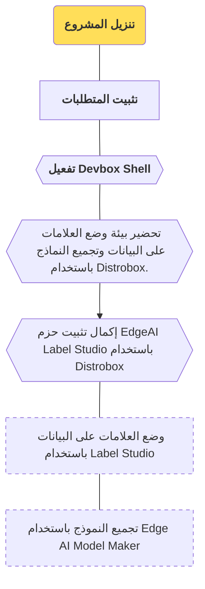

import SnippetSdkClone from '/snippets/ai/clone.mdx';
import SnippetSdkSetup from '/snippets/ai/setup.mdx';
import SnippetSdkDevboxShell from '/snippets/ai/devbox-shell.mdx';
import SnippetSdkTaskBox from '/snippets/ai/task-box.mdx';
import SnippetSdkInstallShell from '/snippets/ai/task-install.mdx';

في هذا القسم، سيتم تنزيل مشروع [edgeai-tensorlab](https://github.com/t3gemstone/edgeai-tensorlab.git) إلى
كمبيوتر المطور وتثبيت أدواته التي يمكن استخدامها على لوحة التطوير.

<Tip>
في نهاية هذا القسم ستكتسب خبرة في المواضيع التالية.

* تجرِبة الاستخدام الأساسي لمكونات edgeai-tensorlab
* إجراء وضع العلامات على البيانات وتجميع النماذج باستخدام edgeai-tensorlab
</Tip>

<Steps>
  <Step title="تنزيل edgeai-tensorlab">
    تنزيل مشروع edgeai-tensorlab بإجراء عملية `git clone` على Ubuntu
  </Step>
  <Step title="تثبيت المتطلبات">
    ثبّت المتطلبات اللازمة لإجراء عملية التجميع بتشغيل السكربت المسمى `setup.sh`
  </Step>
  <Step title="إكمال تثبيت المكتبات">
    أكمل تثبيت الأدوات الموجودة داخل edgeai-tensorlab لتجهيز النظام
  </Step>
</Steps>

# 1\. التحضير

تم تنفيذ عمليات التجميع باستخدام كمبيوتر يعمل بتوزيعة Ubuntu 22.04 GNU/Linux. ورغم إمكانية استخدام توزيعات أخرى
مثل Debian وFedora وPardus، فإن Ubuntu 22 أو Ubuntu 24 ستكون أكثر ملاءمة لمن يستخدم أدوات تجميع مماثلة لأول مرة.

### 1\.1\. متطلبات الكمبيوتر

1. كمبيوتر يعمل بـ Ubuntu 22 أو Ubuntu 24
2. ذاكرة RAM لا تقل عن 8 جيجابايت
3. مساحة قرص فارغة متاحة لا تقل عن 10 جيجابايت

تحتاج Gemstone SDK إلى أدوات مثل `Docker` و`Devbox`. بعد استنساخ مشروع SDK باستخدام الأوامر التالية، يقوم السكربت
المسمى `setup.sh` الموجود داخله بتنفيذ هذه التثبيتات تلقائياً.

<Frame>

</Frame>

### 1\.2\. تنزيل المشروع

على Ubuntu، افتح الطرفية (Terminal) في أي مجلد واستنسخ المشروع باستخدام الأمر `git clone` كما يلي.

<SnippetSdkClone />

### 1\.3\. تثبيت المتطلبات

بعد عملية الاستنساخ، انتقل إلى المجلد من شاشة الطرفية نفسها باستخدام الأمر `cd edgeai-tensorlab` ثم شغّل السكربت
`setup.sh`.

<SnippetSdkSetup />

<Warning>
إذا كان تطبيق Docker غير مثبت مسبقاً على نظامك، أي أنك تثبته لأول مرة، فلا تنسَ تسجيل الخروج من جلسة مستخدم
الكمبيوتر ثم تسجيل الدخول مرة أخرى.
</Warning>

# 2\. التجميع

بعد إكمال سكربت تثبيت المتطلبات، يمكنك بدء خطوات التجميع بتفعيل Devbox Shell من الطرفية أثناء وجودك داخل مجلد sdk.

### 2\.1\. تفعيل وحدة Devbox

فعّل **Devbox**، وهو نظام إدارة حزم برمجية يمكنه أن يتضمن إصدارات مختلفة عن حزم Ubuntu، لضمان اكتمال عمليات
التنزيل والتثبيت اللازمة لـ edgeai-tensorlab.

<SnippetSdkDevboxShell />

### 2\.2\. تحضير بيئة التجميع

نفّذ عملية تثبيت Distrobox عبر الأمر التالي.

<SnippetSdkTaskBox />

قرب نهاية عملية التثبيت سيُطلب منك إعطاء كلمة مرور لبيئة distrobox الخاصة بك: `⚠️  First time user password
setup ⚠️`. يمكنك اختيار كلمة مرور من حرف واحد تختلف عن كلمة مرور جهاز الكمبيوتر الخاص بك حتى تتمكن من تمييز أي
وحدة تحكم تتواجد فيها أثناء عمليات التجميع. أخيراً، عندما ترى السطر `🚀 distrobox:workdir>` فأنت الآن جاهز لتحضير
نماذج معالجة الصور من Gemstone!

### 2\.3\. إكمال تثبيت الحزم

أكمل التثبيتات اللازمة لـ Label Studio وEdge AI Model Maker.

<SnippetSdkInstallShell />

# 3\. الخاتمة

بإتمام هذا القسم، تكون قد جهّزت بيئة تحضير نماذج معالجة الصور من Gemstone.

<Check>
يمكنك الانتقال إلى القسم التالي لبدء وضع العلامات على البيانات وتجميع النماذج للوحات Gemstone.
</Check>
