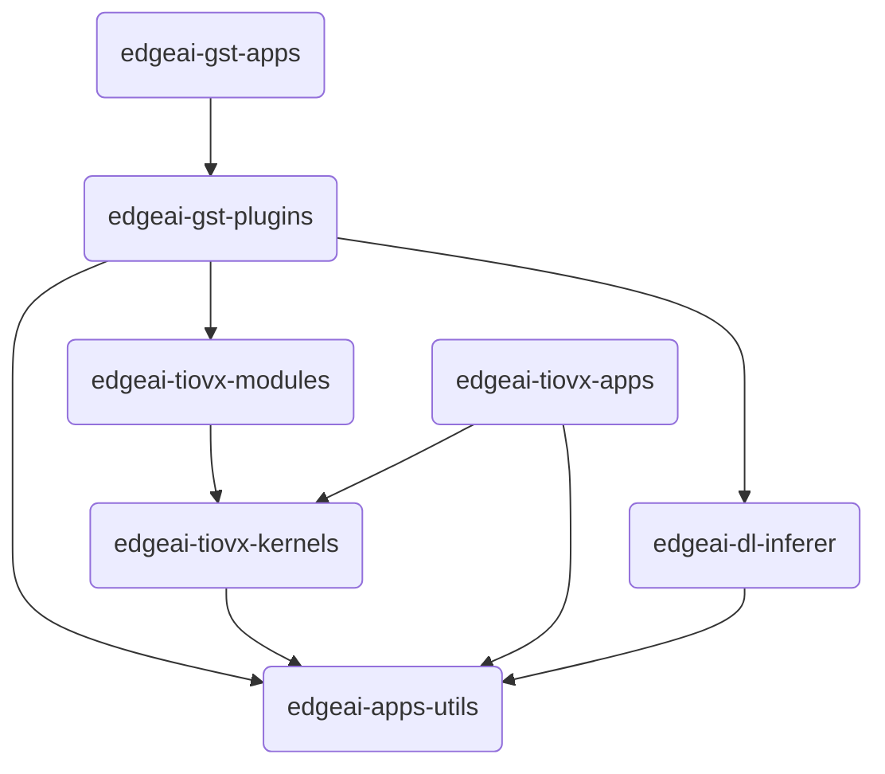

نوى C7x DSP الموجودة في معالجات SoC من سلسلة AM67A مُحسَّنة لمهام معالجة الإشارات والصور عالية الأداء.
ويمكن استخدام هذه النوى عبر المكتبات المحسَّنة التي توفرها Texas Instruments في نطاق واسع من التطبيقات
يمتد من المستوى المنخفض إلى المستوى المتقدم.

### DSPLIB

DSPLIB (Digital Signal Processing Library) هي مكتبة توفر كفاءة عالية لدوال معالجة الإشارات منخفضة المستوى.
عبر هذه المكتبة يمكن تنفيذ خوارزميات DSP الأساسية مثل FFT وتصفية FIR/IIR والارتباط والالتفاف وعمليات المصفوفات
بشكل مسرَّع عتاديًا. تعمل هذه الدوال بسرعة عالية بالاستفادة من قدرة المعالجة المتوازية لنوى C7، وتحقق مكاسب أداء
مهمة خاصة في مراحل المعالجة المسبقة للصور (مثل تقليل الضوضاء وتصفية الإشارات).

يمكنك الوصول إلى دليل مستخدم DSPLIB [من هنا](https://software-dl.ti.com/jacinto7/esd/processor-sdk-rtos-jacinto7/11_01_00_04/exports/docs/dsplib/docs/user_guide/index.html).

### VXLIB

VXLIB (Vision Acceleration Library) هي مكتبة متوافقة مع معيار OpenVX تحتوي على دوال معالجة الصور منخفضة المستوى.
يمكن تنفيذ خطوات معالجة الصور الأساسية مثل اكتشاف الحواف وحساب المدرج التكراري والعمليات المورفولوجية وتحويلات
الفضاء اللوني بشكل محسَّن عبر هذه المكتبة. عند استخدام VXLIB مع DSPLIB، توفر كفاءة عالية في جميع مراحل خط معالجة
الصور (المعالجة المسبقة، استخراج الميزات، التجزئة).

يمكنك الوصول إلى دليل مستخدم VXLIB [من هنا](https://software-dl.ti.com/jacinto7/esd/processor-sdk-rtos-jacinto7/11_01_00_04/exports/docs/vxlib_11_00_00_01/docs/user_guide/index.html).

###  MATHLIB

MATHLIB هي مكتبة تقدم دوال محسَّنة للعمليات الرياضية الأساسية والمتقدمة (الدوال المثلثية، الحسابات اللوغاريتمية، العمليات الأسية، الجذر التربيعي، الرياضيات المتجهية وما إلى ذلك).
تتيح هذه المكتبة الاستفادة بأقصى كفاءة من القدرة العتادية لنوى C7، خاصة في تطبيقات DSP/MCU الزمنية الفعلية التي تتضمن حسابات رياضية مكثفة.

يمكنك الوصول إلى دليل مستخدم MATHLIB [من هنا](https://software-dl.ti.com/jacinto7/esd/processor-sdk-rtos-j722s/latest/exports/docs/mathlib/docs/user_guide/index.html).

### مجالات الاستخدام المحتملة

عند استخدام هذه المكتبات الثلاث معًا، يمكن لنوى C7 الموجودة على معالج AM67A SoC أن تشكل أساسًا ليس فقط للمعالجة
منخفضة المستوى، بل أيضًا للتطبيقات المتقدمة مثل تحليلات الصور المعقدة وعمليات الحساب الرياضي وتحسين الصور
الزمني الفعلي.

على سبيل المثال:

- استخراج الميزات المعتمدة على الصور باستخدام VXLIB
- تنفيذ الحسابات الرياضية المكثفة بأداء عالٍ باستخدام MATHLIB
- المعالجة المسبقة للإشارات باستخدام DSPLIB

وبهذه الطريقة، بينما يُخفَّض الحمل على CPU على مستوى النظام بأكمله، يمكن تطوير حلول لمعالجة الصور والحساب
الرياضي تتمتع بكفاءة طاقة عالية وتعمل بشكل زمني فعلي.

## Edge AI Robotics والنظام البيئي البرمجي

في الجدول التالي توجد مشاريع Edge AI التي توفرها Texas Instruments.

### جدول المستودعات (Repository)

| Repository | الوصف |
|-----------|----------|
| **[edgeai-robotics-sdk](https://github.com/TexasInstruments/edgeai-robotics-sdk)** | يوفر الإطار الأساسي وواجهات API لتطبيقات الروبوتات. يسهّل تطوير تطبيقات الروبوتات والرؤية الحاسوبية على معالجات TI. |
| **[edgeai-robotics-demos](https://github.com/TexasInstruments/edgeai-robotics-demos)** | يحتوي على تطبيقات تجريبية جاهزة للروبوتات وأكواد نماذج. مثالي للبدء السريع وعمل النماذج الأولية. |
| **[edgeai-tidl-tools](https://github.com/TexasInstruments/edgeai-tidl-tools)**  | يحتوي على الأدوات والأمثلة اللازمة لتشغيل نماذج التعلم العميق على معالجات TI. |
| **[edgeai-tiovx-apps](https://github.com/TexasInstruments/edgeai-tiovx-apps)** | يحتوي على تطبيقات وأمثلة للرؤية الحاسوبية المستندة إلى TI OpenVX (TIOVX). مهم لتحسين الأداء. |
| **[edgeai-gst-plugins](https://github.com/TexasInstruments/edgeai-gst-plugins)** | يحتوي على إضافات GStreamer المحسَّنة لمنصات TI. يتيح إنشاء خطوط المعالجة (pipelines) اللازمة لمعالجة الفيديو والذكاء الاصطناعي. |
| **[edgeai-app-stack](https://github.com/TexasInstruments/edgeai-app-stack)** | يحتوي على جميع البرمجيات وإعدادات النظام وأدوات الدمج اللازمة لتطبيقات Edge AI. |
| **[edgeai-tensorlab](https://github.com/TexasInstruments/edgeai-tensorlab)** | أدوات لتحسين النماذج والمعايرة والتحليل. تُستخدم لتحسين أداء النماذج. (يمكنك الوصول إلى نسخة أبسط [من هنا](/ar/boards/o1/ai/edgeai-tensorlab).) |
| **[edgeai-gst-apps](https://github.com/TexasInstruments/edgeai-gst-apps)** | يتيح هذا التطبيق النموذجي للمطورين فهم كيفية تهيئة خطوط معالجة الذكاء الاصطناعي (pipeline) بسرعة وتخصيصها عبر تغيير النماذج أو مصادر الكاميرا أو طرق الإخراج. |
| **[edgeai-tiovx-kernels](https://git.ti.com/cgit/edgeai/edgeai-tiovx-kernels)** | يحتوي على دوال نوى (kernel) خاصة مبنية على التعلم العميق طُوِّرت خصيصًا لإطار TI OpenVX (TIOVX). |
| **[edgeai-dl-inferer](https://git.ti.com/cgit/edgeai/edgeai-dl-inferer)** | يوفر مكتبات التعلم العميق لتشغيل نماذج الذكاء الاصطناعي. |
| **[edgeai-apps-utils](https://git.ti.com/cgit/edgeai/edgeai-apps-utils)** | مجموعة من البرامج المساعدة المشتركة والمكتبات المشتركة لتطبيقات Edge AI. |

### علاقات التبعية

