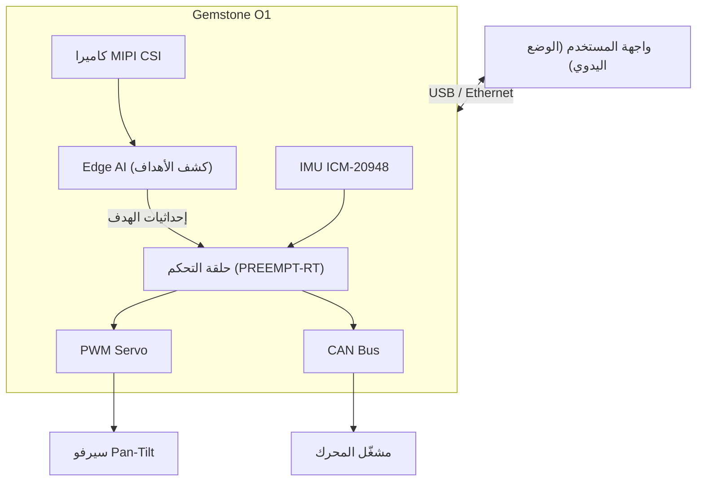

## 1\. نظرة عامة

[مسابقة Teknofest القبة الفولاذية لأنظمة الدفاع الجوي](https://teknofest.org/tr/yarismalar/celikkubbe-hava-savunma-sistemleri-yarismasi/),
هي مسابقة تغطي تطوير أنظمة دفاع جوي تُتحكم بها من الأرض وقادرة على كشف التهديدات الجوية المختلفة وتدميرها.
تمر الأنظمة بثلاث مراحل هي: تدمير الأهداف الثابتة، والتصدي للهجوم السربي، والتمييز بين الأهداف المتحركة
الصديقة والمعادية.

يتطلب إنجاز نظام من هذا النوع دمج معالجة الصور في الوقت الفعلي وتصنيف الأهداف والتحكم الدقيق في السيرفو على
منصة واحدة. بفضل قدرتها المعالجة القوية ومسرّع Edge AI ومخارج PWM العتادية، تمتلك اللوحة خصائص تمكنها من
تحمّل طبقتي الرؤية والحركة في الوقت نفسه.

## 2\. منصة المسابقة

### 2\.1\. كشف الأهداف وتصنيفها مع Edge AI

المتطلب المركزي في جميع مراحل المسابقة هو كشف الأهداف وتصنيفها في الوقت الفعلي.
يوفر مسرّع الذكاء الاصطناعي المدمج بسعة 4 TOPS قوة معالجة قادرة على تمييز أنواع الأهداف المختلفة مثل F16
والمروحيات والصواريخ الباليستية والطائرات بدون طيار الصغيرة/المتناهية الصغر عن بعضها البعض عبر معالجة تدفق
الكاميرا. في المرحلة 3 تدخل الأهداف الصديقة والمعادية المشهد نفسه معاً؛ ويُتوقع من النظام تدمير العدو فقط
وتجاوز الصديق. القدرة على إجراء هذا التمييز على مستوى البكسل هي مساهمة مباشرة من طبقة Edge AI.

| المهمة | النموذج | قوة المعالجة المطلوبة |
|-------|-------|--------------------|
| كشف الأهداف (F16 / مروحية / صاروخ / طائرة بدون طيار) | yolox_s_lite | 1–1,5 TOPS |
| التصنيف صديق/عدو | mobilenet_v2_lite | 0,5 TOPS |
| تتبع الأهداف المتحركة | yolox_s_lite | 1–1,5 TOPS |

لقائمة النماذج المدعومة وخطوات التجميع راجع صفحة [تحضير النموذج](/ar/boards/o1/ai/process).

### 2\.2\. إدراك الصور مع كاميرا MIPI CSI

يتيح منفذا MIPI CSI بأربع مسارات (4-lane) توصيل وحدة كاميرا لكشف الأهداف وتتبعها.
تُدعم الوحدات الشائعة مثل Raspberry Pi Camera V2. يُغذى تدفق الكاميرا مباشرة في مسار Edge AI لاستخراج
إحداثيات الهدف في الوقت الفعلي؛ وتُنقل هذه الإحداثيات إلى حلقة التحكم في السيرفو. يتكون المسار من ثلاث مراحل:
**الإدخال** الذي يلتقط إطار الكاميرا، و**الحساب** الذي ينفذ استنتاج النموذج (inference)، و**الإخراج** الذي
ينقل النتائج. راجع وثيقة تدفق بيانات EdgeAI من TI للتفاصيل:

- [تدفق بيانات EdgeAI (Dataflows) — TI AM67A](https://software-dl.ti.com/jacinto7/esd/processor-sdk-linux-am67a/11_00_00/exports/edgeai-docs/common/edgeai_dataflows.html)

لإعداد الكاميرا راجع صفحة [الكاميرا](/ar/boards/o1/peripherals/camera).

### 2\.3\. التحكم في البرج مع PWM

لكي يتمكن النظام من الحركة على محوري الارتفاع والانحراف، يجب توليد إشارة PWM دقيقة لسيرفو المحركات في آلية
pan-tilt. يمكن استخدام قنوات PWM العتادية السبع الموجودة في رأس GPIO ذي 40 طرفاً لهذا الغرض مباشرة. تُحدَّث
إشارات PWM في الوقت الفعلي وفق إحداثيات الهدف القادمة من Edge AI لتشكيل حلقة تصويب تلقائية. تُبنى هذه الحلقة
عادةً مع متحكم PID منفصل لكل محور؛ ويُستخدم الخطأ بين موضع الجسم المكتشف في الإطار والمركز كإشارة.

لإعداد PWM راجع صفحة [PWM](/ar/boards/o1/peripherals/pwm).

### 2\.4\. قياس اتجاه المنصة مع IMU

يقيس ICM-20948 المدمج (مقياس تسارع + جيروسكوب + مقياس مغناطيسية) الاتجاه اللحظي للمنصة.
يوفر مدخلات تصحيحية لحسابات التصويب في حالات الاهتزاز أو الارتجاج.

لمزيد من المعلومات حول IMU راجع صفحة [IMU](/ar/boards/o1/peripherals/imu).

### 2\.5\. حلقة التصويب في الوقت الفعلي

يؤثر تأخير حلقة التحكم مباشرة على دقة الإصابة في تتبع الأهداف المتحركة.
مع رقعة PREEMPT-RT Linux يمكن تثبيت حلقات معالجة الصور وتحديث السيرفو على أنوية CPU محددة؛ وبهذا يُحصل على
معدل تحكم منخفض التأخير ومتسق بغض النظر عن حمل النظام.

لتثبيت Linux في الوقت الفعلي راجع صفحة [PREEMPT-RT](/ar/projects/preempt-rt).

### 2\.6\. اتصال المحركات مع CAN Bus

بالنسبة للمحاور التي تتطلب دفعاً أقوى، يوفر محول CAN FD من النوع TCAN1462-Q1 إمكانية الاتصال بمشغلات
المحركات عبر DroneCAN أو بروتوكول مخصص. يمكن قراءة قياسات المحرك عن بعد (التيار، الموضع، الحرارة) عبر هذه
الواجهة.

لإعداد CAN Bus راجع صفحة [CAN Bus](/ar/boards/o1/peripherals/canbus).

### 2\.7\. واجهة المستخدم والوضع اليدوي

تُنفذ المرحلة الأولى من المسابقة في الوضع اليدوي بالكامل؛ ومن الضروري أن تعمل جميع الوظائف عبر واجهة
مستخدم أو عصا تحكم أو لوحة مفاتيح. يمكن للوحة استقبال الأوامر من واجهة تحكم على جهاز كمبيوتر متصل عبر USB
أو Ethernet. تُدار الانتقالات بين الوضعين الذاتي واليدوي عبر هذه الواجهة أيضاً.

## 3\. مثال على بنية النظام

يُعالج تدفق الكاميرا في طبقة Edge AI لتحديد نوع الهدف وإحداثياته. تُنقل هذه المعلومات إلى حلقة التحكم في
الوقت الفعلي؛ تقود حلقة التحكم آلية pan-tilt عبر PWM أو CAN Bus. تتصل واجهة المستخدم عبر Ethernet أو USB،
وتُدار التحولات بين الوضعين اليدوي والذاتي من هنا.

## 4\. المراجع التقنية

<CardGroup cols={2}>
  <Card title="مواصفات اللوحة" icon="microchip" href="/ar/boards/o1/introduction">
    معالج TI AM67A وذاكرة RAM بسعة 4GB وتخزين eMMC بسعة 32GB والقائمة الكاملة للمستشعرات والواجهات
  </Card>
  <Card title="Edge AI" icon="microchip-ai" href="/ar/boards/o1/ai/introduction">
    مسرّع AI بسعة 4 TOPS وتجميع النماذج ومسار اكتشاف الأجسام
  </Card>
  <Card title="PWM" icon="signal" href="/ar/boards/o1/peripherals/pwm">
    جدول تخطيط أطراف PWM العتادية والتحكم في السيرفو
  </Card>
  <Card title="Linux في الوقت الفعلي" icon="clock" href="/ar/projects/preempt-rt">
    توقيت حتمي مع رقعة PREEMPT-RT
  </Card>
</CardGroup>

## 5\. روابط مفيدة

- [صفحة مسابقة Teknofest القبة الفولاذية](https://teknofest.org/tr/yarismalar/celikkubbe-hava-savunma-sistemleri-yarismasi/)
- [لائحة المسابقة (PDF)](https://cdn.teknofest.org/media/upload/userFormUpload/2026_%C3%87elikkubbe_Hava_Savunma_Sistemleri_Yar%C4%B1%C5%9Fmas%C4%B1_%C5%9Eartname_TR_v1.3_eFLxN.pdf)
- [منتدى مجتمع T3 Gemstone](https://community.t3gemstone.org/)
