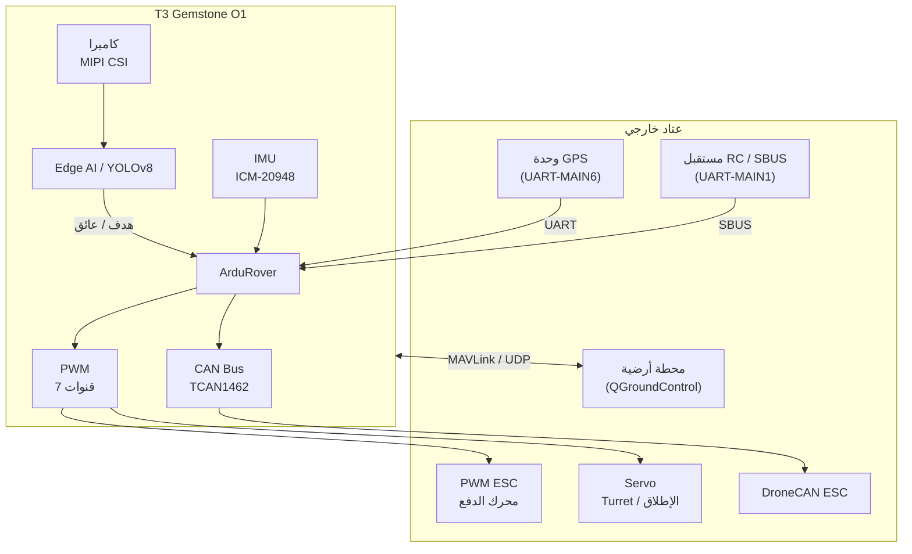

## 1\. نظرة عامة

[مسابقة Teknofest للمركبات الأرضية غير المأهولة](https://teknofest.org/tr/yarismalar/insansiz-kara-araci-yarismasi/),
هي مسابقة وطنية تغطي عمليات تصميم وإنتاج واختبار المركبات الأرضية غير المأهولة القادرة على تنفيذ مهام
تُتحكم بها عن بعد وأخرى ذاتية القيادة بالكامل. يُتوقع من المركبات في المسابقة إكمال سلسلة من الأحداث التي قد
تُواجه في ظروف القتال في بيئة المسار، بما في ذلك مهام الدعم الناري.
تقدم اللوحة منصة شاملة من طرف إلى طرف لهذه المسابقة بفضل قدرتها المعالجة القوية ومستشعراتها المدمجة ومسرّع
Edge AI ودعم ArduPilot.

## 2\. منصة المسابقة مع T3 Gemstone O1

تقدم T3 Gemstone O1 جميع القدرات الأساسية اللازمة لتطوير مركبة أرضية غير مأهولة على لوحة واحدة.

### 2\.1\. التحكم في المركبات الأرضية مع ArduPilot

تتضمن حزمة ArduPilot المثبتة مسبقاً أداة **ArduRover** المطورة خصيصاً للمركبات الأرضية. تدعم إعدادات
القيادة التفاضلية وتوجيه Ackermann والمركبات متعددة الاتجاهات. تُوفَّر تتبع المسار وتجنب العوائق وتخطيط
المهام ذاتية القيادة مباشرة عبر ArduRover.

لتثبيت ArduPilot وإعداد المعاملات راجع صفحة [ArduPilot](/ar/projects/ardupilot).

### 2\.2\. التحكم عن بعد مع مدخل RC

في المرحلة التي تُتحكم بها عن بعد من المسابقة، تُرسل إشارة SBUS القادمة من مستقبل RC إلى ArduRover.
تقرأ اللوحة SBUS عبر طرف UART-MAIN1 RX؛ لكن نظراً لأن بروتوكول SBUS يستخدم إشارة معكوسة، فمن الضروري توصيل
دارة عاكس إشارة خارجية بين مستقبل RC وهذا الطرف.
تُهيأ تعيينات قنوات RC واختيار وضع الطيران عبر معاملات ArduRover.

للمخطط الكهربائي وإعداد SBUS راجع صفحة [ArduPilot](/ar/projects/ardupilot).

### 2\.3\. كشف الأهداف وكشف العوائق مع Edge AI

يوفر مسرّع الذكاء الاصطناعي المدمج بسعة 4 TOPS قوة معالجة كافية لإجراء اكتشاف الأجسام وتصنيفها في الوقت
الفعلي على صور الكاميرا. متطلبات الذكاء الاصطناعي النموذجية في سيناريوهات المسابقة:

| المهمة | قوة المعالجة المطلوبة |
|-------|--------------------|
| كشف الأهداف (YOLOv8s، التعرف على البشر/المركبات) | 1–2 TOPS |
| كشف العوائق وتجزئة الطريق | 1.5–2 TOPS |
| التعرف على العلامات/اللوحات | 0.5–1 TOPS |
| تقدير العمق (كاميرا أحادية) | 1.5–2 TOPS |

يمكن تجميع هذه النماذج وتحميلها على T3 Gemstone O1 عبر سلسلة أدوات TI EdgeAI الموضحة في [قسم Edge AI](/ar/boards/o1/ai/introduction).

### 2\.4\. إدراك المحيط مع كاميرا MIPI CSI

يتيح منفذا MIPI CSI بأربع مسارات (4-lane) توصيل وحدات كاميرا لإدراك المحيط والتعرف على الأهداف في بيئة
المسار. تُدعم الوحدات الشائعة مثل Raspberry Pi Camera V2. يمكن دمج تدفق الكاميرا مع نظام صور ArduRover
ومع مسار Edge AI على حد سواء.

لإعداد الكاميرا راجع صفحة [الكاميرا](/ar/boards/o1/peripherals/camera).

### 2\.5\. التحكم في المحركات والسيرفو مع PWM

تُستخدم قنوات PWM العتادية السبع الموجودة في رأس GPIO ذي 40 طرفاً لتوليد إشارات ESC لمحركات الدفع
وسيرفو دوران البرج وآلية الإطلاق.

لتخطيط أطراف PWM وإعدادها راجع صفحتي [PWM](/ar/boards/o1/peripherals/pwm) و[ArduPilot](/ar/projects/ardupilot).

### 2\.6\. اتصال ESC الذكي مع CAN Bus

يوفر محول CAN FD من النوع TCAN1462-Q1 على اللوحة إمكانية الدمج مع وحدات ESC الذكية الداعمة لبروتوكول
DroneCAN. بهذه الطريقة يمكن قراءة قياسات المحرك عن بعد (التيار، الدورات، الحرارة) مباشرة عبر ArduRover
وإدارة الطاقة بشكل أكثر فعالية.

لإعداد CAN Bus راجع صفحة [CAN Bus](/ar/boards/o1/peripherals/canbus).

### 2\.7\. اتجاه المركبة والملاحة مع IMU

يستخدم مستشعر ICM-20948 المدمج في اللوحة (مقياس تسارع + جيروسكوب + مقياس مغناطيسية) مباشرة من قِبل
ArduRover لقياس اتجاه المركبة. بالعمل مع وحدة GPS خارجية يُجرى تقدير الموقع والسرعة القائم على EKF؛ وبهذه
الطريقة تُوفَّر ملاحة ذاتية القيادة دقيقة في بيئة المسار.

لمزيد من المعلومات حول IMU راجع صفحة [IMU](/ar/boards/o1/peripherals/imu).

### 2\.8\. الملاحة ذاتية القيادة مع GPS

تُوصَّل وحدة GPS الخارجية عبر UART-MAIN6؛ ويُستخدم I2C-MCU0 للبوصلة الخارجية. يدعم ArduRover تتبع نقاط
المسار وتخطيط المسار التلقائي وتنفيذ المهام باستخدام بيانات GPS. يُنصح باستخدام RTK-GPS لتحديد الموقع الدقيق
في المراحل ذاتية القيادة.

### 2\.9\. تنفيذ المهام في الوقت الفعلي

يحظى التفاعل السريع مع العوائق وتوقيت حلقة التحكم بأهمية حرجة في المركبات الأرضية. مع رقعة PREEMPT-RT
Linux تُكتسب خاصية التأخير الحتمي؛ ويمكن تثبيت ArduRover على أنوية CPU محددة.

لتثبيت Linux في الوقت الفعلي راجع صفحة [PREEMPT-RT](/ar/projects/preempt-rt).

### 2\.10\. اتصال المحطة الأرضية

يمكن أن يعمل ArduPilot مع برمجيات تحكم أرضية متنوعة عبر بروتوكول MAVLink. تبث اللوحة MAVLink عبر USB Ethernet.

| البرنامج | المنصة | الميزة |
|---------|----------|---------|
| [QGroundControl](https://qgroundcontrol.com/) | Windows, Linux, macOS, Android, iOS | سهل الاستخدام، دعم الأجهزة المحمولة |
| [Mission Planner](https://ardupilot.org/planner/) | Windows | محرر معاملات ومهام متقدم |
| [MAVProxy](https://ardupilot.org/mavproxy/) | Linux, macOS | سطر الأوامر، توجيه اتصالات متعددة |

## 3\. مثال على بنية النظام

تتواصل وحدة GPS ومستقبل RC مباشرة مع اللوحة عبر UART. تُعالج صورة الكاميرا في طبقة Edge AI وتُرسل الأهداف
والعوائق المكتشفة إلى ArduRover. يقود ArduRover، بدمج بيانات IMU وGPS، وحدات ESC والسيرفو عبر PWM ووحدات
ESC الذكية عبر CAN Bus. يُوفَّر اتصال المحطة الأرضية عبر MAVLink/UDP.

## 4\. المراجع التقنية

<CardGroup cols={2}>
  <Card title="مواصفات اللوحة" icon="microchip" href="/ar/boards/o1/introduction">
    معالج TI AM67A وذاكرة RAM بسعة 4GB وتخزين eMMC بسعة 32GB والقائمة الكاملة للمستشعرات والواجهات
  </Card>
  <Card title="ArduPilot" icon="drone" href="/ar/projects/ardupilot">
    دليل تثبيت ArduPilot وجدول تخطيط أطراف PWM واتصال QGroundControl
  </Card>
  <Card title="Edge AI" icon="microchip-ai" href="/ar/boards/o1/ai/introduction">
    مسرّع AI بسعة 4 TOPS وتجميع النماذج ومسار اكتشاف الأجسام
  </Card>
  <Card title="Linux في الوقت الفعلي" icon="clock" href="/ar/projects/preempt-rt">
    توقيت حتمي مع رقعة PREEMPT-RT
  </Card>
</CardGroup>

## 5\. روابط مفيدة

- [صفحة مسابقة Teknofest للمركبات الأرضية غير المأهولة](https://teknofest.org/tr/yarismalar/insansiz-kara-araci-yarismasi/)
- [توثيق ArduRover](https://ardupilot.org/rover/)
- [تحميل QGroundControl](https://qgroundcontrol.com/)
- [منتدى مجتمع T3 Gemstone](https://community.t3gemstone.org/)
