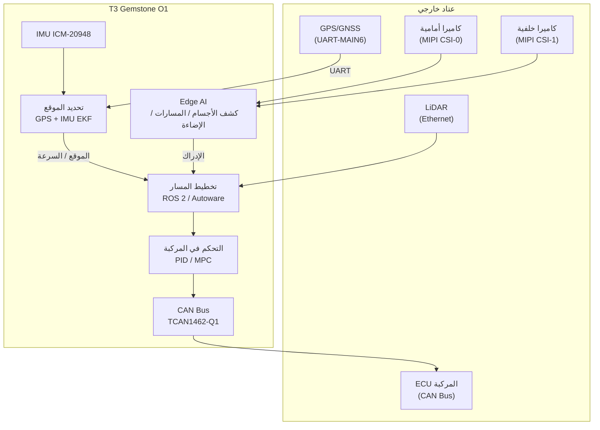

## 1\. نظرة عامة

[مسابقة Teknofest Robotaksi للمركبات ذاتية القيادة للركاب](https://teknofest.org/tr/yarismalar/robotaksi-binek-otonom-arac-yarismasi/),
تُنظم لدعم تطوير تقنيات المركبات ذاتية القيادة في بلدنا.
يُتوقع من المركبات في المسابقة إكمال مهام صعود/نزول الركاب، والامتثال لقواعد المرور، وتجنب العوائق، وركن
السيارة بشكل ذاتي القيادة في مسار يحاكي ظروف حركة المرور داخل المدينة.

تُجرى المسابقة في فئتين:

- **مركبة أصلية:** يصمم الفريق المركبة والبرنامج من الصفر ويصنعهما.
- **مركبة جاهزة:** يُطوَّر برنامج أصلي على منصة مركبة كهربائية مجهزة بالكامل توفرها TEKNOFEST.

تقدم T3 Gemstone O1 منصة شاملة من طرف إلى طرف لكلتا الفئتين بفضل مسرّع Edge AI ودعم الكاميرات المتعددة وواجهة
المركبة CAN Bus وLinux في الوقت الفعلي.

## 2\. تصميم النظام مع T3 Gemstone O1

### 2\.1\. القيادة ذاتية القيادة مع ROS 2

يتطلب برنامج المركبة ذاتية القيادة تواصل طبقات الإدراك والتحديد والتخطيط والتحكم مع بعضها البعض. أصبح ROS 2
المعيار الصناعي في برمجيات القيادة ذاتية القيادة لأنه يشغّل هذه الطبقات كعقد (nodes) مستقلة ويدير تدفق
البيانات فيما بينها. يمكن تشغيل Ubuntu 22.04 وROS 2 Humble على T3 Gemstone O1؛ وتُنفذ Autoware أو برمجيات
القيادة المطورة خصيصاً في هذه البيئة مباشرة.

| عقدة ROS 2 | المهمة |
|------------|-------|
| `perception` | دمج الكاميرا + LiDAR، كشف الأجسام/المسارات |
| `localization` | GPS + IMU EKF، مطابقة الخرائط عالية الدقة |
| `planning` | تخطيط المسار العام والمحلي، التفاعل مع العوائق |
| `control` | التحكم في التوجيه والسرعة PID/MPC |
| `vehicle_interface` | أوامر مشغلات المركبة عبر CAN Bus |

### 2\.2\. إدراك المحيط مع Edge AI

التعرف على المشاة والمركبات وعلامات المرور والمسارات بشكل متزامن في المسار هو حمل حسابي يصعب تنفيذه في الوقت
الفعلي بقوة معالجة CPU قياسية. يشغّل مسرّع الذكاء الاصطناعي المدمج بسعة 4 TOPS هذه العملية على اللوحة دون
الحاجة إلى عتاد خارجي.

| المهمة | النموذج | قوة المعالجة المطلوبة |
|-------|-------|--------------------|
| كشف المركبات / المشاة / العوائق | yolox_s_lite | 1–1,5 TOPS |
| تجزئة المسارات والطريق | deeplabv3plus_mobilenetv2_tv_edgeailite | 1–1,5 TOPS |
| التعرف على علامات / إشارات المرور | mobilenet_v2_lite | 0,5 TOPS |

لقائمة النماذج المدعومة وخطوات التجميع راجع صفحة [تحضير النموذج](/ar/boards/o1/ai/process).

### 2\.3\. الكاميرا المزدوجة مع MIPI CSI

لا يمكن للكاميرا الواحدة تغطية الرؤية الأمامية والخلفية في الوقت نفسه؛ كما أن رؤية مؤخرة المركبة تحظى بأهمية
حرجة أثناء مناورات الركن. يتيح منفذا MIPI CSI بأربع مسارات (4-lane) إعداد كاميرا مزدوجة مثل كاميرا أمامية
بزاوية عريضة وكاميرا خلفية بزاوية ضيقة. تُغذى تدفقات الكاميرا في مسار Edge AI ومواضيع ROS 2
`/image_raw`.

لإعداد الكاميرا راجع صفحة [الكاميرا](/ar/boards/o1/peripherals/camera).

### 2\.4\. التحديد مع GPS وIMU

لا يمكن لـ GPS وحده توفير تحديث موقع عالي التردد؛ فهو يتأخر عند تغيرات السرعة أو الاتجاه المفاجئة. لذلك
تُدمج بيانات IMU القادمة من ICM-20948 المدمج (9 محاور) مع GPS عبر EKF للحصول على تقدير عالي التردد للموقع
والسرعة والاتجاه. تُوصَّل وحدة GPS الخارجية عبر UART-MAIN6، والبوصلة الخارجية عبر I2C-MCU0. يُنصح بـ
RTK-GPS في الحالات التي تتطلب تحديد موقع دقيق.

للتفاصيل حول IMU راجع صفحة [IMU](/ar/boards/o1/peripherals/imu).

### 2\.5\. التحكم في المركبة مع CAN Bus

تنتظر وحدات ECU في جسم المركبة أوامر الوقود والفرملة والتوجيه عبر بروتوكول CAN القياسي؛ لذلك يجب أن تتواصل
طبقة البرنامج عبر CAN أيضاً. ينقل محول CAN FD من النوع TCAN1462-Q1 على اللوحة هذه الأوامر إلى وحدات ECU في
المركبة ويقرأ قياسات السرعة والحالة القادمة من المركبة.

لإعداد CAN Bus راجع صفحة [CAN Bus](/ar/boards/o1/peripherals/canbus).

### 2\.6\. التحكم في الوقت الفعلي

لا تضمن نواة Linux القياسية جدولة العمليات؛ فعند الحمل العالي للنظام قد يزداد تأخير حلقة التحكم مما يؤدي إلى
انعدام أمان القيادة. مع رقعة PREEMPT-RT Linux يُوفَّر تأخير حتمي؛ ويمكن تثبيت عقد حلقة التحكم على أنوية CPU
محددة.

راجع صفحة [PREEMPT-RT](/ar/projects/preempt-rt).

### 2\.7\. المحاكاة

لا يمكن تطبيق اختبارات المركبة الحقيقية في كل مرحلة لأنها تتطلب شروط مساحة ومعدات وأمان. يمكن اختبار برمجيات
ROS 2 العاملة على T3 Gemstone O1 مباشرة مع محاكيات Gazebo أو CARLA للتحقق من الخوارزميات قبل نقلها إلى
المركبة الحقيقية.

## 3\. مثال على بنية النظام

## 4\. المراجع التقنية

<CardGroup cols={2}>
  <Card title="مواصفات اللوحة" icon="microchip" href="/ar/boards/o1/introduction">
    معالج TI AM67A وذاكرة RAM بسعة 4 GB وتخزين eMMC بسعة 32 GB والقائمة الكاملة للمستشعرات والواجهات
  </Card>
  <Card title="Edge AI" icon="microchip-ai" href="/ar/boards/o1/ai/introduction">
    مسرّع AI بسعة 4 TOPS وتجميع النماذج ومسار اكتشاف الأجسام
  </Card>
  <Card title="CAN Bus" icon="network-wired" href="/ar/boards/o1/peripherals/canbus">
    محول CAN FD من النوع TCAN1462-Q1 ودمج اتصالات المركبة
  </Card>
  <Card title="Linux في الوقت الفعلي" icon="clock" href="/ar/projects/preempt-rt">
    توقيت حتمي مع رقعة PREEMPT-RT
  </Card>
</CardGroup>

## 5\. روابط مفيدة

- [صفحة مسابقة Teknofest Robotaksi](https://teknofest.org/tr/yarismalar/robotaksi-binek-otonom-arac-yarismasi/)
- [توثيق Autoware](https://autowarefoundation.github.io/autoware-documentation/)
- [توثيق ROS 2 Humble](https://docs.ros.org/en/humble/)
- [محاكي CARLA](https://carla.org/)
- [منتدى مجتمع T3 Gemstone](https://community.t3gemstone.org/)
