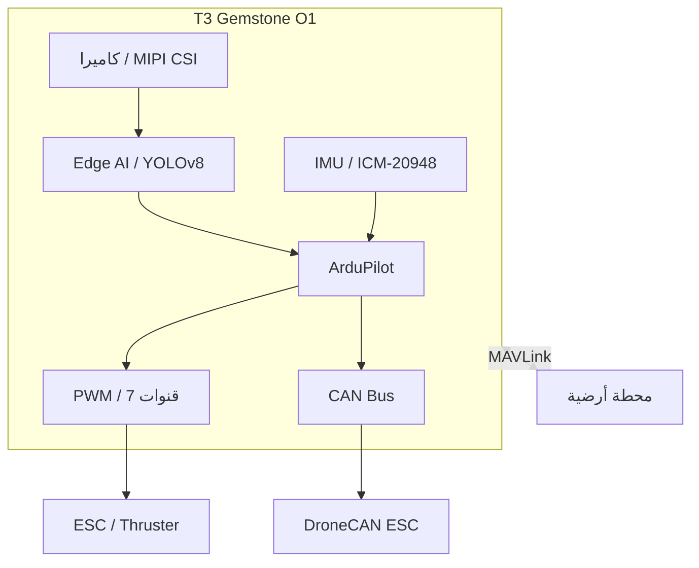

## 1\. نظرة عامة

[مسابقة Teknofest للأنظمة غير المأهولة تحت الماء](https://www.teknofest.org/tr/yarismalar/insansiz-su-alti-sistemleri-yarismasi/),
هي مسابقة وطنية تغطي عمليات تصميم وإنتاج واختبار المركبات تحت الماء (ROV/AUV) القادرة على تنفيذ مهام
تُتحكم بها عن بعد و/أو بشكل ذاتي القيادة. تقدم لوحة تطوير T3 Gemstone O1 منصة شاملة من طرف إلى طرف لهذه
المسابقة بفضل قدرتها المعالجة القوية ومستشعراتها المدمجة ومسرّع Edge AI ودعم ArduPilot.

## 2\. منصة المسابقة مع T3 Gemstone O1

تقدم T3 Gemstone O1 جميع القدرات الأساسية اللازمة لتطوير ROV (مركبة تُشغَّل عن بعد) وAUV (مركبة ذاتية
القيادة تحت الماء) على لوحة واحدة.

### 2\.1\. التحكم في المركبات تحت الماء مع ArduPilot

تتضمن حزمة [ArduPilot](/ar/projects/ardupilot) المثبتة مسبقاً على T3 Gemstone O1 أداة ArduSub المطورة خصيصاً
للمركبات تحت الماء. تُوفَّر الوظائف الحرجة مثل التثبيت وتثبيت العمق وتخطيط المهام ذاتية القيادة مباشرة عبر
هذه الطبقة.

<Warning>
يمكن تفعيل خدمة مركبة واحدة فقط من ArduPilot في الوقت نفسه.
تأكد من تعطيل جميع الخدمات الأخرى عدا ArduSub للمركبة تحت الماء.
</Warning>

### 2\.2\. اكتشاف الأجسام تحت الماء مع Edge AI

يوفر مسرّع الذكاء الاصطناعي بسعة 4 TOPS في T3 Gemstone O1 قوة معالجة كافية لإجراء اكتشاف الأجسام في الوقت
الفعلي على صور الكاميرا تحت الماء. متطلبات الذكاء الاصطناعي النموذجية للمهام التي تُواجه كثيراً في سيناريوهات
المسابقة:

| المهمة | قوة المعالجة المطلوبة |
|-------|--------------------|
| اكتشاف الأجسام (YOLOv8s، كشف العوائق تحت الماء) | 1–2 TOPS |
| التعرف على الأهداف بناءً على اللون/الشكل | 0.5–1 TOPS |
| تقدير العمق (كاميرا أحادية) | 1.5–2 TOPS |

يمكن تجميع هذه النماذج وتحميلها على T3 Gemstone O1 عبر سلسلة أدوات TI EdgeAI الموضحة في [قسم Edge AI](/ar/boards/o1/ai/introduction).

### 2\.3\. التصوير تحت الماء مع كاميرا MIPI CSI

يوفر منفذا MIPI CSI بأربع مسارات (4-lane) على اللوحة واجهة مباشرة لوحدات الكاميرا تحت الماء. وحدات الكاميرا
الشائعة مثل Raspberry Pi Camera V2 متوافقة مع T3 Gemstone O1. يمكن دمج تدفق الكاميرا مع نظام صور ArduSub
ومع مسار Edge AI على حد سواء.

لإعداد الكاميرا راجع صفحة [الكاميرا](/ar/boards/o1/peripherals/camera).

### 2\.4\. التحكم في الدوافع مع PWM

يمكن استخدام قنوات PWM العتادية السبع الموجودة في رأس GPIO ذي 40 طرفاً في T3 Gemstone O1 لتوليد إشارات
ESC (وحدة التحكم الإلكتروني في السرعة) للدوافع مثل BlueRobotics T200 أو ما يشابهها. بهذه الطريقة يمكن للوحة
التحكم في الدوافع عبر ArduSub وعبر تطبيقات Python/C مباشرة.

لإعداد PWM راجع صفحة [PWM](/ar/boards/o1/peripherals/pwm).

### 2\.5\. اتصال ESC مع CAN Bus

يوفر محول CAN FD من النوع TCAN1462-Q1 على اللوحة إمكانية الدمج مع وحدات ESC الذكية الداعمة لبروتوكول
UAVCAN/DroneCAN. بهذه الطريقة يمكن قراءة قياسات الدافع عن بعد (التيار، السرعة، الحرارة) مباشرة عبر ArduSub.

لإعداد CAN Bus راجع صفحة [CAN Bus](/ar/boards/o1/peripherals/canbus).

### 2\.6\. التحكم في اتجاه المركبة وتوازنها مع IMU

يستخدم مستشعر ICM-20948 المدمج في اللوحة (مقياس تسارع + جيروسكوب + مقياس مغناطيسية) مباشرة من قِبل ArduSub
لقياس اتجاه المركبة تحت الماء (pitch وroll وyaw). بهذه الطريقة تُوفَّر وظيفتا التثبيت وتثبيت العمق دون الحاجة
إلى وحدة IMU خارجية.

لمزيد من المعلومات حول IMU راجع صفحة [IMU](/ar/boards/o1/peripherals/imu).

### 2\.7\. تنفيذ المهام في الوقت الفعلي

يحظى توقيت المهام بأهمية حرجة في المركبات تحت الماء. تكتسب T3 Gemstone O1 خاصية التأخير الحتمي (deterministic)
مع رقعة PREEMPT-RT Linux. يوفر ذلك توقيتاً متسقاً خاصة في مهام الغوص ذاتية القيادة وحلقات قراءة المستشعرات.

لتثبيت Linux في الوقت الفعلي راجع صفحة [PREEMPT-RT](/ar/projects/preempt-rt).

### 2\.8\. اتصال المحطة الأرضية

يمكن أن يعمل ArduPilot مع برمجيات تحكم أرضية متنوعة عبر بروتوكول MAVLink. تبث اللوحة MAVLink عبر USB Ethernet؛
وللاتصال اللاسلكي يمكن استخدام Wi-Fi (802.11n) أو وحدة راديو قياس عن بعد خارجية.

| البرنامج | المنصة | الميزة |
|---------|----------|---------|
| [QGroundControl](https://qgroundcontrol.com/) | Windows, Linux, macOS, Android, iOS | سهل الاستخدام، دعم الأجهزة المحمولة |
| [Mission Planner](https://ardupilot.org/planner/) | Windows | محرر معاملات ومهام متقدم |
| [MAVProxy](https://ardupilot.org/mavproxy/) | Linux, macOS | سطر الأوامر، توجيه اتصالات متعددة |
| تطبيق مخصص | أي | يمكن كتابته من الصفر بلغة Python باستخدام [pymavlink](https://github.com/ArduPilot/pymavlink) |

## 3\. مثال على بنية النظام

يلخص المخطط التالي المكونات الأساسية لمركبة ROV مبنية على T3 Gemstone O1 وتدفق البيانات فيما بينها.
تُعالج صورة الكاميرا في طبقة Edge AI وتُرسل إلى ArduPilot مع بيانات IMU؛ بينما يدير ArduPilot الدوافع عبر PWM
وCAN Bus. تتواصل المحطة الأرضية عبر بروتوكول MAVLink.

## 4\. المراجع التقنية

<CardGroup cols={2}>
  <Card title="مواصفات اللوحة" icon="microchip" href="/ar/boards/o1/introduction">
    معالج TI AM67A وذاكرة RAM بسعة 4GB وتخزين eMMC بسعة 32GB والقائمة الكاملة للمستشعرات والواجهات
  </Card>
  <Card title="ArduPilot" icon="drone" href="/ar/projects/ardupilot">
    دليل تثبيت ArduPilot وجدول تخطيط أطراف PWM واتصال QGroundControl
  </Card>
  <Card title="Edge AI" icon="microchip-ai" href="/ar/boards/o1/ai/introduction">
    مسرّع AI بسعة 4 TOPS وتجميع النماذج ومسار اكتشاف الأجسام
  </Card>
  <Card title="Linux في الوقت الفعلي" icon="clock" href="/ar/projects/preempt-rt">
    توقيت حتمي مع رقعة PREEMPT-RT
  </Card>
</CardGroup>

## 5\. روابط مفيدة

- [صفحة مسابقة Teknofest للأنظمة غير المأهولة تحت الماء](https://www.teknofest.org/tr/yarismalar/insansiz-su-alti-sistemleri-yarismasi/)
- [توثيق ArduPilot](/ar/projects/ardupilot)
- [توثيق ArduSub](https://www.ardusub.com/)
- [تحميل QGroundControl](https://qgroundcontrol.com/)
- [BlueRobotics (الدوافع ووحدات ESC)](https://bluerobotics.com/)
- [منتدى مجتمع T3 Gemstone](https://community.t3gemstone.org/)
