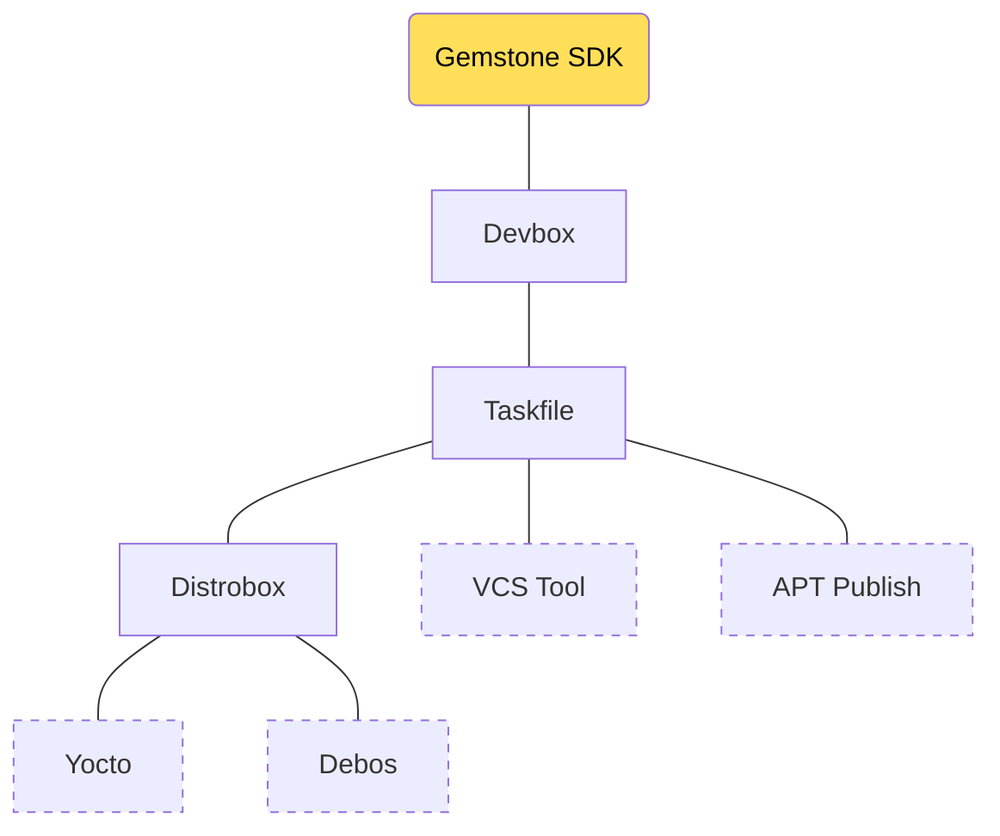
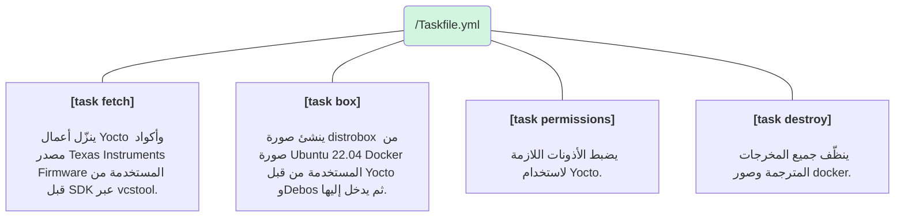
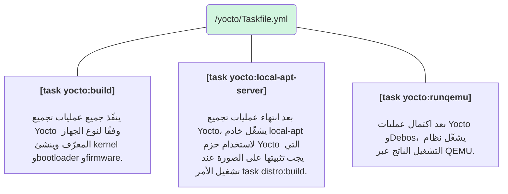
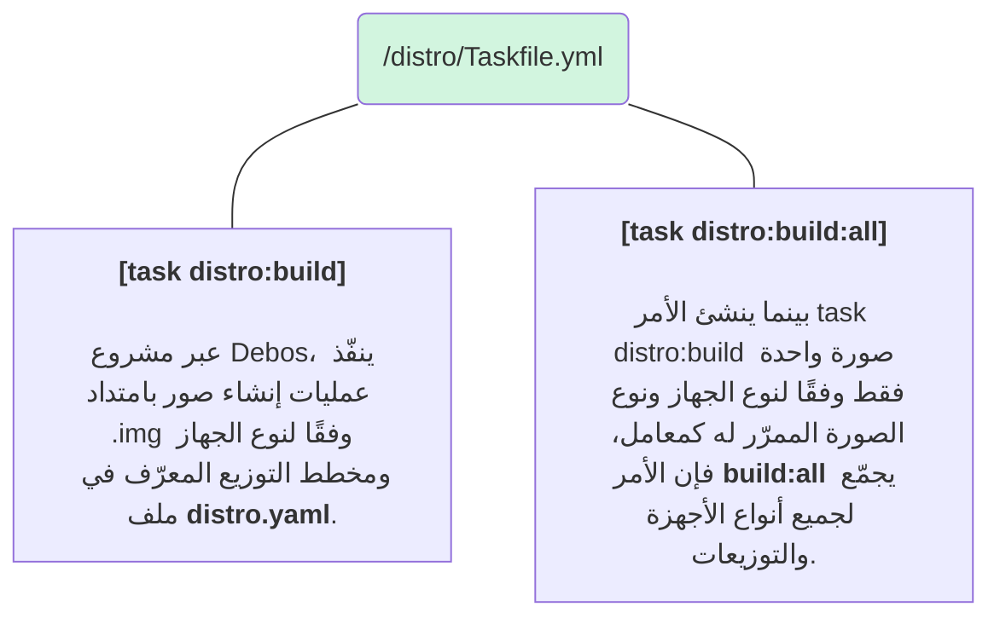

import SnippetSdkCompDirLayout from '/snippets/sdk/comp/dir-layout.mdx';
import SnippetSdkCompExampleCmd from '/snippets/sdk/comp/example-cmd.mdx';

<Note>
في هذا القسم سيتم التطرّق إلى الاستخدام المفصّل لجميع الأدوات الموجودة في [SDK](../faq#ما-هو-sdk) الخاص بـGemstone
وسبب تفضيلها.
</Note>

<Tip>
في نهاية القسم ستكتسب خبرة في المواضيع التالية.

* وظيفة مشروع SDK وبنية المجلدات
* استخدام أدوات مثل Devbox وDistrobox وTaskfile وVCS Tool وDebos وDebootstrap.
</Tip>

# 1\. تمهيد

كما هو معروف، فإن Linux هو نواة (Kernel) نظام تشغيل مفتوحة المصدر. أما نظام التشغيل فهو كلٌّ يضم عشرات التطبيقات
المختلفة مثل النواة (Kernel) وShell وتطبيقات سطح المكتب ومدير النوافذ ومحررات النصوص والمتصفح وأدوات النظام وخدمات
النظام. وعلى عكس أنظمة التشغيل مثل Windows، لا يتم توزيعه من جهة تصنيع واحدة، بل يمكن للمؤسسات المختلفة تجميعه
وترتيبه ونشره بحرّية تحت أسماء مختلفة. على سبيل المثال: أنظمة التشغيل مثل [Ubuntu](https://ubuntu.com/) و
[Debian](https://www.debian.org/) و[Pardus](https://pardus.org.tr/) و[Fedora](https://www.fedoraproject.org/) و
[openSUSE](https://www.opensuse.org/) تحتوي جميعها على نواة Linux، مع اختلاف أدوات GNU والبرمجيات مفتوحة المصدر
أو الإصدارات. 

تُسمى أنظمة التشغيل هذه المحتوية على Linux في الغالب باسم [Distro](../faq#ما-هي-distro) (التوزيعة). ونظرًا لأن أغلب
البرمجيات مفتوحة المصدر الموجودة فيها هي من أعمال GNU (www.gnu.org)، يفضّل مجتمع المصادر المفتوحة تسميتها بـ
[GNU/Linux](https://opensource.stackexchange.com/questions/1025/why-do-some-people-refer-to-linux-as-gnu-linux).

يؤدي هذا الوضع إلى تنوّع كبير وإمكانيات تخصيص وقوة، لكنه قد يسبّب أيضًا حالات عدم توافق وأخطاء بسبب استخدام إصدارات
برمجية مختلفة. على سبيل المثال، قد تختلف المكتبات التي يستخدمها محرر نصوص في إصدارَي Ubuntu 22 و
Ubuntu 24 عن تلك الموجودة في [Fedora Workstation 42](https://fedoraproject.org/workstation/download).

أما الأدوات المستخدمة في Gemstone SDK، وخاصة أدوات مثل [Yocto](https://www.yoctoproject.org/)، فتدعم إصدارات محددة من
توزيعات GNU/Linux، وتُوضّح هذه الأمور في وثائق المشاريع المعنية.

ولتقليل التعقيد الذي تخلقه هذه الاختلافات للمستخدمين المبتدئين، استُفيد في [SDK](../faq#ما-هو-sdk) الخاص بـGemstone من
حلول مثل Devbox وDistrobox لبيئة التطوير. تتيح هذه الأدوات استخدام الإصدارات المناسبة من البرمجيات المطلوبة بالبنية
نفسها على جميع الأنظمة، بغضّ النظر عن توزيعة GNU/Linux أو إصدارات التوزيعات!

<Note>
ولضرب مثال على هذا الوضع، عند تثبيت المكتبة المسماة [fmt](https://github.com/fmtlib/fmt) بالأمر
`sudo apt install libfmt-dev` على Ubuntu 22.04، فقد يختلف الإصدار الموجود في نظامك عن الإصدار الذي يُثبَّت بالأمر
`sudo dnf install libfmt-dev` على Fedora. لذا عند تطوير البرمجيات، يتعيّن على من ينزّلون أكوادك ويجمّعونها توفير
الإصدارات المناسبة.
</Note>

# 2\. مقدمة

[Devbox](https://www.jetify.com/devbox): نظام إدارة حزم مفتوح المصدر أُنشئ لتقليل الاختلافات المحتملة للبرمجيات ذات
الإصدارات المختلفة في التوزيعات وتعقيد التطوير. يتيح استخدام إصدارات البرمجيات نفسها عبر توزيعات مثل Ubuntu وFedora.

<Note>
إذا كنت ترغب في استخدام الإصدار رقم 10.0 من QEMU عبر Devbox وكانت هناك إصدارات مختلفة متاحة في مديري الحزم
الافتراضيين لـUbuntu وPardus وDebian، يصبح Devbox أداة مساعدة مناسبة جدًا.
</Note>

استُخدم Devbox في Gemstone SDK حتى لا تكون هناك حاجة لأعمال خاصة بكل توزيعة عند تثبيت البرمجيات المطلوبة، ويُكتب في
الملف `sdk/devbox.json` البرمجيات المستخدمة.

[Distrobox](https://distrobox.it/): يتيح تشغيل الإصدار المطلوب من توزيعات GNU/Linux المختلفة على نظام GNU/Linux الذي
تستخدمه بالاستفادة من تقنيات الحاويات مثل Docker. (على سبيل المثال، يمكنك استخدام Ubuntu 22.04 عبر الطرفية من خلال
Distrobox أثناء استخدامك لـFedora 42)

[Taskfile](https://taskfile.dev/): عند تشغيل أوامر السكربتات، تُستخدم غالبًا تطبيقات صغيرة تسمى سكربتات بامتداد **.sh**.
ومع مرور الوقت، يؤدي تزايد هذه السكربتات/سكربتات الـShell إلى نشوء تعقيد وصعوبة في الاستخدام. لتقليل هذه الصعوبات،
استُخدمت الأداة المسماة Task (المعروفة باسم Go-Task/Task أو Taskfile)، والتي تتيح كتابة السكربتات التي ستُشغَّل في ملفات
بامتداد **.yml** على شكل أجزاء صغيرة، وتصنيفها، واستخدام ميزات إضافية مثل الإكمال التلقائي عند الضغط على مفتاح `<tab>`
في الطرفية. يوجد ملف Taskfile الأساسي لـSDK في `sdk/Taskfile.yml`.

# 3\. مكوّنات SDK

يتمثل الغرض الأساسي من **Gemstone SDK** في إنشاء جميع الصور الأساسية (النواة Linux Kernel ومحمل الإقلاع Bootloader
والبرمجيات الثابتة Firmware والمشغّل Driver) وصور نظام التشغيل (التي تحتوي على جميع التطبيقات التي تستخدمها) الموجودة
على لوحات تطوير Gemstone؛ وبيان بنيته في المخطط التالي.

### 3\.1\. بنية المجلدات

<SnippetSdkCompDirLayout />

| المجلد              | الوصف |
| :--------------     | :------- |
| /build              | هو المجلد الذي يحتوي على جميع المخرجات التي تنتجها Yocto وDebos وأدوات التجميع الأخرى |
| /distro             | هو المجلد الذي يحتوي على الإعدادات وملفات التخصيص التي تحدد كيفية تجميع صور Gemstone المختلفة مثل Desktop وMinimal |
| /yocto              | أعمال Yocto الخاصة بمشروع Gemstone |
| /src                | هو المجلد الذي يحتوي على أكواد المصدر الخاصة بالبرمجيات الثابتة (Firmware) للوحة التطوير المحتوية على رقاقات مثل Texas Instruments، أو المشاريع الخارجية |

| الملف               | الوصف |
| :--------------     | :------- |
| repos.yml           | هو الملف الذي يحتوي على عناوين مستودعات git وغيرها لأكواد المصدر لجميع المشاريع الخارجية التي يحتاجها Gemstone SDK. تُنزَّل أكواد المصدر إلى هذا المجلد بإجراء عملية `fetch` عبر تطبيق يسمى vcstool |
| distrobox.ini       | هو ملف الإعداد الذي ينشئ حاوية docker بنظام Ubuntu 22.04 باستخدام الأداة المسماة Distrobox |
| Taskfile.yml        | يتيح ملف taskfile الموجود في كل مجلد تشغيل أوامر السكربتات بصيغة `task مجلد:أمر` |
| devbox.json         | هو ملف إعداد Devbox |
| /distro/distro.yaml | هو ملف إعداد Debos الذي ينشئ صور Gemstone المسماة Desktop وMinimal وKiosk بتخصيصها |

### 3\.2\. Devbox

يُثبَّت Devbox المستخدم في Gemstone SDK على نظامك بتشغيل الأمر `setup.sh` بعد استنساخ المشروع، كما ورد في
[قسم مقدمة SDK](./introduction#1-3-تثبيت-المتطلبات). بعد ذلك، عند تشغيل الأمر `devbox shell` من الطرفية داخل المجلد،
يتم تفعيله وينزّل الحزم **Distrobox وTaskfile وVSCTool وQemu** المعرّفة في الملف `devbox.json` إلى المجلد `sdk/.devbox`،
ويفعّل الـShell حتى تتمكن من استخدام البرمجيات الموجودة داخله.

يتمثل الغرض الأساسي من استخدامه في تثبيت واستخدام التطبيقات والحزم المساعدة ذات الإصدار نفسه عبر توزيعات GNU/Linux
المختلفة بنظام مشترك.

<Tip>
انقر على [هذا الرابط](https://www.jetify.com/docs/devbox/quickstart/) لاستعراض التطبيق وإجراء التمارين، ثم اطّلع على
الملف `sdk/devbox.json`.
</Tip>

### 3\.3\. Taskfile

عند تشغيل أوامر مثل `task fetch yocto:build distro:build` من الطرفية أثناء استخدام Gemstone SDK، تُنفَّذ الدوال المعرّفة
في الملفات `sdk/Taskfile.yml sdk/yocto/Taskfile.yml sdk/distro/Taskfile.yml`.

<Note>
يُثبَّت التطبيق المسمى Taskfile على نظامك بواسطة Devbox لأنه معرّف في ملف devbox.json.
</Note>

في المخططات التالية مُلخّص لجميع دوال Task التي يستخدمها SDK.

<SnippetSdkCompExampleCmd />

#### 3\.3\.1\. الدوال الأساسية

<Card>

</Card>

#### 3\.3\.2\. دوال Yocto

<Card>

</Card>

#### 3\.3\.3\. دوال Distro

<Card>

</Card>

<Tip>
انقر على [هذا الرابط](https://taskfile.dev/installation/) لاستعراض التطبيق وإجراء التمارين، ثم اطّلع على الملف
`sdk/distro/Taskfile.yml`.
</Tip>

### 3\.4\. VCS Tool

بدلًا من كتابة سكربت Bash Shell وإجراء هذه العمليات يدويًا لتنزيل أكواد المصدر من مستودعات git الخارجية التي يحتاجها
SDK، يتم تعريف المشاريع في الملف المسمى `repos.yml` ليتسنى تنزيلها بشكل منتظم. عند تشغيل الأمر `vcs import . < repos.yml`
، يتم تنزيل المشاريع المعرّفة في الملف المعني تلقائيًا أو تحديثها إن وُجدت.

<Note>
يُثبَّت التطبيق المسمى [VCS (Version Control System) Tool](https://github.com/dirk-thomas/vcstool) على نظامك بواسطة
Devbox لأنه معرّف في ملف devbox.json.
</Note>

### 3\.5\. Distrobox

يوجد داخل مجلد SDK ملف يسمى `Dockerfile`. في الظروف العادية، يمكن استخدام هذا الملف لإنشاء صورة عبر Docker واستخدام
النظام الموجود داخلها، لكن بسبب بنية Docker، فإنه عند إجراء تغييرات داخل الصورة أو تحميل ملفات وحذفها، يقوم بحذفها بعد
إعادة التشغيل، مما يجعل استخدام نظام ملفات دائم أمرًا متعبًا.

أما Distrobox فقد تم تفضيله لأنه يتيح حفظ التغييرات والملفات المرفوعة بشكل دائم بعد الدخول إلى الصور المنشأة عبر Docker.

<Tip>
انقر على [هذا الرابط](https://distrobox.it/) لاستعراض التطبيق وإجراء التمارين، ثم اطّلع على الملفين `sdk/distrobox.ini`
و`sdk/Dockerfile`.
</Tip>

### 3\.6\. ديبوس {#3-6-ديبوس}

عند تنزيل تثبيت توزيعات مثل Ubuntu أو Debian التي تستخدمها من مواقعها الإلكترونية، تأتي ككلٍّ يحتوي على جميع البرمجيات
والمشغّلات، فينتج نظام تشغيل بحجم كبير جدًا. ويمكن استخدام توزيعات مثل Ubuntu وDebian أيضًا في أعمال Linux المدمجة، لكن
يتعيّن تخصيصها وحذف التطبيقات والمكتبات غير المطلوبة. على سبيل المثال، إذا كان Ubuntu 22.04 الذي تستخدمه يشغل مساحة
25 جيجابايت، فلا يمكن استخدامه على لوحات مثل _T3-GEM-O1_.

تتيح الأداة المسماة [Debootstrap](https://wiki.debian.org/Debootstrap) اختيار الحزم المطلوبة من بين الحزم التي تتضمنها
توزيعات مثل Ubuntu وDebian وتحضير توزيعات مخصّصة. على سبيل المثال، تتيح إنشاء نسخة ubuntu/debian صغيرة جدًا لا تحتوي
على المكتبات غير المطلوبة والواجهات الرسومية، لاستخدامها على لوحات Linux المدمجة مثل _T3-GEM-O1_.

أما [Debos](https://github.com/t3gemstone/debos) فهو مشروع مكتوب بلغة Go يستخدم الأداة المسماة
[Debootstrap](https://gist.github.com/varqox/42e213b6b2dde2b636ef)، ويتيح إنشاء توزيعات مفهومة ومصنّفة بشكل أفضل بكثير
عبر ملفات بامتداد `.yaml` بدلًا من إنشاء الصور بعمليات معقدة من سطر الأوامر.

<Tip>
انقر على [هذا الرابط](https://pkg.go.dev/github.com/go-debos/debos/actions/) لإجراء المراجعة، ثم اطّلع على الملف
`sdk/distro.yaml`.
</Tip>

صُوِّرت الصور Minimal وKiosk وDesktop المنشأة عبر Gemstone SDK باستخدام Debos، وتتوفر اختياريًا بعدة إصدارات من Ubuntu
وDebian. وهي معدّة للعمل بمعماريات مختلفة وفقًا للآلات _T3-GEM-O1_ وBeagley-AI وIntel-Core-I7.

# 4\. الخاتمة

بإتمامك هذا القسم، تكون قد تعرّفت على ماهية الأدوات التي يستخدمها Gemstone SDK وسبب تفضيلها.

<Check>
قبل الانتقال إلى القسم التالي، لا تنسَ زيارة المواقع الإلكترونية لجميع الأدوات المذكورة أعلاه، وتثبيتها على حاسوبك،
ثم إجراء التمارين والتجارب!
</Check>
