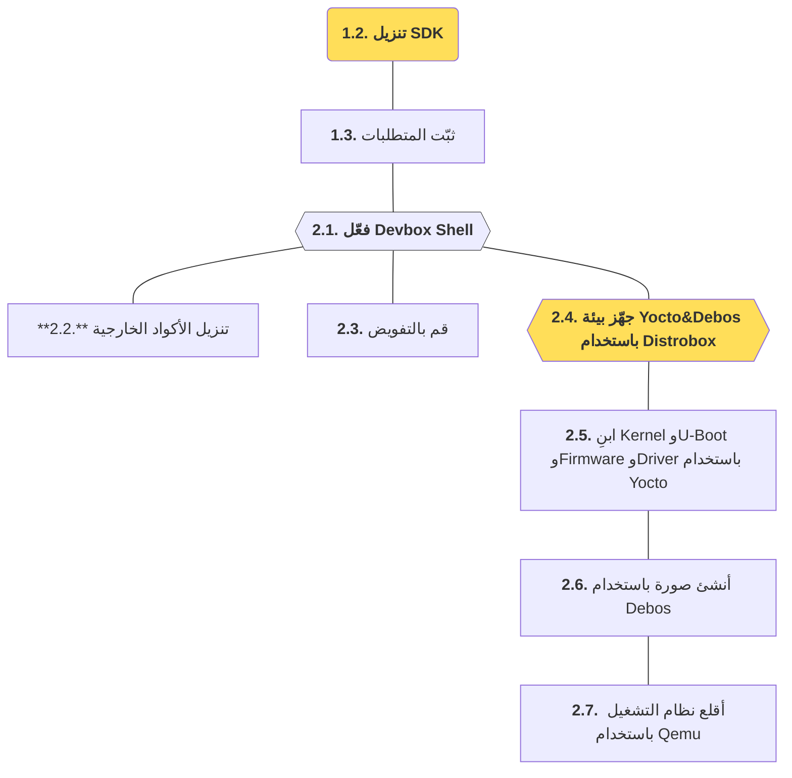

import SnippetSdkClone from '/snippets/sdk/intro/clone.mdx';
import SnippetSdkSetup from '/snippets/sdk/intro/setup.mdx';
import SnippetSdkDevboxShell from '/snippets/sdk/intro/devbox-shell.mdx';
import SnippetSdkTaskFetch from '/snippets/sdk/intro/task-fetch.mdx';
import SnippetSdkPermissions from '/snippets/sdk/intro/permissions.mdx';
import SnippetSdkTaskBox from '/snippets/sdk/intro/task-box.mdx';
import SnippetSdkTaskYocto from '/snippets/sdk/intro/task-yocto.mdx';
import SnippetSdkTaskDebos from '/snippets/sdk/intro/task-debos.mdx';
import SnippetSdkTaskQemu from '/snippets/sdk/intro/task-qemu.mdx';

في هذا القسم سيتم تنزيل [مشروع SDK](https://github.com/t3gemstone/sdk.git) إلى حاسوب المطوّر وتجميع صور Gemstone. وسيتم شرح
كيفية إجراء عملية التجميع على المستوى الأساسي بغرض **التدرّب**. أما في الأقسام التالية فسيتم تفصيل جميع هذه الأدوات
التي استُخدمت كتمرين.

<Tip>
في نهاية القسم ستكتسب خبرة في المواضيع التالية.

* تجربة الاستخدام الأساسي لمكوّنات SDK
* إجراء تجميعات النواة (Kernel) وU-Boot والبرمجيات الثابتة (Firmware) والصور باستخدام Gemstone SDK
* استخدام توزيعات GNU/Linux مختلفة على حاسوبك الخاص باستخدام أدوات مثل Docker وDistrobox.
</Tip>

<Note>
يُعدّ مشروع SDK الجزء الذي يحتوي على أكثر المعلومات التقنية كثافةً في البنية البرمجية لـGemstone. وهو **غير مطلوب**
لتطوير البرمجيات باستخدام لوحة التطوير؛ إذ يشرح مواضيع تقنية مثل كيفية إنشاء نظام التشغيل الخاص بـGemstone.
إذا كنت ترغب فقط في تطوير المشاريع باستخدام لوحات التطوير ولم تكن مهتمًا بهذه المواضيع، فيمكنك تخطّي هذا القسم.
الجمهور المستهدف من هذا القسم هو من يريدون أن يصبحوا **مطوّري Gemstone**.
</Note>

<Steps>
  <Step title="تنزيل SDK">
    نزّل مشروع SDK بإجراء عملية `git clone` على Ubuntu
  </Step>
  <Step title="تثبيت المتطلبات">
    ثبّت المتطلبات لتتمكن من إجراء عملية التجميع بتشغيل السكربت المسمى `setup.sh`
  </Step>
  <Step title="إنشاء الصورة">
    أنشئ صورة Gemstone باستخدام الأدوات الموجودة داخل SDK
  </Step>
  <Step title="استخدام QEMU">
    شغّل الصورة الناتجة كآلة افتراضية عبر QEMU
  </Step>
</Steps>

# 1\. التحضير

تمت عمليات التجميع على حاسوب يعمل بتوزيعة Ubuntu 22.04 من GNU/Linux. ورغم إمكانية استخدام توزيعات مثل Debian وFedora
وPardus أيضًا، فإن Ubuntu 22 أو Ubuntu 24 سيكونان أكثر ملاءمة لمن يستخدمون أدوات تجميع مماثلة لأول مرة.

### 1\.1\. متطلبات الحاسوب

1. حاسوب يعمل بنظام Ubuntu 22 أو Ubuntu 24
2. ذاكرة RAM لا تقل عن 16 جيجابايت
3. مساحة قرص فارغة متاحة لا تقل عن 256 جيجابايت

يحتاج Gemstone SDK إلى أدوات مثل `Docker` و`Devbox`. وبعد استنساخ مشروع SDK بالأوامر التالية، يقوم السكربت المسمى
`setup.sh` الموجود داخله بهذه التثبيتات تلقائيًا.

<Card>

</Card>

### 1\.2\. تنزيل SDK

افتح الطرفية (Terminal) في أي مجلد على Ubuntu واستنسخ المشروع بالأمر `git clone` كما يلي.

<SnippetSdkClone />

### 1\.3\. تثبيت المتطلبات {#1-3-تثبيت-المتطلبات}

بعد عملية الاستنساخ، ادخل إلى المجلد بالأمر `cd sdk` من شاشة الطرفية نفسها، ثم قم بتشغيل السكربت `setup.sh`.

<SnippetSdkSetup />

<Warning>
إذا لم يكن التطبيق المسمى Docker مثبتًا في نظامك من قبل؛ أي إذا كنت تثبّته لأول مرة، فلا تنسَ تسجيل الخروج من جلسة
مستخدم الحاسوب ثم تسجيل الدخول مرة أخرى.
</Warning>

# 2\. التجميع

بعد إتمام سكربت تثبيت المتطلبات، يمكنك بدء خطوات التجميع بتفعيل Devbox Shell من الطرفية أثناء وجودك داخل مجلد sdk.

### 2\.1\. تفعيل وحدة تحكم Devbox

قم بتفعيل **Devbox**، وهو نظام إدارة حزم برمجية قد يحتوي على إصدارات مختلفة عن حزم Ubuntu، لإتمام عمليات التنزيل
والتثبيت اللازمة لـGemstone SDK.

<SnippetSdkDevboxShell />

### 2\.2\. تنزيل أكواد المشاريع الخارجية

يتم تنزيل جميع أكواد المصدر التي يحتاجها SDK أثناء التجميع من خلال الأمر `task fetch` أدناه. يمكنك الاطّلاع على
ماهية هذه المشاريع المنزّلة من الملف `sdk/repos.yml`.

<SnippetSdkTaskFetch />

### 2\.3\. إجراء عمليات الترخيص

لا تتم أعمال تجميع نظام التشغيل بمشروع Yocto مباشرة على نظام Ubuntu الذي تستخدمه، بل عبر أداة تسمى Distrobox.
قم بالترخيص من خلال الأمر التالي لتتمكن من استخدام Yocto داخل Distrobox.

<SnippetSdkPermissions />

### 2\.4\. تجهيز بيئة التجميع

قم بعملية تثبيت Distrobox من خلال الأمر التالي.

<SnippetSdkTaskBox />

قرب نهاية عملية التثبيت، سيُطلب منك تعيين كلمة مرور لبيئة distrobox الخاصة بك عبر `⚠️  First time user password setup ⚠️`.
يمكنك اختيار كلمة مرور من حرف واحد تختلف عن كلمة مرور حاسوبك لتتمكن من تمييز وحدة التحكم التي تعمل فيها أثناء عمليات
التجميع. أخيرًا، عندما ترى السطر `🚀 distrobox:workdir>`، تكون جاهزًا لتجميع Yocto والصورة!

### 2\.5\. تجميع البرمجيات الأساسية باستخدام Yocto

تحتوي مجموعة أدوات المطوّر SDK على عدد من المعاملات لتتمكن من التجميع لمعماريات وأنظمة تشغيل مختلفة. على سبيل المثال،
بينما طراز Gemstone _T3-GEM-O1_ هو هدف (target) بمعمارية aarch64، يمكنك اختيار `intel-corei7-64` لحاسوب Ubuntu
الذي تستخدمه لتشغيل ملفات الصورة الناتجة مباشرة على حاسوبك الخاص. عمليات التجميع التالية أُجريت لمعمارية
`intel-corei7-64`، وشُرحت بطريقة تتيح لك تشغيل هذه الصور مباشرة من حاسوبك عبر تطبيق المحاكاة الافتراضية المسمى QEMU.

<Warning>
قد تستغرق هذه العمليات حوالي 5 ساعات اعتمادًا على أداء حاسوبك.
</Warning>

<SnippetSdkTaskYocto />

### 2\.6\. تجميع صورة نظام التشغيل باستخدام Debos

عند اكتمال تجميع Yocto في القسم أعلاه، تتكوّن البرمجيات الأساسية مثل النواة (Kernel) ومحمل الإقلاع (Bootloader)
والبرمجيات الثابتة (Firmware). أما Debos/Debootstrap فيُنشئ نظام التشغيل ويدمجه مع البرمجيات الأساسية لتحضير ملف الصورة
ذي الامتداد **.img**.

<SnippetSdkTaskDebos />

### 2\.7\. تشغيل الصورة المجمّعة عبر QEMU

لتشغيل ملف الصورة الذي أنشأته كآلة افتراضية عبر QEMU قبل تحميله على لوحات Gemstone، نفّذ الأمر التالي وتجوّل داخل
نظام التشغيل!

<SnippetSdkTaskQemu />

<Frame caption="تشغيل صورة Gemstone عبر QEMU.">
  <video controls className="w-full aspect-video" src="../../videos/gemstone-qemu.mp4"></video>
</Frame>

<Tip>اسم مستخدم QEMU: **gemstone** كلمة المرور: **t3**</Tip>

# 3\. الخاتمة

بإتمامك هذا القسم، قمت بتجميع نظام التشغيل وتشغيله عبر QEMU، وتعرّفت على الأدوات التي يستخدمها مطوّرو Gemstone
والعمليات التي يتبعونها عند تجميع الأنظمة.

<Check>
قبل الانتقال إلى القسم التالي، حاول تذكّر جميع العمليات التي تعلّمتها أعلاه دون النظر إلى هذه الصفحة قدر الإمكان،
وجرّب إجراء عملية التجميع.
</Check>
