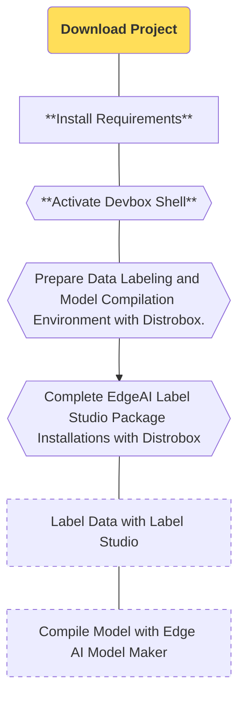

import SnippetSdkClone from '/snippets/ai/clone.mdx';
import SnippetSdkSetup from '/snippets/ai/setup.mdx';
import SnippetSdkDevboxShell from '/snippets/ai/devbox-shell.mdx';
import SnippetSdkTaskBox from '/snippets/ai/task-box.mdx';
import SnippetSdkInstallShell from '/snippets/ai/task-install.mdx';

In this section, the [edgeai-tensorlab](https://github.com/t3gemstone/edgeai-tensorlab.git) project will be downloaded to the developer's computer, and the tools that can be used on the development board will be installed.

<Tip>
By the end of this section, you will have experience in the following topics.

* Experiencing the basic usage of edgeai-tensorlab components
* Performing data labeling and model compilations with edgeai-tensorlab
</Tip>

<Steps>
  <Step title="Download edgeai-tensorlab">
    Download the edgeai-tensorlab project by performing `git clone` on Ubuntu
  </Step>
  <Step title="Install Requirements">
    Install the requirements to perform the compilation process by running the script named `setup.sh`
  </Step>
  <Step title="Complete Library Installations">
    Complete the installation of the tools inside edgeai-tensorlab to prepare the system
  </Step>
</Steps>

# 1. Preparation

Compilation operations were performed with a computer containing the Ubuntu 22.04 GNU/Linux distribution. While it is possible to use distributions such as Debian, Fedora, Pardus, Ubuntu 22 or Ubuntu 24 will be more suitable for those using such compilation tools for the first time.

### 1.1. Computer Requirements

1. Ubuntu 22 or Ubuntu 24 computer
2. At least 8GB RAM
3. At least 10GB of available free disk space

The Gemstone SDK requires tools like `Docker` and `Devbox`. After cloning the SDK project with the following commands, the `setup.sh` script inside it performs these installations automatically.

<Frame>

</Frame>

### 1.2. Download the Project

Open a Terminal in any folder on Ubuntu and clone the project with the `git clone` command as below.

<SnippetSdkClone />

### 1.3. Install Requirements

After the cloning process, enter the folder with the `cd edgeai-tensorlab` command from the same terminal screen and run the `setup.sh` script.

<SnippetSdkSetup />

<Warning>
If the application named Docker was not previously installed on your system; if you are installing it for the first time, remember to log out and log back in to your computer user session.
</Warning>

# 2. Compilation

After completing the requirement installation script, you can start the compilation steps by activating the Devbox Shell from within the sdk folder in the Terminal.

### 2.1. Activate Devbox Console

Activate **Devbox**, a software package management system that may contain different versions from Ubuntu packages, to complete the necessary downloads and installations for edgeai-tensorlab.

<SnippetSdkDevboxShell />

### 2.2. Prepare Compilation Environment

Perform the Distrobox installation process via the following command.

<SnippetSdkTaskBox />

Towards the end of the installation process, you will be asked for `⚠️  First time user password setup ⚠️` to give a password for your distrobox environment. To distinguish which console you are in from the Terminal during compilation operations, you can choose a 1-character password different from your computer's password. Finally, when you see the `🚀 distrobox:workdir>` line, you are ready to prepare Gemstone Image Processing models!

### 2.3. Complete Package Installations

Complete the necessary installations for Label Studio and Edge AI Model Maker.

<SnippetSdkInstallShell />

# 3. End

By completing this section, you have set up the Gemstone image processing model preparation environment.

<Check>
You can proceed to the next section and start data labeling and model compilation for Gemstone boards.
</Check>
