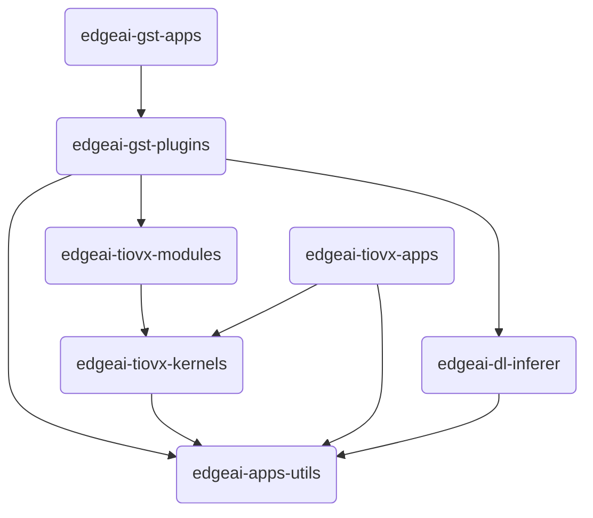

The C7x DSP cores in AM67A Series SoCs are optimized for high-performance signal and image processing tasks.
These cores can be used across a wide range of applications, from low-level to advanced, through optimized libraries provided by Texas Instruments.

### DSPLIB

DSPLIB (Digital Signal Processing Library) is a library that provides high efficiency for low-level signal processing functions.
Basic DSP algorithms such as FFT, FIR/IIR filtering, correlation, convolution, and matrix operations can be performed with hardware acceleration through this library.
These functions run at high speeds by leveraging the parallel processing capacity of the C7 cores and provide significant performance gains, especially in image pre-processing stages (e.g., noise reduction, signal filtering).

You can access the DSPLIB User Guide [here](https://software-dl.ti.com/jacinto7/esd/processor-sdk-rtos-jacinto7/11_01_00_04/exports/docs/dsplib/docs/user_guide/index.html).

### VXLIB

VXLIB (Vision Acceleration Library) is a library containing low-level image processing functions, compatible with the OpenVX standard.
Basic image processing steps such as edge detection, histogram calculation, morphological operations, and color space conversions can be performed optimally with this library.
When used together with DSPLIB, VXLIB provides high efficiency in all stages of the image processing pipeline (pre-processing, feature extraction, segmentation).

You can access the VXLIB User Guide [here](https://software-dl.ti.com/jacinto7/esd/processor-sdk-rtos-jacinto7/11_01_00_04/exports/docs/vxlib_11_00_00_01/docs/user_guide/index.html).

### MATHLIB

MATHLIB is a library that provides optimized functions for basic and advanced mathematical operations (trigonometric functions, logarithmic calculations, exponential operations, square roots, vector mathematics, etc.). 
This library enables C7 cores to utilize their hardware capabilities most efficiently, particularly in real-time DSP/MCU applications involving intensive mathematical calculations.

You can access the MATHLIB User Guide [here](https://software-dl.ti.com/jacinto7/esd/processor-sdk-rtos-j722s/latest/exports/docs/mathlib/docs/user_guide/index.html).

### Potential Use Cases

When these three libraries are used together, the C7 cores on the AM67A SoC can form the basis not only for low-level processing but also for advanced applications such as complex image analytics, machine learning inference operations, and real-time image optimization.

For example:

- Signal pre-processing with DSPLIB,
- Image-based feature extraction with VXLIB,
- High-performance execution of intensive mathematical calculations with MATHLIB. 

This way, while the overall system load on the CPU is reduced, energy-efficient and real-time capable image processing and mathematical computation solutions can be developed.

## Edge AI Robotics and Software Ecosystem

The table below lists Edge AI projects provided by Texas Instruments.

### Repository Table

| Repository | Description |
|-----------|----------|
| **[edgeai-robotics-sdk](https://github.com/TexasInstruments/edgeai-robotics-sdk)** | Provides the core framework and APIs for robotics applications. Facilitates the development of robotics and computer vision applications on TI processors. |
| **[edgeai-robotics-demos](https://github.com/TexasInstruments/edgeai-robotics-demos)** | Contains ready-to-use robotics demo applications and sample code. Ideal for quick start and prototyping. |
| **[edgeai-tidl-tools](https://github.com/TexasInstruments/edgeai-tidl-tools)**  | Includes the necessary tools and examples for running deep learning models on TI processors. |
| **[edgeai-tiovx-apps](https://github.com/TexasInstruments/edgeai-tiovx-apps)** | Contains TI OpenVX (TIOVX) based computer vision applications and examples. Essential for performance optimization. |
| **[edgeai-gst-plugins](https://github.com/TexasInstruments/edgeai-gst-plugins)** | Contains GStreamer plugins optimized for TI platforms. Enables building pipelines for video processing and AI tasks. |
| **[edgeai-app-stack](https://github.com/TexasInstruments/edgeai-app-stack)** | Contains all required software, system configurations, and integration tools for Edge AI applications. |
| **[edgeai-tensorlab](https://github.com/TexasInstruments/edgeai-tensorlab)** | Model optimization, calibration, and analysis tools. Used to improve model performance. (A simplified version can be found [here](/en/boards/o1/ai/edgeai-tensorlab).) |
| **[edgeai-gst-apps](https://github.com/TexasInstruments/edgeai-gst-apps)** | This sample application allows developers to quickly understand and customize how to configure AI pipelines with model changes, camera sources, or output methods. |
| **[edgeai-tiovx-kernels](https://git.ti.com/cgit/edgeai/edgeai-tiovx-kernels)** | Contains custom-developed, deep learning-based kernel functions for the TI OpenVX (TIOVX) framework. |
| **[edgeai-dl-inferer](https://git.ti.com/cgit/edgeai/edgeai-dl-inferer)** | Provides deep learning libraries for running AI models. |
| **[edgeai-apps-utils](https://git.ti.com/cgit/edgeai/edgeai-apps-utils)** | A collection of common utility functions and shared libraries for Edge AI applications. |

### Dependency Relationships

