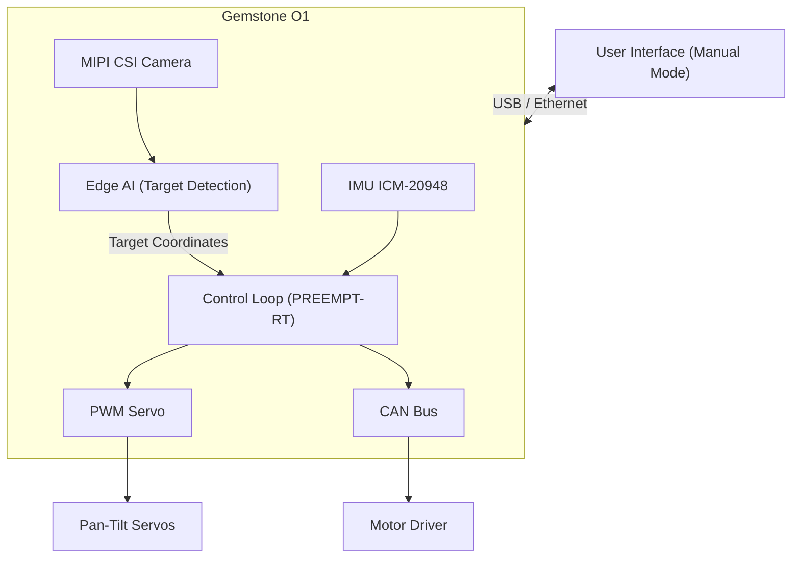

## 1. Overview

The [Teknofest Steel Dome Air Defense Systems Competition](https://teknofest.org/en/competitions/steeldome-air-defense-systems-competition/)
is a competition focused on developing ground-based air defense systems capable of detecting and
neutralizing various aerial threats. Systems go through three stages: stationary target neutralization,
swarm attack interception, and moving target engagement with friend-or-foe discrimination.

Building a system like this requires real-time image processing, target classification, and precise
servo control all running on a single platform. With its powerful processing capacity, Edge AI
accelerator, and hardware PWM outputs, the board can carry both the vision and motion layers at once.

## 2. Competition Platform

### 2.1. Target Detection and Classification with Edge AI

The central requirement across all competition stages is real-time target detection and classification.
The onboard 4 TOPS AI accelerator processes the camera stream to distinguish between target types
such as F-16, helicopter, ballistic missile, and mini/micro UAV. In Stage 3, friendly and enemy
targets appear in the same scene simultaneously; the system must neutralize only the enemy while
leaving friendlies untouched. Making this distinction at the pixel level is where the Edge AI layer
directly contributes.

| Task | Required Processing Power |
|------|--------------------------|
| Target detection (YOLOv8, F-16 / helicopter / missile / UAV) | 1–2 TOPS |
| Friend/foe classification (color/shape) | 0.5–1 TOPS |
| Moving target tracking | 1–1.5 TOPS |

These models can be compiled and loaded onto the board using the TI EdgeAI toolchain described in
the [Edge AI section](/en/boards/o1/ai/introduction).

### 2.2. Image Perception with MIPI CSI Camera

Two 4-lane MIPI CSI ports allow connecting camera modules for target detection and tracking.
Common modules such as the Raspberry Pi Camera V2 are supported. The camera stream feeds directly into the Edge AI pipeline, which outputs real-time target
coordinates that are then passed to the servo control loop. The pipeline consists of three stages:
an **input** stage that captures camera frames, a **compute** stage that runs model inference,
and an **output** stage that delivers the results. For details, refer to TI's EdgeAI dataflow
documentation:

- [EdgeAI Dataflows — TI AM67A](https://software-dl.ti.com/jacinto7/esd/processor-sdk-linux-am67a/11_00_00/exports/edgeai-docs/common/edgeai_dataflows.html)

Refer to the [Camera](/en/boards/o1/peripherals/camera) page for camera configuration.

### 2.3. Turret Control with PWM

The system must move along both elevation and azimuth axes. The 7 hardware PWM channels on the
40-pin GPIO header can be used directly to drive servo motors or stepper motor drivers in the
pan-tilt mechanism. PWM signals are updated in real time based on target coordinates from the Edge AI layer, forming
a closed-loop auto-aim system. This loop is typically built with a separate PID controller for
each axis, using the error between the detected object's position in the frame and the center
as the control signal.

Refer to the [PWM](/en/boards/o1/peripherals/pwm) page for PWM configuration.

### 2.4. Platform Orientation with IMU

The onboard ICM-20948 (accelerometer + gyroscope + magnetometer) measures the platform's
instantaneous orientation. It provides corrective input to the aiming calculations in cases
where the platform experiences vibration or disturbance.

For more information about the IMU, refer to the [IMU](/en/boards/o1/peripherals/imu) page.

### 2.5. Real-Time Aiming Loop

In moving target tracking, control loop latency directly affects hit accuracy. The PREEMPT-RT
Linux patch allows the image processing and servo update loops to be pinned to specific CPU cores,
delivering consistent low-latency control regardless of system load.

Refer to the [PREEMPT-RT](/en/projects/preempt-rt) page for real-time Linux installation.

### 2.6. Motor Communication with CAN Bus

For axes requiring more powerful actuation, the TCAN1462-Q1 CAN FD transceiver enables
communication with motor drivers over DroneCAN or custom protocols. Motor telemetry (current,
position, temperature) can be read through this interface.

Refer to the [CAN Bus](/en/boards/o1/peripherals/canbus) page for CAN Bus configuration.

### 2.7. User Interface and Manual Mode

The first stage of the competition is conducted entirely in manual mode; all functions must
operate through a user interface, joystick, or keyboard. The board can receive commands from
a control interface running on a connected computer over USB or Ethernet. Switching between
autonomous and manual modes is also managed through this interface.

## 3. Example System Architecture

The camera stream is processed by the Edge AI layer to determine target type and coordinates.
This information is passed to the real-time control loop, which drives the pan-tilt mechanism
over PWM or CAN Bus. The user interface connects over Ethernet or USB, and mode switching
between manual and autonomous operation is handled there.

## 4. Technical References

<CardGroup cols={2}>
  <Card title="Board Specifications" icon="microchip" href="/en/boards/o1/introduction">
    TI AM67A processor, 4GB RAM, 32GB eMMC, full list of sensors and interfaces
  </Card>
  <Card title="Edge AI" icon="microchip-ai" href="/en/boards/o1/ai/introduction">
    4 TOPS AI accelerator, model compilation, and object detection pipeline
  </Card>
  <Card title="PWM" icon="signal" href="/en/boards/o1/peripherals/pwm">
    Hardware PWM pinout table and servo control
  </Card>
  <Card title="Real-Time Linux" icon="clock" href="/en/projects/preempt-rt">
    Deterministic scheduling with the PREEMPT-RT patch
  </Card>
</CardGroup>

## 5. Useful Links

- [Teknofest Steel Dome Competition Page](https://teknofest.org/en/competitions/steeldome-air-defense-systems-competition/)
- [Competition Specification (PDF)](https://cdn.teknofest.org/media/upload/userFormUpload/2026_%C3%87elikkubbe_Hava_Savunma_Sistemleri_Yar%C4%B1%C5%9Fmas%C4%B1_%C5%9Eartname__EN__V1.3_vZQxH.pdf)
- [T3 Gemstone Community Forum](https://community.t3gemstone.org/)
