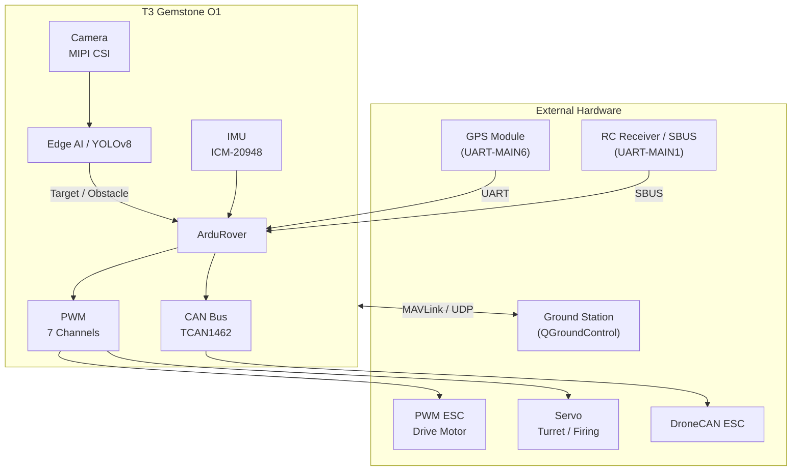

## 1. Overview

[Teknofest Unmanned Ground Vehicle Competition](https://teknofest.org/tr/yarismalar/insansiz-kara-araci-yarismasi/)
is a national competition covering the design, manufacturing, and testing of unmanned ground vehicles (UGV) capable of
both remote-controlled and fully autonomous mission execution. Vehicles are expected to complete a series of
events simulating combat conditions on a course, including fire support missions.

The T3 Gemstone O1 development board offers an end-to-end platform for this competition with its powerful
processing capacity, onboard sensors, Edge AI accelerator, and ArduPilot support.

## 2. Competition Platform with T3 Gemstone O1

The T3 Gemstone O1 provides all the essential capabilities required for developing unmanned ground vehicles (UGV)
on a single board.

### 2.1. Ground Vehicle Control with ArduPilot

The [ArduPilot](/en/projects/ardupilot) package pre-installed on the T3 Gemstone O1 includes **ArduRover**,
specifically developed for ground vehicles. It supports differential drive, Ackermann steering, and
omni-directional vehicle configurations. Waypoint following, obstacle avoidance, and autonomous mission
planning are handled directly through ArduRover.

### 2.2. Remote Control with RC Input

During the remote-controlled phase of the competition, the SBUS signal from the RC receiver is forwarded
to ArduRover. The board reads SBUS via the UART-MAIN1 RX pin; however, since the SBUS protocol uses an
inverted signal, an external signal inverter circuit must be connected between the RC receiver and this pin.
RC channel assignments and flight mode selection are configured through ArduRover parameters.

Refer to the [ArduPilot](/en/projects/ardupilot) page for circuit diagram and SBUS configuration.

### 2.3. Target Detection and Obstacle Detection with Edge AI

The built-in 4 TOPS AI accelerator provides sufficient processing power for real-time object detection
and classification on camera images. Typical AI requirements for competition scenarios:

| Task | Required Processing Power |
|------|--------------------------|
| Target detection (YOLOv8s, human/vehicle recognition) | 1–2 TOPS |
| Obstacle detection and road segmentation | 1.5–2 TOPS |
| Sign/board recognition | 0.5–1 TOPS |
| Depth estimation (mono camera) | 1.5–2 TOPS |

These models can be compiled and loaded onto the T3 Gemstone O1 using the TI EdgeAI toolchain described
in the [Edge AI section](/en/boards/o1/ai/introduction).

### 2.4. Environmental Perception with MIPI CSI Camera

Two 4-lane MIPI CSI ports allow connecting camera modules for environmental perception and target recognition
on the course. Common modules such as Raspberry Pi Camera V2 are supported. The camera stream can be integrated
with both ArduRover's vision system and the Edge AI pipeline.

Refer to the [Camera](/en/boards/o1/peripherals/camera) page for camera configuration.

### 2.5. Motor and Servo Control with PWM

The 7 hardware PWM channels on the 40-pin GPIO header are used for ESC signals for drive motors,
turret rotation servos, and the firing mechanism. This allows the board to control actuators both
through ArduRover and directly from Python/C applications.

Refer to the [PWM](/en/boards/o1/peripherals/pwm) page for PWM configuration.

### 2.6. Smart ESC Communication with CAN Bus

The board's TCAN1462-Q1 CAN FD transceiver enables integration with smart ESCs supporting the DroneCAN
protocol. This allows motor telemetry (current, RPM, temperature) to be read directly through ArduRover
and power management to be handled more effectively.

Refer to the [CAN Bus](/en/boards/o1/peripherals/canbus) page for CAN Bus configuration.

### 2.7. Vehicle Orientation and Navigation with IMU

The board's onboard ICM-20948 sensor (accelerometer + gyroscope + magnetometer) is used directly by ArduRover
to measure vehicle orientation. Working together with an external GPS module, EKF-based position and velocity
estimation is performed, enabling precise autonomous navigation on the course.

For more information about the IMU, refer to the [IMU](/en/boards/o1/peripherals/imu) page.

### 2.8. Autonomous Navigation with GPS

The external GPS module connects via UART-MAIN6; I2C-MCU0 is used for the external compass. ArduRover
supports waypoint following, automatic route planning, and mission execution with GPS data. RTK-GPS is
recommended for precise positioning during autonomous phases.

### 2.9. Real-Time Mission Execution

Fast obstacle response and control loop timing are critical in ground vehicles. The PREEMPT-RT
Linux patch provides deterministic latency; ArduRover can be pinned to specific CPU cores.

Refer to the [PREEMPT-RT](/en/projects/preempt-rt) page for real-time Linux installation.

### 2.10. Ground Station Connectivity

ArduPilot can work with various ground control software over the MAVLink protocol. The board streams
MAVLink over USB Ethernet.

| Software | Platform | Feature |
|----------|----------|---------|
| [QGroundControl](https://qgroundcontrol.com/) | Windows, Linux, macOS, Android, iOS | Easy to use, mobile support |
| [Mission Planner](https://ardupilot.org/planner/) | Windows | Advanced parameter and mission editor |
| [MAVProxy](https://ardupilot.org/mavproxy/) | Linux, macOS | Command line, multi-connection routing |

## 3. Example System Architecture

The GPS and RC receiver communicate with the board directly over UART. Camera images are processed by the
Edge AI layer, and detected targets and obstacles are forwarded to ArduRover. ArduRover fuses IMU and GPS
data to drive ESCs and servos over PWM, and smart ESCs over CAN Bus. Ground station connectivity is
provided over MAVLink/UDP.

## 4. Technical References

<CardGroup cols={2}>
  <Card title="Board Specifications" icon="microchip" href="/en/boards/o1/introduction">
    TI AM67A processor, 4GB RAM, 32GB eMMC, full list of sensors and interfaces
  </Card>
  <Card title="ArduPilot" icon="drone" href="/en/projects/ardupilot">
    ArduPilot setup guide, PWM pinout table, and QGroundControl connection
  </Card>
  <Card title="Edge AI" icon="microchip-ai" href="/en/boards/o1/ai/introduction">
    4 TOPS AI accelerator, model compilation, and object detection pipeline
  </Card>
  <Card title="Real-Time Linux" icon="clock" href="/en/projects/preempt-rt">
    Deterministic scheduling with the PREEMPT-RT patch
  </Card>
</CardGroup>

## 5. Useful Links

- [Teknofest Unmanned Ground Vehicle Competition Page](https://teknofest.org/tr/yarismalar/insansiz-kara-araci-yarismasi/)
- [ArduRover Documentation](https://ardupilot.org/rover/)
- [QGroundControl Download](https://qgroundcontrol.com/)
- [T3 Gemstone Community Forum](https://community.t3gemstone.org/)
