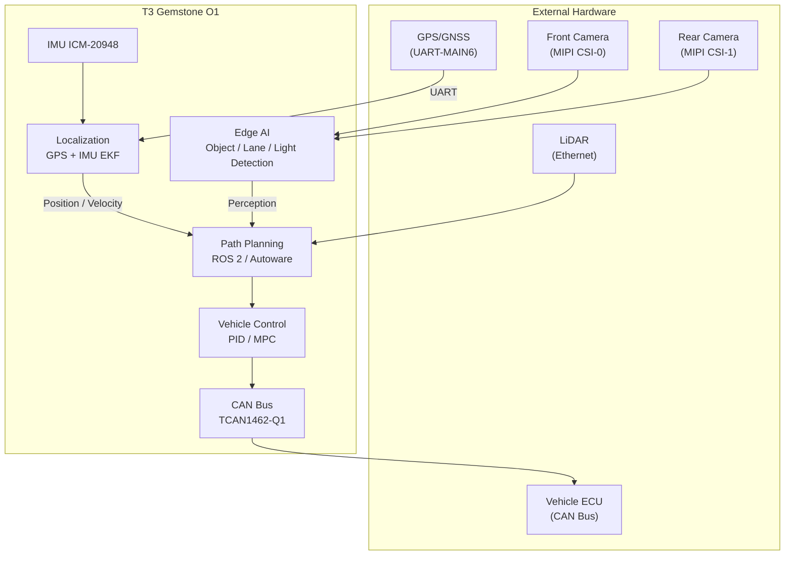

## 1. Overview

The [Teknofest Robotaxi Autonomous Vehicle Competition](https://teknofest.org/tr/yarismalar/robotaksi-binek-otonom-arac-yarismasi/)
aims to advance autonomous vehicle technologies in Turkey.
Vehicles are expected to autonomously complete passenger pick-up/drop-off, traffic rule compliance,
obstacle avoidance, and parking tasks on a course simulating urban traffic conditions.

The competition runs in two categories:

- **Original Vehicle:** Teams design and build the vehicle and software from scratch.
- **Ready-Made Vehicle:** Teams develop custom software on a fully equipped electric vehicle platform provided by TEKNOFEST.

T3 Gemstone O1 provides an end-to-end platform for both categories with its Edge AI accelerator,
multi-camera support, CAN Bus vehicle interface, and real-time Linux.

## 2. System Design with T3 Gemstone O1

### 2.1. Autonomous Driving with ROS 2

Autonomous vehicle software requires perception, localization, planning, and control layers to communicate with each other. ROS 2 has become the industry standard for autonomous driving because it runs these layers as independent nodes and manages the data flow between them. Ubuntu 22.04 and ROS 2 Humble run natively on T3 Gemstone O1; Autoware or custom-developed autonomous driving software runs directly in this environment.

| ROS 2 Node | Role |
|------------|------|
| `perception` | Camera + LiDAR fusion, object/lane detection |
| `localization` | GPS + IMU EKF, HD map matching |
| `planning` | Global and local path planning, obstacle response |
| `control` | PID/MPC steering and speed control |
| `vehicle_interface` | Vehicle actuator commands over CAN Bus |

### 2.2. Edge AI for Environment Perception

Simultaneously detecting pedestrians, vehicles, traffic signs, and lane markings in real time is a compute-intensive task that is difficult to run on standard CPU processing power alone. The built-in 4 TOPS AI accelerator handles this workload directly on the board without requiring external hardware.

| Task | Model | Required Compute |
|------|-------|-----------------|
| Vehicle / pedestrian / obstacle detection | yolox_s_lite | 1–1.5 TOPS |
| Lane and road segmentation | deeplabv3plus_mobilenetv2_tv_edgeailite | 1–1.5 TOPS |
| Traffic sign / light recognition | mobilenet_v2_lite | 0.5 TOPS |

See the [Model Preparation](/en/boards/o1/ai/process) page for the supported model list and compilation steps.

### 2.3. Dual Camera with MIPI CSI

A single camera cannot cover both front and rear views simultaneously; rear visibility is also critical during parking maneuvers. Two 4-lane MIPI CSI ports allow a dual-camera setup such as a wide-angle front camera and a narrow-angle rear camera. Camera streams feed into the Edge AI pipeline and ROS 2 `/image_raw` topics.

See the [Camera](/en/boards/o1/peripherals/camera) page for configuration details.

### 2.4. Localization with GPS and IMU

GPS alone cannot provide high-frequency position updates and lags during sudden speed or direction changes. For this reason, IMU data from the built-in ICM-20948 (9-axis) is fused with GPS through an EKF to produce high-frequency position, velocity, and orientation estimates. An external GPS module connects via UART-MAIN6 and an external compass via I2C-MCU0. RTK-GPS is recommended where precise localization is required.

See the [IMU](/en/boards/o1/peripherals/imu) page for details.

### 2.5. Vehicle Control over CAN Bus

The ECUs in the vehicle chassis expect throttle, brake, and steering commands over the standard CAN protocol, so the software layer must communicate over CAN as well. The TCAN1462-Q1 CAN FD transceiver delivers these commands to the vehicle ECUs and reads speed and status telemetry from the vehicle.

See the [CAN Bus](/en/boards/o1/peripherals/canbus) page for configuration.

### 2.6. Real-Time Control

The standard Linux kernel does not guarantee process scheduling; under high system load, control loop latency can increase and cause unsafe driving behavior. The PREEMPT-RT Linux patch provides deterministic latency; control loop nodes can be pinned to specific CPU cores.

See the [PREEMPT-RT](/en/projects/preempt-rt) page.

### 2.7. Simulation

Real vehicle testing requires access to a field, equipment, and safety conditions that are not always available at every stage of development. ROS 2 software running on T3 Gemstone O1 can be tested directly with Gazebo or CARLA simulators, allowing algorithms to be validated before being deployed to the real vehicle.

## 3. Example System Architecture

## 4. Technical References

<CardGroup cols={2}>
  <Card title="Board Specifications" icon="microchip" href="/en/boards/o1/introduction">
    TI AM67A processor, 4 GB RAM, 32 GB eMMC, full list of sensors and interfaces
  </Card>
  <Card title="Edge AI" icon="microchip-ai" href="/en/boards/o1/ai/introduction">
    4 TOPS AI accelerator, model compilation and object detection pipeline
  </Card>
  <Card title="CAN Bus" icon="network-wired" href="/en/boards/o1/peripherals/canbus">
    TCAN1462-Q1 CAN FD transceiver and vehicle communication integration
  </Card>
  <Card title="Real-Time Linux" icon="clock" href="/en/projects/preempt-rt">
    Deterministic scheduling with PREEMPT-RT patch
  </Card>
</CardGroup>

## 5. Useful Links

- [Teknofest Robotaxi Competition Page](https://teknofest.org/tr/yarismalar/robotaksi-binek-otonom-arac-yarismasi/)
- [Autoware Documentation](https://autowarefoundation.github.io/autoware-documentation/)
- [ROS 2 Humble Documentation](https://docs.ros.org/en/humble/)
- [CARLA Simulator](https://carla.org/)
- [T3 Gemstone Community Forum](https://community.t3gemstone.org/)
