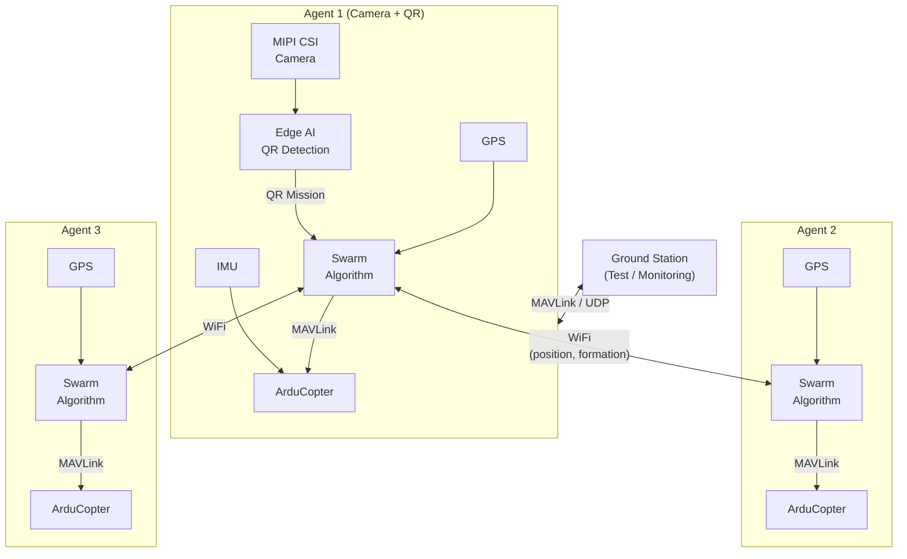

## 1. Overview

The [Teknofest Swarm UAV Competition](https://teknofest.org/en/competitions/swarm-uav-competition/)
is a competition focused on enabling multiple unmanned aerial vehicles to perform autonomous formation
flight, dynamically plan missions by reading QR codes, and respond to operator inputs in a coordinated
manner as a single unit. It is centered on demonstrating swarm intelligence algorithms — increasingly
critical in both civilian and defense applications — on real hardware.

Building a system like this requires simultaneous flight control, real-time image processing, and
inter-agent communication all running on a single platform. With its processing power, Edge AI
accelerator, and onboard WiFi, the board is ready to act as a capable agent computer for every
UAV in the swarm.

## 2. Swarm Platform

### 2.1. Multicopter Control with ArduPilot

The pre-installed ArduPilot package includes **ArduCopter**, designed specifically for multicopter
frames. Stabilization, altitude hold, and waypoint following are handled directly through this layer.
A separate ArduCopter instance runs for each agent in the swarm; the swarm software sends commands
to these instances via the MAVLink interface.

Refer to the [ArduPilot](/en/projects/ardupilot) page for setup and configuration.

### 2.2. QR Code Detection with Edge AI

One of the most critical requirements of the competition is that at least one agent in the swarm
visually detects a QR code and decodes its content. The onboard 4 TOPS AI accelerator provides
sufficient processing power to handle QR detection and landing zone color segmentation in real time.

| Task | Required Processing Power |
|------|--------------------------|
| QR code detection and decoding | 0.5–1 TOPS |
| Landing zone color segmentation (red/blue) | 0.5–1 TOPS |
| Collision avoidance perception | 1–1.5 TOPS |

These models can be compiled and loaded onto the board using the TI EdgeAI toolchain described in
the [Edge AI section](/en/boards/o1/ai/introduction).

### 2.3. Image Perception with MIPI CSI Camera

Two 4-lane MIPI CSI ports allow connecting camera modules for QR code reading and landing zone
detection. Common modules such as the Raspberry Pi Camera V2 are supported. The camera stream can
feed both the QR decoding pipeline and collision avoidance algorithms.

Refer to the [Camera](/en/boards/o1/peripherals/camera) page for camera configuration.

### 2.4. Distributed Swarm Communication with WiFi

A distributed architecture — where each agent makes its own decisions and operates in coordination
with its neighbors — is the preferred approach for swarm communication. The onboard 802.11n WiFi
allows position, velocity, and formation state messages to be exchanged between agents over UDP/TCP.
Agents can communicate through an access point or via a software-based ad-hoc network configured
on Linux.

### 2.5. Swarm Stabilization with IMU

The onboard ICM-20948 (accelerometer + gyroscope + magnetometer) is used by ArduCopter to measure
each agent's instantaneous orientation. Precise pitch, roll, and yaw measurements during formation
maneuvers help maintain swarm geometry.

For more information about the IMU, refer to the [IMU](/en/boards/o1/peripherals/imu) page.

### 2.6. Autonomous Navigation with GPS

The external GPS module connects via UART-MAIN6. Each agent reads its own GPS position; the swarm
software combines these to compute formation geometry and route.

Refer to the [ArduPilot](/en/projects/ardupilot) page for GPS wiring and configuration.

### 2.7. Real-Time Swarm Algorithm

For formation update loops and collision avoidance computations that require deterministic timing,
the PREEMPT-RT Linux patch provides a critical advantage. The swarm algorithm can be pinned to
specific CPU cores, ensuring consistent update rates regardless of system load.

Refer to the [PREEMPT-RT](/en/projects/preempt-rt) page for real-time Linux installation.

### 2.8. Monitoring and Debugging with MAVLink

During pre-competition testing, each agent can connect to QGroundControl or Mission Planner over
the MAVLink protocol. The board streams MAVLink over USB Ethernet; multi-agent telemetry can be
monitored over WiFi.

| Software | Platform | Feature |
|----------|----------|---------|
| [QGroundControl](https://qgroundcontrol.com/) | Windows, Linux, macOS, Android, iOS | Multi-vehicle monitoring, easy interface |
| [Mission Planner](https://ardupilot.org/planner/) | Windows | Parameter configuration, advanced mission editor |
| [MAVProxy](https://ardupilot.org/mavproxy/) | Linux, macOS | Multi-connection routing, command line |

## 3. Example System Architecture

Each agent runs ArduCopter, the swarm algorithm, and (where applicable) the Edge AI pipeline on
its own board. Inter-agent communication is provided over WiFi. At least one agent has its
camera and QR detection pipeline active; once a mission is decoded, it is broadcast to the entire swarm.

## 4. Technical References

<CardGroup cols={2}>
  <Card title="Board Specifications" icon="microchip" href="/en/boards/o1/introduction">
    TI AM67A processor, 4GB RAM, 32GB eMMC, full list of sensors and interfaces
  </Card>
  <Card title="ArduPilot" icon="drone" href="/en/projects/ardupilot">
    ArduCopter setup guide, PWM pinout table, and QGroundControl connection
  </Card>
  <Card title="Edge AI" icon="microchip-ai" href="/en/boards/o1/ai/introduction">
    4 TOPS AI accelerator, model compilation, and QR detection pipeline
  </Card>
  <Card title="Real-Time Linux" icon="clock" href="/en/projects/preempt-rt">
    Deterministic scheduling with the PREEMPT-RT patch
  </Card>
</CardGroup>

## 5. Useful Links

- [Teknofest Swarm UAV Competition Page](https://teknofest.org/en/competitions/swarm-uav-competition/)
- [Competition Specification (PDF)](https://cdn.teknofest.org/media/upload/userFormUpload/2026_SURU_IHA_YARISMASI_ENG_20_02_V2_lhQDS.pdf)
- [ArduCopter Documentation](https://ardupilot.org/copter/)
- [QGroundControl Download](https://qgroundcontrol.com/)
- [T3 Gemstone Community Forum](https://community.t3gemstone.org/)
