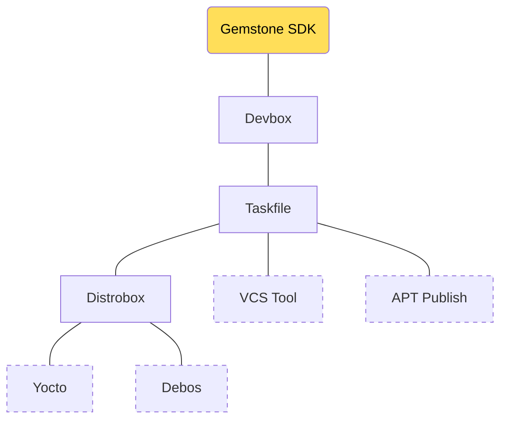
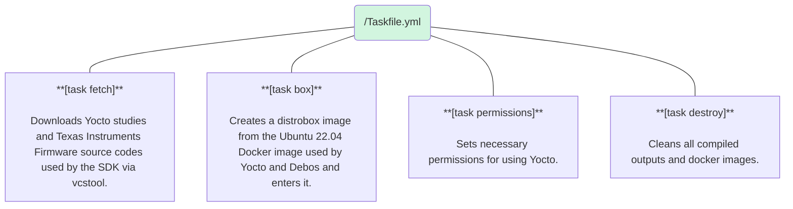
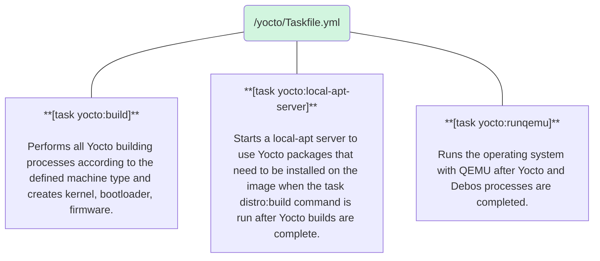
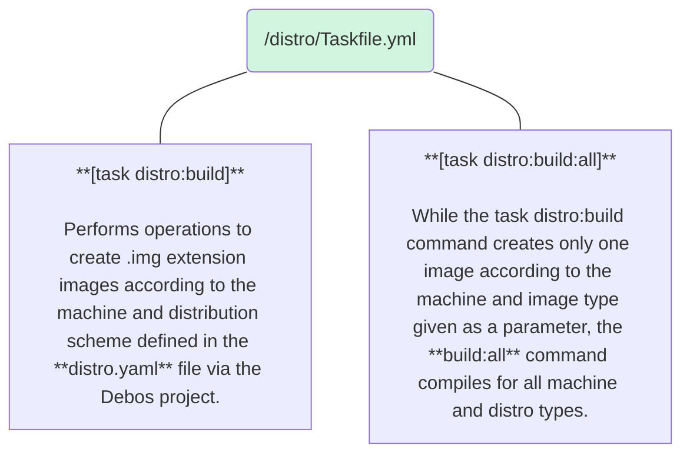

import SnippetSdkCompDirLayout from '/snippets/sdk/comp/dir-layout.mdx';
import SnippetSdkCompExampleCmd from '/snippets/sdk/comp/example-cmd.mdx';

<Note>
This section will cover the detailed usage of all tools in the Gemstone [SDK](../faq#what-is-sdk) and why 
they were chosen.
</Note>

<Tip>
By the end of this section, you will gain experience in:

* The function and folder structure of the SDK Project
* Usage of tools like Devbox, Distrobox, Taskfile, VCS Tool, Debos, and Debootstrap
</Tip>

# 1. Preface

As known, Linux is an open-source operating system kernel. The operating system is a whole that contains 
dozens of different applications like Kernel, Shell, desktop applications, window managers, text editors, 
browsers, system tools, and system services. Unlike operating systems like Windows, it is not distributed by 
a single manufacturer but can be freely compiled and packaged by different organizations under different 
names. For example: Operating systems like [Ubuntu](https://ubuntu.com/), [Debian](https://www.debian.org/), 
[Pardus](https://pardus.org.tr/), [Fedora](https://www.fedoraproject.org/), 
and [openSUSE](https://www.opensuse.org/) all contain the Linux kernel while including different GNU tools, 
open-source software, or versions.

These Linux-containing operating systems are mostly referred to as [Distro](../faq#what-is-distro) (Distribution). 
Since most of the open-source software they contain are GNU (www.gnu.org) projects, the open-source community 
prefers to call them 
[GNU/Linux](https://opensource.stackexchange.com/questions/1025/why-do-some-people-refer-to-linux-as-gnu-linux).

This situation brings great diversity, customization opportunities, and power, but can also cause incompatibilities 
and errors due to the use of different software versions. For instance, the libraries used by a text editor in 
Ubuntu 22 and Ubuntu 24 versions may differ from those in 
[Fedora Workstation 42](https://fedoraproject.org/workstation/download).

Tools like [Yocto](https://www.yoctoproject.org/) used in the Gemstone SDK support specific versions of 
GNU/Linux distributions, and these aspects are documented in the relevant projects' documentation.

To reduce the complexity these differences create for entry-level users, solutions like Devbox and Distrobox 
are utilized in the Gemstone [SDK](../faq#what-is-sdk). These tools allow using the appropriate versions of 
required software with the same structure across all systems, regardless of the GNU/Linux distribution or its versions!

<Note>
To give an example, when you install the [fmt](https://github.com/fmtlib/fmt) library with 
`sudo apt install libfmt-dev` on Ubuntu 22.04, the version on your system may differ from what you get 
with `sudo dnf install libfmt-dev` on Fedora. Therefore, when developing software, those who download 
and compile your code need to obtain the appropriate versions.
</Note>

# 2. Introduction

[Devbox](https://www.jetify.com/devbox): An open-source package management system created to reduce potential 
differences and development complexity caused by different versions of software in distributions. It allows 
using the same software versions across distributions like Ubuntu and Fedora.

<Note>
If you want to use version 10.0 of QEMU and different versions are available in the default package managers 
of Ubuntu, Pardus, or Debian, Devbox becomes a very suitable helper tool.
</Note>

Devbox is used in the Gemstone SDK to avoid the need for distribution-specific work when installing required 
software. The packages used are defined in the `sdk/devbox.json` file.

[Distrobox](https://distrobox.it/): Leverages container technologies like Docker to run desired versions of 
different GNU/Linux distributions on your existing GNU/Linux system. (For example, you can use Ubuntu 22.04 via 
Terminal while running Fedora 42)

[Taskfile](https://taskfile.dev/): When running script commands, small applications called scripts with 
**.sh** extensions are often used. Over time, the increase in these scripts leads to complexity and usage 
difficulties. To reduce such challenges, the Task (called Go-Task/Task or Taskfile) tool is used, allowing 
you to write executable scripts in **.yml** files in small, classified pieces and use additional features 
like autocompletion when pressing `<tab>` in Terminal. The basic Taskfile of the SDK is located in `sdk/Taskfile.yml`.

# 3. SDK Components

The basic purpose of the **Gemstone SDK** is to create all core (Linux Kernel, Bootloader, Firmware, Driver) 
and operating system images (containing all applications you use) for Gemstone development boards. Its structure 
is shown in the diagram below.

### 3.1. Folder Structure

<SnippetSdkCompDirLayout />

| Folder              | Description |
| :------------------ | :---------- |
| /build              | Contains all outputs produced by Yocto, Debos, and other building tools |
| /distro             | Contains configurations and customization files that determine how different images like Desktop and Minimal of Gemstone will be compiled |
| /yocto              | Yocto studies belonging to the Gemstone project |
| /src                | Contains source codes of Firmware for development boards with chips like Texas Instruments or external projects |

| File                | Description |
| :------------------ | :---------- |
| repos.yml           | Contains git repository addresses of all external projects needed by the Gemstone SDK. Source codes are downloaded to this folder with a `fetch` operation using an application called vcstool |
| distrobox.ini       | Configuration file that creates an Ubuntu 22.04 docker container with the Distrobox tool |
| Taskfile.yml        | The taskfile in each folder allows running script commands in the format `task folder:command` |
| devbox.json         | Configuration file for Devbox |
| /distro/distro.yaml | Configuration file for Debos that customizes and creates Gemstone Desktop, Minimal, and Kiosk images |

### 3.2. Devbox

Devbox used in the Gemstone SDK is installed on your system by running the `setup.sh` command after cloning the 
project, as explained in the [SDK Introduction Section](./introduction#1-3-install-requirements). When you 
run the `devbox shell` command in Terminal within the folder, it activates and downloads the **Distrobox, Taskfile, 
VSCTool, Qemu** packages defined in the `devbox.json` file to the `sdk/.devbox` folder and activates the shell to 
use the software inside.

Its main purpose is to allow the installation and use of helper applications and packages with the same version 
across different GNU/Linux distributions.

<Tip>
Click [this link](https://www.jetify.com/docs/devbox/quickstart/) to examine the application and do exercises, 
then review the `sdk/devbox.json` file.
</Tip>

### 3.3. Taskfile

When you run commands like `task fetch yocto:build distro:build` in Terminal while using the Gemstone SDK, the 
functions defined in `sdk/Taskfile.yml sdk/yocto/Taskfile.yml sdk/distro/Taskfile.yml` files are executed.

<Note>
The Taskfile application is installed by Devbox as it is defined in the devbox.json file.
</Note>

The diagrams below summarize all Task functions used by the SDK.

<SnippetSdkCompExampleCmd />

#### 3.3.1. Basic Functions

<Card>

</Card>

#### 3.3.2. Yocto Functions

<Card>

</Card>

#### 3.3.3. Distro Functions

<Card>

</Card>

<Tip>
Click [this link](https://taskfile.dev/installation/) to examine the application and do exercises, then review the `sdk/distro/Taskfile.yml` file.
</Tip>

### 3.4. VCS Tool

Instead of writing Bash Shell scripts or manually performing operations to download source codes from external 
git repositories needed by the SDK, projects are defined in the `repos.yml` file to allow them to be downloaded 
in an organized manner. When the `vcs import . < repos.yml` command is run, it automatically downloads or updates 
the projects defined in the relevant file.

<Note>
The [VCS (Version Control System) Tool](https://github.com/dirk-thomas/vcstool) application is installed by Devbox 
as it is defined in the devbox.json file.
</Note>

### 3.5. Distrobox

There is a file called `Dockerfile` in the SDK folder. Normally, you can use this file to create an image via 
Docker and use the system inside, but due to Docker's architecture, when changes are made inside the image or 
files are uploaded and deleted, it deletes them after restarting, making persistent file system usage cumbersome.

Distrobox is preferred because it allows changes made and files uploaded inside images created via Docker to be 
permanently stored.

<Tip>
Click [this link](https://distrobox.it/) to examine the application and do exercises, then review the 
`sdk/distrobox.ini` and `sdk/Dockerfile` files.
</Tip>

### 3.6. Debos

When you download the installation of distributions like Ubuntu or Debian from their websites, they 
come as a whole containing all software and drivers, resulting in a very large operating system. In embedded 
Linux studies, distributions like Ubuntu and Debian can also be used, but they need to be customized and 
unnecessary applications and libraries removed. For example, if your Ubuntu 22.04 uses 25GB of space, it's 
not possible to use it on boards like _T3-GEM-O1_.

The [Debootstrap](https://wiki.debian.org/Debootstrap) tool allows selecting desired packages from those 
included in distributions like Ubuntu and Debian and preparing customized distributions. For example, you 
can create a very small Ubuntu/Debian version without unnecessary libraries and graphical interfaces for use 
on embedded Linux boards like _T3-GEM-O1_.

[Debos](https://github.com/t3gemstone/debos) is a project written in Go that uses the 
[Debootstrap](https://gist.github.com/varqox/42e213b6b2dde2b636ef) tool but allows creating 
distributions in a more understandable, classified way with `.yaml` files instead of complex operations 
from the command line to create images.

<Tip>
Click [this link](https://pkg.go.dev/github.com/go-debos/debos/actions/) to examine and then review the `sdk/distro.yaml` file.
</Tip>

The Minimal, Kiosk, and Desktop images created with the Gemstone SDK are created with Debos and optionally 
have several versions of Ubuntu and Debian. They are configured to work on different architectures for machines 
like _T3-GEM-O1_, Beagley-AI, and Intel-Core-I7.

# 4. Conclusion

By completing this section, you've seen what tools the Gemstone SDK uses and why they were chosen.

<Check>
Before moving to the next section, don't forget to visit the websites of all the tools above, install them on your 
computer, and do exercises and trials!
</Check>
