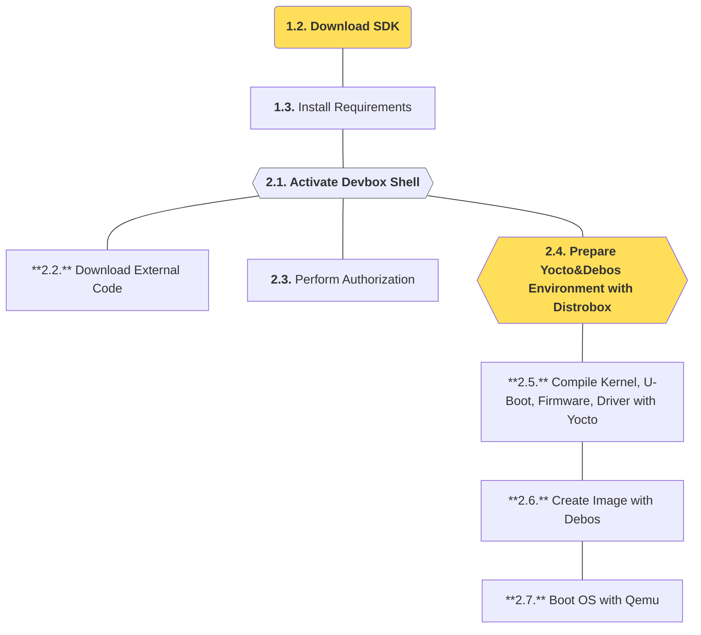

In this section, we will download the [SDK project](https://github.com/t3gemstone/sdk.git) to a developer computer 
and compile Gemstone images. The basic building process will be explained as an **exercise**, with detailed 
explanations of all these tools provided in subsequent sections.

<Tip>
By the end of this section, you will gain experience in:

* Basic usage of SDK components
* Compiling Kernel, U-Boot, Firmware, and Images with Gemstone SDK
* Using tools like Docker and Distrobox to work with different GNU/Linux distributions on your computer
</Tip>

<Note>
The SDK project contains the most technically intensive part of Gemstone's software infrastructure. It is 
**not required** for developing software using the development board - it explains technical topics like 
how Gemstone's operating system is created. If you only want to develop projects with development boards 
and aren't interested in these topics, you can skip this section. This section targets those who want to 
become **Gemstone developers**.
</Note>

<Steps>
  <Step title="Download SDK">
    Download the SDK project using `git clone` on Ubuntu
  </Step>
  <Step title="Install Requirements">
    Run the `setup.sh` script to install building requirements
  </Step>
  <Step title="Create Image">
    Use SDK tools to create a Gemstone image
  </Step>
  <Step title="Use QEMU">
    Run the created image as a virtual machine using QEMU
  </Step>
</Steps>

# 1. Preparation

Compilation was done on a computer running Ubuntu 22.04 GNU/Linux distribution. While distributions like 
Debian, Fedora, or Pardus can also be used, Ubuntu 22 or 24 will be more suitable for first-time users of such 
compilation tools.

### 1.1. Computer Requirements

1. Ubuntu 22 or Ubuntu 24 computer
2. Minimum 16GB RAM
3. Minimum 256GB available disk space

Gemstone SDK requires tools like `Docker` and `Devbox`. The included `setup.sh` script will automatically handle 
these installations after cloning the SDK project.

<Card>

</Card>

### 1.2. Download SDK

Open Terminal in any folder on Ubuntu and clone the project with `git clone`:

<CodeGroup>

  ```bash Command line
  git clone https://github.com/t3gemstone/sdk.git
  ```

  ```bash Terminal Output lines
  gem@ubuntu:~$ git clone https://github.com/t3gemstone/sdk.git
  Cloning into 'sdk'...
  remote: Enumerating objects: 2871, done.
  remote: Counting objects: 100% (171/171), done.
  remote: Compressing objects: 100% (90/90), done.
  remote: Total 2871 (delta 122), reused 107 (delta 78), pack-reused 2700 (from 2)
  Receiving objects: 100% (2871/2871), 25.23 MiB | 5.52 MiB/s, done.
  Resolving deltas: 100% (1100/1100), done.
  gem@ubuntu:~$
  ```
</CodeGroup>

### 1.3. Install Requirements

After cloning, navigate to the folder with `cd sdk` and run the `setup.sh` script:

<CodeGroup>

  ```bash Command lines
  cd sdk
  ./setup.sh
  ```

  ```bash Terminal Output lines
  gem@ubuntu:~$ cd sdk/
  gem@ubuntu:sdk$ ./setup.sh 

  🚀 T3 Gemstone Software Development Kit

    This script downloads and installs T3 Gemstone Boards' required
    packages 📦 for the development of its customized GNU/Linux Distro.
    Powered by Jetify Devbox, Distrobox, Love and Passion.

  → requirements...
  ✓ requirements... [DONE]
  → docker...
  ✓ docker... [DONE]
  ✓ docker-permissions... [DONE]
  → devbox...
  ✓ devbox... [DONE]

  What's the next?
    1. Learn how to build 🌍 a new world
      Read the docs at https://docs.t3gemstone.org

    2. Get help and give feedback
      Join our community at https://community.t3gemstone.org
  ```
</CodeGroup>

<Warning>
If Docker wasn't previously installed on your system, remember to log out and log back in after first-time installation.
</Warning>

# 2. Building

After completing the requirement installation script, activate Devbox Shell from Terminal while in the sdk folder 
to begin build steps.

### 2.1. Activate Devbox Console

Activate **Devbox**, a software package management system that may contain different versions than Ubuntu packages, 
to complete necessary downloads and installations for Gemstone SDK.

<CodeGroup>

  ```bash Command lines
  devbox shell
  ```

  ```bash Terminal Output lines
  gem@ubuntu:~$ cd sdk
  gem@ubuntu:sdk$ devbox shell
  Starting a devbox shell...
  📦 devbox:sdk>
  ```

</CodeGroup>

### 2.2. Download External Project Code

Use the `task fetch` command below to download all source codes needed by the SDK during building. You can 
examine these projects in the `sdk/repos.yml` file.

<CodeGroup>

  ```bash Command lines
  task fetch
  ```

  ```bash Terminal Output lines
  gem@ubuntu:sdk$ devbox shell
  Starting a devbox shell...
  📦 devbox:sdk> task fetch 
  task: [fetch] vcs import . < repos.yml
  ............
  === ./src/cc33xx-fw (git) ===
  === ./src/ti-img-rogue-umlibs (git) ===
  === ./src/wl18xx-fw (git) ===
  === ./yocto/meta-arm (git) ===
  === ./yocto/meta-gemstone (git) ===
  === ./yocto/meta-intel (git) ===
  === ./yocto/meta-mingw (git) ===
  === ./yocto/meta-openembedded (git) ===
  === ./yocto/meta-qt6 (git) ===
  === ./yocto/meta-ti (git) ===
  === ./yocto/openembedded-core (git) ===
  === ./yocto/poky (git) ===
  📦 devbox:sdk> 
  ```

</CodeGroup>

### 2.3. Perform Authorization

Operating system compilation with Yocto project isn't done directly on your Ubuntu system, but through a tool 
called Distrobox. Use the command below to authorize Yocto usage within Distrobox.

<CodeGroup>

  ```bash Command lines
  task permissions
  ```

  ```bash Terminal Output lines
  📦 devbox:sdk> task permissions 
  task: [permissions] sudo cp .meta/bitbake-apparmor.conf /etc/apparmor.d/bitbake
  [sudo] password for vm: 
  task: [permissions] sudo apparmor_parser -r /etc/apparmor.d/bitbake
  task: [permissions] git config --global http.postBuffer 157286400
  task: [permissions] mkdir -p build src
  📦 devbox:sdk> 
  ```

</CodeGroup>

### 2.4. Prepare Building Environment

Perform Distrobox installation with the command below.

<CodeGroup>

  ```bash Command lines
  task box
  ```

  ```bash Terminal Output lines
  📦 devbox:sdk> task box
  task: [box] distrobox-list | grep -q 'gemstone-distrobox' || docker build -f Dockerfile -t t3gemstone/distrobox:latest .
  [+] Building 108.3s (5/12)                                                                                                                                                 docker:default
  => [internal] load build definition from Dockerfile                                                                                                                                 0.1s                                                                                                                                                0.0s
  => => transferring context: 2B                                                                                                                                                      0.0s
  => [1/8] FROM docker.io/library/ubuntu:22.04@sha256:01a3ee0b5e413cefaaffc6abe68c9c37879ae3cced56a8e088b1649e5b269eee                                                                6.2s
  => => extracting sha256:89dc6ea4eae2b38a3550534ece4983005a7d2e90e4fa503ed04dcfc58ee71159                                                                                            2.5s
  => [2/8] RUN apt-get update &&     apt-get upgrade -y &&     apt-get install -y         bash         binfmt-support         build-essential         ca-certificates         ccac  313.4s
  => [3/8] RUN sed -i 's/pam_unix\.so obscure/pam_unix.so minlen=1 obscure/' /etc/pam.d/common-password                                                                               0.6s
  => [4/8] RUN echo gemstone > /etc/hostname                                                                                                                                          0.9s
  => [5/8] RUN curl --location https://taskfile.dev/install.sh | sudo sh -s -- -d -b /usr/local/bin &&     task --completion bash > /etc/bash_completion.d/task                       4.9s
  => [6/8] RUN pip install vcstool --force-reinstall &&     cp /usr/local/share/vcstool-completion/vcs.bash /etc/bash_completion.d/vcs                                                4.7s
  => [7/8] RUN apt-get install -y         binfmt-support         bmap-tools         btrfs-progs         debian-archive-keyring         debian-keyring         dosfstools         e2  46.0s
  => [8/8] RUN cd /tmp &&     export GOPATH=/tmp/debos &&     go install -v github.com/t3gemstone/debos/cmd/debos@v1.1.3.6 &&     cp /tmp/debos/bin/debos /usr/local/bin &&     rm   44.7s
  => exporting to image                                                                                                                                                              10.0s
  => => naming to docker.io/t3gemstone/distrobox:latest                                                                                                                               0.0s
  task: [box] distrobox-assemble create --file distrobox.ini
  - Creating gemstone-distrobox...
  Creating 'gemstone-distrobox' using image t3gemstone/distrobox   [ OK ]
  Distrobox 'gemstone-distrobox' successfully created.
  To enter, run:

  distrobox enter gemstone-distrobox

  Successfully copied 2.05kB to /tmp/gemstone-distrobox.os-release
  Starting container...                            [ OK ]
  Installing basic packages...                     [ OK ]
  Setting up devpts mounts...                      [ OK ]
  Setting up read-only mounts...                   [ OK ]
  Setting up read-write mounts...                  [ OK ]
  Setting up host's sockets integration...         [ OK ]
  Integrating host's themes, icons, fonts...       [ OK ]
  Setting up distrobox profile...                  [ OK ]
  Setting up sudo...                               [ OK ]
  Setting up user groups...                        [ OK ]
  Setting up user's group list...                  [ OK ]
  Adding user...                                   [ OK ]
  Ensuring user's access...                        [ OK ]
  Setting up skel...                               [ OK ]
  Executing init hooks...                          [ OK ]
  Setting up init system...                        [ OK ]
  Firing up init system...                         [ OK ]

  Container Setup Complete!
  task: [box] distrobox-enter --additional-flags "--tty" --name gemstone-distrobox --no-workdir
  ⚠️  First time user password setup ⚠️ 
  New password: 
  Retype new password: 
  passwd: password updated successfully
  _____ _____   _____                     _       _   _             
  |_   _|___ /  |  ___|__  _   _ _ __   __| | __ _| |_(_) ___  _ __  
    | |   |_ \  | |_ / _ \| | | | '_ \ / _` |/ _` | __| |/ _ \| '_ \ 
    | |  ___) | |  _| (_) | |_| | | | | (_| | (_| | |_| | (_) | | | |
    |_| |____/  |_|  \___/ \__,_|_| |_|\__,_|\__,_|\__|_|\___/|_| |_|
                                                                    
  🚀 distrobox:workdir> 
  ```

</CodeGroup>

Near the end of installation, you'll be prompted with `⚠️ First time user password setup ⚠️` to set a password 
for your distrobox environment. You can choose a 1-character password different from your computer password to 
help distinguish which console you're working in during building. When you see `🚀 distrobox:workdir>`, you're 
ready for Yocto and Image building!

### 2.5. Compile Core Software with Yocto

The SDK software kit contains parameters for compiling for different architectures and operating systems. For 
example, while Gemstone _T3-GEM-O1_ model is an aarch64 architecture target, you can select `intel-corei7-64` for 
your Ubuntu computer to directly run the resulting image files on your own machine. The compilation below is done 
for `intel-corei7-64` architecture, explaining how to boot these images directly on your computer using QEMU 
virtualization.

<Warning>
These operations may take about 5 hours depending on your computer's performance.
</Warning>

<CodeGroup>

  ```bash Command lines
  task yocto:build MACHINE=intel-corei7-64
  ```

  ```bash Terminal Output lines
  🚀 distrobox:workdir> task yocto:build MACHINE=intel-corei7-64
  task: [yocto:build] bash -c "TEMPLATECONF=/home/workdir/yocto/meta-gemstone/conf/templates/intel-corei7-64/ source /home/workdir/yocto/poky/oe-init-build-env /home/workdir/build/intel-corei7-64 && cd /home/workdir && bitbake gemstone-boot-files"
  Loading cache: 100% |                                                                                                                                                     | ETA:  --:--:--
  Loaded 0 entries from dependency cache.
  Parsing recipes: 100% |####################################################################################################################################################| Time: 0:00:23
  Parsing of 958 .bb files complete (0 cached, 958 parsed). 1921 targets, 322 skipped, 0 masked, 0 errors.
  NOTE: Resolving any missing task queue dependencies

  Build Configuration:
  BB_VERSION           = "2.8.0"
  BUILD_SYS            = "x86_64-linux"
  NATIVELSBSTRING      = "ubuntu-22.04"
  TARGET_SYS           = "x86_64-gemstone-linux-musl"
  MACHINE              = "intel-corei7-64"
  DISTRO               = "gemstone"
  DISTRO_VERSION       = "0.0.1"
  TUNE_FEATURES        = "m64 corei7"
  TARGET_FPU           = ""
  meta                 = "HEAD:62cb12967391db709315820d48853ffa4c6b4740"
  meta-gemstone        = "HEAD:f1532a1b4965e02070ff691950aa18faee3fa73f"
  meta-intel           = "HEAD:0be954e82f09d235d2b5e5ea01bb62ffa8d0b5f7"

  Sstate summary: Wanted 928 Local 0 Mirrors 0 Missed 928 Current 162 (0% match, 14% complete)################################################################               | ETA:  0:00:00
  Initialising tasks: 100% |#################################################################################################################################################| Time: 0:00:03
  NOTE: Executing Tasks
  Setscene tasks: 1090 of 1090
  Currently  8 running tasks (1878 of 2435)  77% |#########################################################################################################                                |
  0: linux-intel-6.6.65+git-r0 do_fetch - 14m11s (pid 39218)  54% |##########################################################                                                   | 3.10 MiB/s
  1: gcc-cross-x86_64-13.3.0-r0 do_compile - 4m24s (pid 220797)
  2: ovmf-native-edk2-stable202402-r0 do_fetch - 4m21s (pid 222276)  36% |####################################                                                                  | 4.14 MiB/s
  3: ovmf-edk2-stable202402-r0 do_fetch - 4m13s (pid 226477)
  4: cpio-native-2.15-r0 do_configure - 1m47s (pid 271124)
  5: glib-2.0-native-1_2.78.6-r0 do_configure - 1m14s (pid 278327)
  6: groff-native-1.23.0-r0 do_compile - 37s (pid 293231)
  7: libx11-native-1_1.8.9-r0 do_compile - 30s (pid 298691)
  Sstate summary: Wanted 41 Local 0 Mirrors 0 Missed 41 Current 1049 (0% match, 100% complete)#################################################################               | ETA:  0:00:00
  Initialising tasks: 100% |################################################################################################################################################# | Time: 0:00:03
  NOTE: Executing Tasks
  NOTE: Executing Tasks
  NOTE: Tasks Summary: Attempted 2435 tasks of which 2365 didn't need to be rerun and all succeeded.
  ```

</CodeGroup>

### 2.6. Compile OS Image with Debos

When Yocto compilation completes in the section above, core software like Kernel, Bootloader, and Firmware 
will be created. Debos/Debootstrap creates the operating system and combines it with core software to prepare 
the **.img** file.

<CodeGroup>

  ```bash Command lines
  task distro:build MACHINE=intel-corei7-64 DISTRO_TYPE=desktop DISTRO_BASE=ubuntu DISTRO_SUITE=jammy IMG_SIZE=16G
  ```

  ```bash Terminal Output lines
  🚀 distrobox:workdir> task distro:build MACHINE=intel-corei7-64 DISTRO_TYPE=desktop DISTRO_BASE=ubuntu DISTRO_SUITE=jammy IMG_SIZE=16G
  task: [distro:permissions] sudo mkdir -p /home/workdir/build/debos
  [sudo] password for vm: 
  task: [distro:permissions] sudo chown $USER:$USER /home/workdir/build/debos
  task: [distro:permissions] chmod +x /home/workdir/distro/scripts/*/*.sh
  task: [distro:yocto:local-apt-server] pkill -f "python3 -m http.server" &>/dev/null || true
  task: [distro:yocto:local-apt-server] bash -c "TEMPLATECONF=/home/workdir/yocto/meta-gemstone/conf/templates/intel-corei7-64/ source /home/workdir/yocto/poky/oe-init-build-env /home/workdir/build/intel-corei7-64 && cd /home/workdir && bitbake package-index"
  Loading cache: 100% |######################################################################################################################################################| Time: 0:00:00
  NOTE: Executing Tasks
  NOTE: Running task 545 of 548 (/home/workdir/yocto/openembedded-core/meta/recipes-core/meta/package-index.bb:do_package_index)
  NOTE: recipe package-index-1.0-r0: task do_package_index: Started
  NOTE: recipe package-index-1.0-r0: task do_package_index: Succeeded
  NOTE: Running noexec task 548 of 548 (/home/workdir/yocto/openembedded-core/meta/recipes-core/meta/package-index.bb:do_build)
  NOTE: Tasks Summary: Attempted 548 tasks of which 546 didn't need to be rerun and all succeeded.
  task: [distro:yocto:local-apt-server] bash -c "cd /home/workdir/build/tmp-musl/deploy/deb && python3 -m http.server 2>/dev/null" &
  task: [distro:build] sudo mkdir -p /run/debos
  task: [distro:build] cd /run/debos && sudo debos --disable-fakemachine --debug-shell --artifactdir=/home/workdir/build/debos --scratchdir=/home/workdir/build/debos --rootdir=/run/debos --template-var="workdir:/home/workdir" --template-var="machine:intel-corei7-64" --template-var="base:ubuntu" --template-var="type:desktop" --template-var="suite:jammy" --template-var="release:v2025.10" --template-var="image:gemstone-desktop-v2025.10-ubuntu-jammy-intel-corei7-64.img" --template-var="imagepath:/home/workdir/build/debos/gemstone-desktop-v2025.10-ubuntu-jammy-intel-corei7-64.img" --template-var="imagesize:6G" --template-var="arch:amd64" /home/workdir/distro/distro.yaml 2>&1 | tee -a /home/workdir/build/debos/log.txt
  2025/06/23 13:24:46 ==== debootstrap ====
  2025/06/23 13:24:46 Debootstrap | I: Retrieving InRelease 
  2025/06/23 13:24:47 Debootstrap | I: Checking Release signature
  2025/06/23 13:24:47 Debootstrap | I: Valid Release signature (key id F6ECB3762474EDA9D21B7022871920D1991BC93C)
  2025/06/23 13:24:49 Debootstrap | I: Retrieving Packages 
  2025/06/23 13:24:50 Debootstrap | I: Validating Packages 
  2025/06/23 13:24:54 Debootstrap | I: Resolving dependencies of required packages...
  2025/06/23 13:24:55 Debootstrap | I: Resolving dependencies of base packages...
  2025/06/23 13:25:00 Debootstrap | I: Checking component main on https://archive.ubuntu.com/ubuntu...
  2025/06/23 13:25:00 Debootstrap | I: Validating ...
  2025/06/23 13:25:02 Debootstrap | I: Chosen extractor for .deb packages: dpkg-deb
  2025/06/23 13:25:03 Debootstrap | I: Extracting ...
  2025/06/23 13:25:04 Debootstrap | I: Installing core packages...
  2025/06/23 13:25:05 Debootstrap | I: Unpacking required packages...
  2025/06/23 13:25:08 Debootstrap | I: Configuring required packages...
  2025/06/23 13:25:10 Debootstrap | I: Unpacking the base system...
  2025/06/23 13:25:11 Debootstrap | I: Configuring the base system...
  2025/06/23 13:25:14 Debootstrap | I: Base system installed successfully.
  2025/06/23 13:25:14 ==== apt ===
  2025/06/23 13:27:24 ==== Install PiXflat theme from deb ====
  2025/06/23 13:27:24 cd $(mktemp -d)... | --2025-06-23 13:27:24--  http://archive.raspberrypi.org/debian/pool/main/p/pixflat-icons/pixflat-icons_0.26_all.deb
  2025/06/23 13:27:33 install-local-apt.sh intel-corei7-64 desktop false | Preparing to unpack .../0-kernel-6.6.65-intel-pk-standard_6.6.65+git0+9901a21dd1.a4ec5f44dc-r0_amd64.deb ...
  2025/06/23 13:27:58 install-astral-uv.sh | downloading uv 0.7.13 x86_64-unknown-linux-gnu
  2025/06/23 13:28:02 ==== overlay ====
  2025/06/23 13:28:02 Overlaying /home/workdir/distro/overlays/desktop/all on /run/debos/root
  2025/06/23 13:28:02 ==== overlay ====
  2025/06/23 13:28:02 Overlaying /home/workdir/distro/overlays/desktop/intel-corei7-64 on /run/debos/root
  2025/06/23 13:28:02 ==== run ====
  2025/06/23 13:28:07 install-firefox.sh | 
  2025/06/23 13:28:36 ==== run ====
  2025/06/23 13:28:36 install-vscode.sh | 
  2025/06/23 13:28:36 ==== run ====
  2025/06/23 13:31:33 disable-services.sh desktop | Removed /etc/systemd/system/timers.target.wants/e2scrub_all.timer.
  2025/06/23 13:31:34 ==== run ====
  2025/06/23 13:31:34 setup-gemstone-apt.sh intel-corei7-64 jammy | deb [signed-by=/etc/apt/keyrings/gemstone-packages-keyring.gpg] https://packages.t3gemstone.org/apt/intel-corei7-64 jammy main
  2025/06/23 13:31:34 ==== run ====
  2025/06/23 13:31:34 setup-services.sh | Created symlink /etc/systemd/system/multi-user.target.wants/gem-first-boot.service → /etc/systemd/system/gem-first-boot.service.
  2025/06/23 13:31:34 ==== run ====
  2025/06/23 13:31:34 clean-up.sh desktop | apt-get remove
  2025/06/23 13:31:41 ==== run ====
  2025/06/23 13:31:41 ==== image-partition ====
  2025/06/23 13:31:42 Formatting partition 1 | mkfs.fat 4.2 (2021-01-31)
  2025/06/23 13:31:42 Formatting partition 2 | mke2fs 1.46.5 (30-Dec-2021)
  2025/06/23 13:31:42 ==== Deploying filesystem onto image ====
  2025/06/23 13:33:03 Setting up fstab
  2025/06/23 13:33:03 Setting up /etc/kernel/cmdline
  2025/06/23 13:33:08 ==== Recipe done ====
  task: [distro:build] sudo chown $USER:$USER /home/workdir/build/debos/gemstone-desktop-v2025.10-ubuntu-jammy-intel-corei7-64.img*
  ```

</CodeGroup>

### 2.7. Run Compiled Image with QEMU

To run your created image file as a Virtual Machine with QEMU before loading it onto Gemstone boards, execute the 
command below and explore the operating system!

<CodeGroup>

  ```bash Command lines
  task yocto:runqemu MACHINE=intel-corei7-64 DISTRO_TYPE=desktop DISTRO_BASE=ubuntu DISTRO_SUITE=jammy WORKDIR=$PWD
  ```

  ```bash Terminal output lines
  🚀 distrobox:workdir> task yocto:runqemu MACHINE=intel-corei7-64 DISTRO_TYPE=desktop DISTRO_BASE=ubuntu DISTRO_SUITE=jammy WORKDIR=$PWD
  task: [yocto:runqemu] qemu-system-x86_64 -enable-kvm -machine pc -cpu host -smp $(nproc) -append 'root=/dev/vda2 rw init_fatal_sh=1 loglevel=4 console=ttyS0,115200' \
    -m 4G \
    -netdev user,id=net0,hostfwd=tcp::10022-:22 \
    -device virtio-net-pci,netdev=net0,mac=52:54:00:12:34:02 \
    -object rng-random,filename=/dev/urandom,id=rng0 \
    -device virtio-rng-pci,rng=rng0 \
    -device virtio-blk-pci,drive=disk0 \
    -drive id=disk0,file="/home/workdir/build/debos/gemstone-desktop-v2025.10-ubuntu-jammy-intel-corei7-64.img",format=raw,if=none \
    -device qemu-xhci \
    -device usb-tablet \
    -device usb-kbd \
    -device virtio-vga \
    -serial stdio \
    -initrd "/home/workdir/build/tmp-musl/deploy/images/intel-corei7-64/gemstone-image-rd-intel-corei7-64.cpio.gz" \
    -kernel "/home/workdir/build/tmp-musl/deploy/images/intel-corei7-64/bzImage"
  Gtk-Message: 14:13:08.868: Failed to load module "canberra-gtk-module"
  Gtk-Message: 14:13:08.869: Failed to load module "canberra-gtk-module"
  ```

</CodeGroup>

<Frame caption="Running Gemstone image with QEMU.">
  <video controls className="w-full aspect-video" src="../../videos/gemstone-qemu.mp4"></video>
</Frame>

<Tip>QEMU Username: **gemstone** Password: **t3**</Tip>

# 3. Conclusion

By completing this section, you've compiled the operating system, run it with QEMU, and seen what tools Gemstone 
developers use and the processes they follow when compiling systems.

<Check>
Before moving to the next section, try to recall all the operations you learned above without looking at this page 
and attempt the building process again.
</Check>
