import SnippetSdkClone from '/snippets/sdk/intro/clone.mdx';
import SnippetSdkSetup from '/snippets/sdk/intro/setup.mdx';
import SnippetSdkDevboxShell from '/snippets/sdk/intro/devbox-shell.mdx';
import SnippetSdkTaskFetch from '/snippets/sdk/intro/task-fetch.mdx';
import SnippetSdkPermissions from '/snippets/sdk/intro/permissions.mdx';
import SnippetSdkTaskBox from '/snippets/sdk/intro/task-box.mdx';
import SnippetSdkTaskYocto from '/snippets/sdk/intro/task-yocto.mdx';
import SnippetSdkTaskDebos from '/snippets/sdk/intro/task-debos.mdx';
import SnippetSdkTaskQemu from '/snippets/sdk/intro/task-qemu.mdx';

In this section, we will download the [SDK project](https://github.com/t3gemstone/sdk.git) to a developer computer 
and compile Gemstone images. The basic building process will be explained as an **exercise**, with detailed 
explanations of all these tools provided in subsequent sections.

<Tip>
By the end of this section, you will gain experience in:

* Basic usage of SDK components
* Compiling Kernel, U-Boot, Firmware, and Images with Gemstone SDK
* Using tools like Docker and Distrobox to work with different GNU/Linux distributions on your computer
</Tip>

<Note>
The SDK project contains the most technically intensive part of Gemstone's software infrastructure. It is 
**not required** for developing software using the development board - it explains technical topics like 
how Gemstone's operating system is created. If you only want to develop projects with development boards 
and aren't interested in these topics, you can skip this section. This section targets those who want to 
become **Gemstone developers**.
</Note>

<Steps>
  <Step title="Download SDK">
    Download the SDK project using `git clone` on Ubuntu
  </Step>
  <Step title="Install Requirements">
    Run the `setup.sh` script to install building requirements
  </Step>
  <Step title="Create Image">
    Use SDK tools to create a Gemstone image
  </Step>
  <Step title="Use QEMU">
    Run the created image as a virtual machine using QEMU
  </Step>
</Steps>

# 1. Preparation

Compilation was done on a computer running Ubuntu 22.04 GNU/Linux distribution. While distributions like 
Debian, Fedora, or Pardus can also be used, Ubuntu 22 or 24 will be more suitable for first-time users of such 
compilation tools.

### 1.1. Computer Requirements

1. Ubuntu 22 or Ubuntu 24 computer
2. Minimum 16GB RAM
3. Minimum 256GB available disk space

Gemstone SDK requires tools like `Docker` and `Devbox`. The included `setup.sh` script will automatically handle 
these installations after cloning the SDK project.

```mermaid
flowchart
	n1@{ shape: "diam", label: "Perform git clone" }
	n1@{ shape: "diam", label: "**1.2. Download SDK**" } --- n2@{ label: "**1.3.** Install Requirements" }
	n2@{ label: "**1.3.** Install Requirements" } --- n3["Activate Devbox Shell"]@{ shape: "diam" }
	n3 --- n4["**2.2.** Download External Code"]
	n3 --- n5@{ label: "**2.3.** Perform Authorization" }
	n3@{ shape: "hex", label: "**2.1. Activate Devbox Shell**" } --- n6@{ shape: "hex", label: "**2.4.** Prepare Yocto&Debos Environment with Distrobox" }
	n6@{ shape: "hex", label: "**2.4. Prepare Yocto&Debos Environment with Distrobox**" } --- n7["**2.5.** Compile Core (Linux Kernel, U-Boot, Firmware, Driver) with Yocto"]
	n1@{ shape: "rounded", label: "**1.2. Download SDK**" }
	n7["**2.5.** Compile Kernel, U-Boot, Firmware, Driver with Yocto"]
	n7 --- n10["**2.6.** Create Image with Debos"]
	n10 --- n11["**2.7.** Boot OS with Qemu"]
	style n1 fill:#FFDE59
	style n3 stroke-width:0.5px,stroke:#000000
	style n6 fill:#FFDE59
```

<Card>

</Card>

### 1.2. Download SDK

Open Terminal in any folder on Ubuntu and clone the project with `git clone`:

<SnippetSdkClone />

### 1.3. Install Requirements

After cloning, navigate to the folder with `cd sdk` and run the `setup.sh` script:

<SnippetSdkSetup />

<Warning>
If Docker wasn't previously installed on your system, remember to log out and log back in after first-time installation.
</Warning>

# 2. Building

After completing the requirement installation script, activate Devbox Shell from Terminal while in the sdk folder 
to begin build steps.

### 2.1. Activate Devbox Console

Activate **Devbox**, a software package management system that may contain different versions than Ubuntu packages, 
to complete necessary downloads and installations for Gemstone SDK.

<SnippetSdkDevboxShell />

### 2.2. Download External Project Code

Use the `task fetch` command below to download all source codes needed by the SDK during building. You can 
examine these projects in the `sdk/repos.yml` file.

<SnippetSdkTaskFetch />

### 2.3. Perform Authorization

Operating system compilation with Yocto project isn't done directly on your Ubuntu system, but through a tool 
called Distrobox. Use the command below to authorize Yocto usage within Distrobox.

<SnippetSdkPermissions />

### 2.4. Prepare Building Environment

Perform Distrobox installation with the command below.

<SnippetSdkTaskBox />

Near the end of installation, you'll be prompted with `⚠️ First time user password setup ⚠️` to set a password 
for your distrobox environment. You can choose a 1-character password different from your computer password to 
help distinguish which console you're working in during building. When you see `🚀 distrobox:workdir>`, you're 
ready for Yocto and Image building!

### 2.5. Compile Core Software with Yocto

The SDK software kit contains parameters for compiling for different architectures and operating systems. For 
example, while Gemstone _T3-GEM-O1_ model is an aarch64 architecture target, you can select `intel-corei7-64` for 
your Ubuntu computer to directly run the resulting image files on your own machine. The compilation below is done 
for `intel-corei7-64` architecture, explaining how to boot these images directly on your computer using QEMU 
virtualization.

<SnippetSdkTaskYocto />

### 2.6. Compile OS Image with Debos

When Yocto compilation completes in the section above, core software like Kernel, Bootloader, and Firmware 
will be created. Debos/Debootstrap creates the operating system and combines it with core software to prepare 
the **.img** file.

<SnippetSdkTaskDebos />

### 2.7. Run Compiled Image with QEMU

To run your created image file as a Virtual Machine with QEMU before loading it onto Gemstone boards, execute the 
command below and explore the operating system!

<SnippetSdkTaskQemu />

<Frame caption="Running Gemstone image with QEMU.">
  <video controls className="w-full aspect-video" src="../../videos/gemstone-qemu.mp4"></video>
</Frame>

<Tip>QEMU Username: **gemstone** Password: **t3**</Tip>

# 3. Conclusion

By completing this section, you've compiled the operating system, run it with QEMU, and seen what tools Gemstone 
developers use and the processes they follow when compiling systems.

<Check>
Before moving to the next section, try to recall all the operations you learned above without looking at this page 
and attempt the building process again.
</Check>
