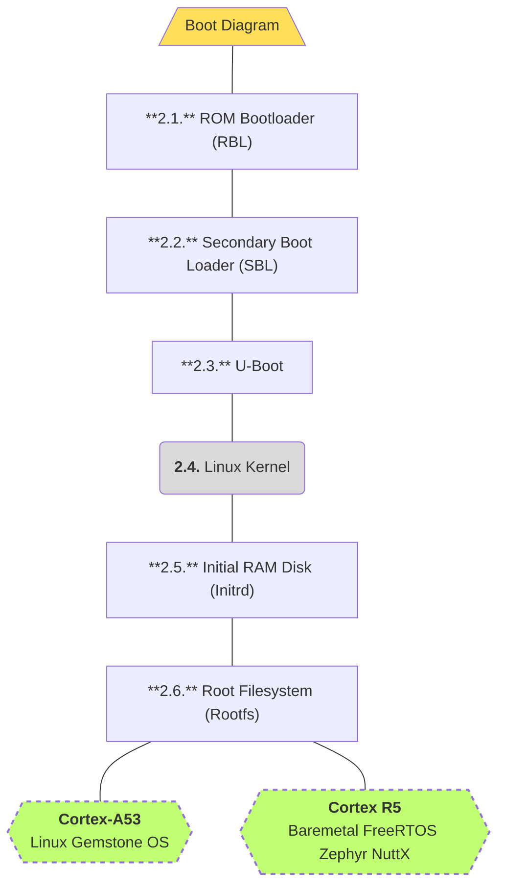

<Frame>

```mermaid
flowchart
	n1@{ shape: "rounded", label: "Boot Diagram" } --- n2["**2.1.** ROM Bootloader (RBL)"]
	n1@{ shape: "trap-b", label: "Boot Diagram" }
  n2["**2.1.** ROM Bootloader (RBL)"]
	n2["**2.1.** ROM Bootloader (RBL)"] --- n3["**2.2.** Secondary Boot Loader (SBL)"]
	n3 --- n4["**2.3.** U-Boot"]
	n4 --- n5@{ shape: "rounded", label: "**2.4.** Linux Kernel" }
	n5 --- n6["**2.5.** Initial RAM Disk (Initrd)"]
	style n1 fill:#FFDE59
	n6 --- n7["**2.6.** Root Filesystem (Rootfs)"]
	n7 --- n8@{ shape: "circle", label: "**Cortex-A53**<br>Linux Gemstone OS" }
	n7["**2.6.** Root Filesystem (Rootfs)"] --- n9@{ shape: "hex", label: "**Cortex R5**<br>Baremetal FreeRTOS Zephyr NuttX" }
	n8@{ shape: "hex", label: "**Cortex-A53**<br>Linux Gemstone OS" }
	style n8 stroke-width:2px,stroke-dasharray:5 5,fill:#C1FF72
	style n9 stroke-width:2px,stroke-dasharray:5 5,fill:#C1FF72
	style n5 fill:#D9D9D9
```
</Frame>
