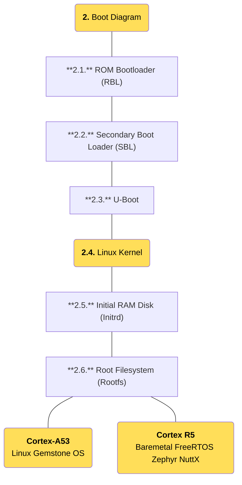

<Frame>

```mermaid
flowchart
	n1@{ shape: "rounded", label: "**2.** Boot Diagram" } --- n2["**2.1.** ROM Bootloader (RBL)"]
  n2["**2.1.** ROM Bootloader (RBL)"]
	n2["**2.1.** ROM Bootloader (RBL)"] --- n3["**2.2.** Secondary Boot Loader (SBL)"]
	n3 --- n4["**2.3.** U-Boot"]
	n4 --- n5@{ shape: "rounded", label: "**2.4.** Linux Kernel" }
	n5 --- n6["**2.5.** Initial RAM Disk (Initrd)"]
	style n1 color:#000000,fill:#FFDE59
	n6 --- n7["**2.6.** Root Filesystem (Rootfs)"]
	n7 --- n8@{ shape: "rounded", label: "**Cortex-A53**<br>Linux Gemstone OS" }
	n7["**2.6.** Root Filesystem (Rootfs)"] --- n9@{ shape: "rounded", label: "**Cortex R5**<br>Baremetal FreeRTOS Zephyr NuttX" }
	n8@{ shape: "rounded", label: "**Cortex-A53**<br>Linux Gemstone OS" }
	style n8 color:#000000,fill:#FFDE59
	style n9 color:#000000,fill:#FFDE59
	style n5 color:#000000,fill:#FFDE59
```
</Frame>

