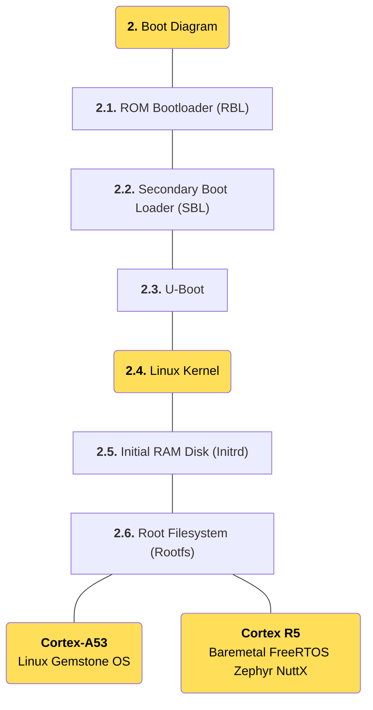

<Frame>

```mermaid
flowchart
	n1@{ shape: "rounded", label: "**2.** Boot Diagram" } --- n2@{ label: "**2.1.** ROM Bootloader (RBL)" }
  n2@{ label: "**2.1.** ROM Bootloader (RBL)" }
	n2@{ label: "**2.1.** ROM Bootloader (RBL)" } --- n3@{ label: "**2.2.** Secondary Boot Loader (SBL)" }
	n3@{ label: "**2.2.** Secondary Boot Loader (SBL)" } --- n4@{ label: "**2.3.** U-Boot" }
	n4@{ label: "**2.3.** U-Boot" } --- n5@{ shape: "rounded", label: "**2.4.** Linux Kernel" }
	n5@{ label: "**2.4.** Linux Kernel" } --- n6@{ label: "**2.5.** Initial RAM Disk (Initrd)" }
	style n1 color:#000000,fill:#FFDE59
	n6 --- n7@{ label: "**2.6.** Root Filesystem (Rootfs)" }
	n7@{ label: "**2.6.** Root Filesystem (Rootfs)" } --- n8@{ shape: "rounded", label: "**Cortex-A53**<br>Linux Gemstone OS" }
	n7@{ label: "**2.6.** Root Filesystem (Rootfs)" } --- n9@{ shape: "rounded", label: "**Cortex R5**<br>Baremetal FreeRTOS Zephyr NuttX" }
	n8@{ shape: "rounded", label: "**Cortex-A53**<br>Linux Gemstone OS" }
	style n8 color:#000000,fill:#FFDE59
	style n9 color:#000000,fill:#FFDE59
	style n5 color:#000000,fill:#FFDE59
```
</Frame>

