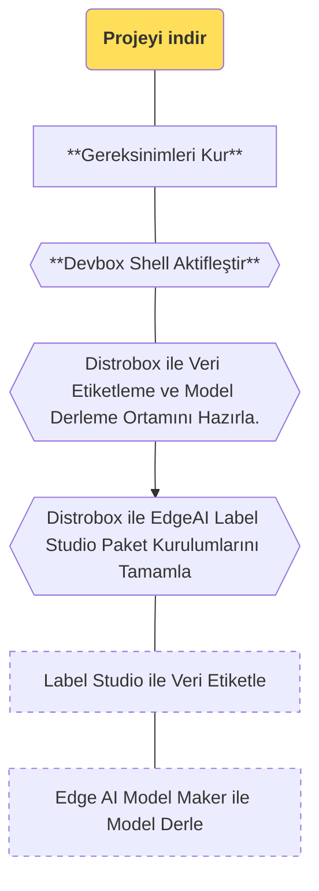

import SnippetSdkClone from '/snippets/ai/clone.mdx';
import SnippetSdkSetup from '/snippets/ai/setup.mdx';
import SnippetSdkDevboxShell from '/snippets/ai/devbox-shell.mdx';
import SnippetSdkTaskBox from '/snippets/ai/task-box.mdx';
import SnippetSdkInstallShell from '/snippets/ai/task-install.mdx';

Bu bölümde [edgeai-tensorlab](https://github.com/t3gemstone/edgeai-tensorlab.git) projesi geliştirici
bilgisayarına indirilerek geliştirme kartında kullanılabilecek araçlarının kurulumu yapılacaktır.

<Tip>
Bölüm bitiminde aşağıdaki konularda tecrübe edineceksiniz.

* edgeai-tensorlab bileşenlerinin temel kullanımını deneyimlemek
* edgeai-tensorlab ile veri etiketleme ve model derlemeleri yapmak
</Tip>

<Steps>
  <Step title="edgeai-tensorlab'ı indir">
    Ubuntu üzerinde `git clone` işlemi yaparak edgeai-tensorlab projesini indir
  </Step>
  <Step title="Gereksinimleri Kur">
    Derleme işlemi yapabilmek için gereksinimleri `setup.sh` isimli scripti çalıştırarak kur
  </Step>
  <Step title="Kütüphane Kurulumlarını Tamamla">
    edgeai-tensorlab içerisindeki araçları kurulumunu tamamlayarak sistemi hazır hale getir
  </Step>
</Steps>

# 1. Hazırlık

Derleme işlemleri Ubuntu 22.04 GNU/Linux dağıtımı içeren bilgisayar ile yapıldı. Debian, Fedora, Pardus gibi
dağıtımların da kullanılması mümkün olmakla birlikte ilk kez buna benzer derleme araçları kullananlar için
Ubuntu 22 veya Ubuntu 24 daha uygun olacaktır.

### 1.1. Bilgisayar Gereksinimleri

1. Ubuntu 22 veya Ubuntu 24 bilgisayar
2. En az 8GB RAM
3. En az 10GB kullanılabilir boş disk alanı

Gemstone SDK `Docker` ve `Devbox` gibi araçlara ihtiyaç duymaktadır. Aşağıdaki komutlarla SDK
projesi klonlandıktan sonra içerisinde bulunan `setup.sh` isimli script bu kurulumları otomatik yapmaktadır.

<Frame>

</Frame>

### 1.2. Projeyi İndir

Ubuntu üzerinde herhangi bir klasörde Terminal açarak aşağıdaki gibi `git clone` komutu ile projeyi klonlayınız.

<SnippetSdkClone />

### 1.3. Gereksinimleri Kur

Klonlama işlemi sonrası aynı terminal ekranından `cd edgeai-tensorlab` komutu ile klasöre girerek `setup.sh`
scriptini çalıştırma işlemini yapınız.

<SnippetSdkSetup />

<Warning>
Docker isimli uygulama daha önce sisteminizde kurulu değilse; ilk kez kuruyorsanız, Bilgisayar kullanıcı oturumunu
kapatarak yeniden giriş yapmayı unutmayınız.
</Warning>

# 2. Derleme

Gereksinim kurulum scriptini tamamladıktan sonra Terminal'den sdk klasörü içerisindeyken Devbox Shell aktifleştirerek
derleme adımlarına başlayabilirsiniz.

### 2.1. Devbox Konsolunu Aktifleştir

Ubuntu paketlerinden farklı versiyonlar içerebilen yazılım paket yönetim sistemi olan **Devbox**'ı aktifleştirerek
edgeai-tensorlab için gerekli indirme işlemlerini ve kurulumları tamamlanmasını sağlayınız.

<SnippetSdkDevboxShell />

### 2.2. Derleme Ortamını Hazırla

Aşağıdaki komut aracılığıyla Distrobox kurulum işlemini gerçekleştiriniz.

<SnippetSdkTaskBox />

Kurulum işleminin sonuna doğru sizlerden `⚠️  First time user password setup ⚠️` distrobox ortamınıza
bir şifre vermeniz istenecektir. Derleme işlemlerini yaparken Terminalden hangi konsol içerisinde bulunduğunuzu
ayırt edebilmeniz için bilgisayarınızın şifresinden farklı olarak 1 karakterlik şifre seçebilirsiniz.
Son olarak `🚀 distrobox:workdir>` satırını gördüğünüzde artık Gemstone Görüntü İşleme modelleri hazırlamak için hazırsınız!

### 2.3. Paket Kurulumlarını Tamamla

Label Studio ve Edge AI Model Maker için gerekli olan kurulumları tamamlayınız.

<SnippetSdkInstallShell />

# 3. Son

Bu bölümü tamamlayarak; Gemstone görüntü işleme modelleri hazırlama ortamını kurdunuz.

<Check>
Sonraki bölüme geçerek veri etiketleme ve Gemstone kartları için model derlemeye başlayabilirsiniz.
</Check>
