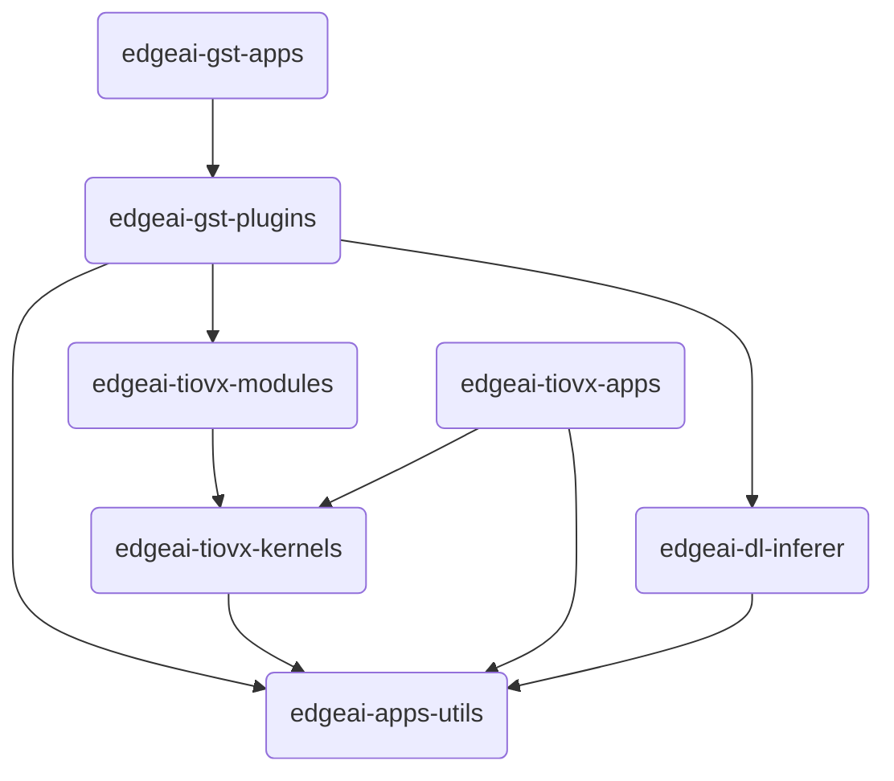

AM67A Serisi SoC’lerde yer alan C7x DSP çekirdekleri, yüksek performanslı sinyal ve görüntü işleme görevleri
için optimize edilmiştir. Bu çekirdekler, Texas Instruments tarafından sağlanan optimize kütüphaneler aracılığıyla
düşük seviyeden ileri seviyeye uzanan geniş bir uygulama yelpazesinde kullanılabilmektedir.

### DSPLIB

DSPLIB (Digital Signal Processing Library), düşük seviye sinyal işleme fonksiyonları için yüksek verimlilik sağlayan 
bir kütüphanedir. Bu kütüphane üzerinden FFT, FIR/IIR filtreleme, korelasyon, konvolüsyon ve matris işlemleri gibi 
temel DSP algoritmaları donanım hızlandırmalı şekilde gerçekleştirilebilir. Bu fonksiyonlar, C7 çekirdeklerinin 
paralel işleme kapasitesinden faydalanarak yüksek hızda çalışır ve özellikle görüntü ön işleme aşamalarında
(örneğin gürültü azaltma, sinyal filtreleme) önemli performans kazançları sağlar.

DSPLIB Kullanıcı Kılavuzuna [buradan](https://software-dl.ti.com/jacinto7/esd/processor-sdk-rtos-jacinto7/11_01_00_04/exports/docs/dsplib/docs/user_guide/index.html) ulaşabilirsiniz.

### VXLIB

VXLIB (Vision Acceleration Library), düşük seviyeli görüntü işleme fonksiyonlarını içeren, OpenVX standardı ile 
uyumlu bir kütüphanedir. Kenar tespiti, histogram hesaplama, morfolojik işlemler, renk uzayı dönüşümleri gibi 
temel görüntü işleme adımları bu kütüphane ile optimize şekilde gerçekleştirilebilir. VXLIB, DSPLIB ile birlikte 
kullanıldığında görüntü işleme hattının tüm aşamalarında (ön işleme, özellik çıkarımı, segmentasyon) yüksek 
verimlilik sağlar.

VXLIB Kullanıcı Kılavuzuna [buradan](https://software-dl.ti.com/jacinto7/esd/processor-sdk-rtos-jacinto7/11_01_00_04/exports/docs/vxlib_11_00_00_01/docs/user_guide/index.html) ulaşabilirsiniz.

###  MATHLIB

MATHLIB, temel ve ileri düzey matematiksel işlemler (trigonometrik fonksiyonlar, logaritmik hesaplamalar, üstel işlemler, karekök, vektörel matematik vb.) için optimize edilmiş fonksiyonlar sunan bir kütüphanedir. 
Bu kütüphane, özellikle yoğun matematiksel hesaplamalar içeren gerçek zamanlı DSP/MCU uygulamalarında C7 çekirdeklerinin donanımsal kapasitesinden en verimli şekilde yararlanılmasını sağlar.

MATHLIB Kullanıcı Kılavuzuna [buradan](https://software-dl.ti.com/jacinto7/esd/processor-sdk-rtos-j722s/latest/exports/docs/mathlib/docs/user_guide/index.html) ulaşabilirsiniz.

### Potansiyel Kullanım Yerleri

Bu üç kütüphane bir arada kullanıldığında, AM67A SoC üzerindeki C7 çekirdekleri sadece düşük seviye işleme değil, 
aynı zamanda karmaşık görüntü analitiği, matematiksel hesaplama süreçleri ve gerçek zamanlı görüntü optimizasyonu 
gibi ileri seviye uygulamaların da temelini oluşturabilir.

Örneğin:

- VXLIB ile görüntü tabanlı özellik çıkarımı
- MATHLIB ile yoğun matematiksel hesaplamaların yüksek performansla yürütülmesi
- DSPLIB ile sinyal ön işleme

Bu sayede sistem genelinde CPU üzerindeki yük azaltılırken, enerji verimliliği yüksek ve gerçek zamanlı 
çalışabilen görüntü işleme ve matematiksel hesaplama çözümleri geliştirilebilir.

## Edge AI Robotics ve Yazılım Ekosistemi

Aşağıdaki tabloda Texas Instruments tarafından sağlanan Edge AI projeleri bulunmaktadır.

### Repository Tablosu

| Repository | Açıklama |
|-----------|----------|
| **[edgeai-robotics-sdk](https://github.com/TexasInstruments/edgeai-robotics-sdk)** | Robotik uygulamalar için temel framework ve API'lar sağlar. TI işlemcilerinde robotik ve bilgisayarlı görü uygulamalarının geliştirilmesini kolaylaştırır. |
| **[edgeai-robotics-demos](https://github.com/TexasInstruments/edgeai-robotics-demos)** | Hazır robotik demo uygulamaları ve örnek kodlar içerir. Hızlı başlangıç ve prototipleme için idealdir. |
| **[edgeai-tidl-tools](https://github.com/TexasInstruments/edgeai-tidl-tools)**  | Derin öğrenme modellerinin TI işlemcilerinde çalıştırılması için gerekli araçları ve örnekleri içerir. |
| **[edgeai-tiovx-apps](https://github.com/TexasInstruments/edgeai-tiovx-apps)** | TI OpenVX (TIOVX) tabanlı bilgisayarlı görü uygulamaları ve örneklerini içerir. Performans optimizasyonu için önemlidir. |
| **[edgeai-gst-plugins](https://github.com/TexasInstruments/edgeai-gst-plugins)** | TI platformları için optimize edilmiş GStreamer plugin'leri içerir. Video işleme ve AI için gerekli olan pipeline'ları oluşturmayı sağlar. |
| **[edgeai-app-stack](https://github.com/TexasInstruments/edgeai-app-stack)** | Edge AI uygulamaları için gerekli olan tüm yazılımları, sistem konfigürasyonları ve entegrasyon araçlarını içerir. |
| **[edgeai-tensorlab](https://github.com/TexasInstruments/edgeai-tensorlab)** | Model optimizasyonu, kalibrasyon ve analiz araçları. Model performansını iyileştirmek için kullanılır. (Daha basit versiyonuna [buradan](/tr/boards/o1/ai/edgeai-tensorlab) ulaşabilirsiniz.) |
| **[edgeai-gst-apps](https://github.com/TexasInstruments/edgeai-gst-apps)** | Bu örnek uygulama sayesinde geliştiricilerin AI işlem hatlarını (pipeline) model değişiklikleri, kamera kaynakları veya çıktı yöntemleriyle nasıl yapılandıracaklarını hızlıca anlamalarına ve özelleştirmelerine olanak tanır. |
| **[edgeai-tiovx-kernels](https://git.ti.com/cgit/edgeai/edgeai-tiovx-kernels)** | TI OpenVX (TIOVX) çerçevesi için özel geliştirilmiş, derin öğrenme tabanlı özel çekirdek (kernel) işlevlerini içerir. |
| **[edgeai-dl-inferer](https://git.ti.com/cgit/edgeai/edgeai-dl-inferer)** | AI modellerini çalıştırmak için derin öğrenme kütüphaneleri sağlar. |
| **[edgeai-apps-utils](https://git.ti.com/cgit/edgeai/edgeai-apps-utils)** | Edge AI uygulamaları için ortak yardımcı programlar ve paylaşılan kütüphaneler koleksiyonudur. |

### Bağımlılık İlişkileri

