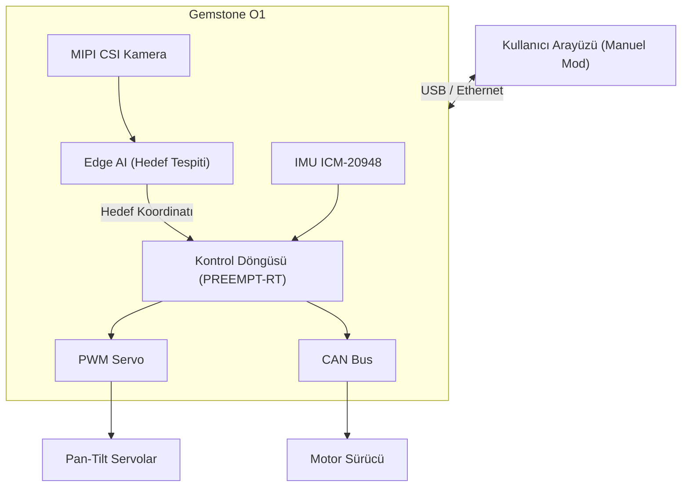

## 1. Genel Bakış

[Teknofest Çelikkubbe Hava Savunma Sistemleri Yarışması](https://teknofest.org/tr/yarismalar/celikkubbe-hava-savunma-sistemleri-yarismasi/),
farklı hava tehditlerini tespit edip imha edebilen yerden kontrollü hava savunma sistemlerinin
geliştirilmesini kapsayan bir yarışmadır. Sistemler; statik hedef imhası, sürü saldırısı karşılama
ve hareketli dost/düşman hedef ayrımı olmak üzere üç aşamadan geçer.

Bu tür bir sistemi hayata geçirmek; gerçek zamanlı görüntü işleme, hedef sınıflandırma ve hassas
servo kontrolünün tek bir platformda birleşmesini gerektiriyor. Güçlü işlem kapasitesi, Edge AI
hızlandırıcısı ve donanımsal PWM çıkışlarıyla kart, hem görme hem de hareket katmanını aynı anda
taşıyabilecek özelliklere sahip.

## 2. Yarışma Platformu

### 2.1. Edge AI ile Hedef Tespiti ve Sınıflandırma

Yarışmanın tüm aşamalarında merkezi gereksinim gerçek zamanlı hedef tespiti ve sınıflandırmasıdır.
Yerleşik 4 TOPS yapay zeka hızlandırıcısı, kamera akışını işleyerek F16, helikopter, balistik füze
ve mini/mikro İHA gibi farklı hedef tiplerini birbirinden ayırt edebilecek işlem gücünü sağlar.
3. Aşamada aynı sahneye dost ve düşman hedefler birlikte girer; sistemin yalnızca düşmanı imha
etmesi, dostu ise atlaması beklenir. Bu ayrımı piksel düzeyinde yapabilmek Edge AI katmanının
doğrudan katkısıdır.

| Görev | Gereken İşlem Gücü |
|-------|--------------------|
| Hedef tespiti (YOLOv8, F16 / helikopter / füze / İHA) | 1–2 TOPS |
| Dost/düşman sınıflandırması (renk/şekil) | 0.5–1 TOPS |
| Hareketli hedef takibi | 1–1.5 TOPS |

Bu modeller, [Edge AI bölümünde](/tr/boards/o1/ai/introduction) anlatılan TI EdgeAI araç zinciriyle
derlenerek karta yüklenebilir.

### 2.2. MIPI CSI Kamera ile Görüntü Algılama

İki adet 4-lane MIPI CSI portu, hedef tespiti ve takibi için kamera modülü bağlamaya olanak tanır.
Raspberry Pi Kamera V2 gibi yaygın modüller desteklenir. Kamera akışı doğrudan Edge AI pipeline'ına beslenerek gerçek zamanlı hedef koordinatları çıkarılır;
bu koordinatlar servo kontrol döngüsüne aktarılır. Pipeline; kamera karesini alan **giriş**,
model çıkarımını (inference) gerçekleştiren **hesaplama** ve sonuçları ileten **çıkış** olmak
üzere üç aşamadan oluşur. Ayrıntılar için TI'ın EdgeAI veri akışı dökümanına bakınız:

- [EdgeAI Veri Akışı (Dataflows) — TI AM67A](https://software-dl.ti.com/jacinto7/esd/processor-sdk-linux-am67a/11_00_00/exports/edgeai-docs/common/edgeai_dataflows.html)

Kamera yapılandırması için [Kamera](/tr/boards/o1/peripherals/camera) sayfasına bakınız.

### 2.3. PWM ile Turret Kontrolü

Sistemin yükseliş ve yan ekseninde hareket edebilmesi için pan-tilt mekanizmasındaki servo motorlara
hassas PWM sinyali üretilmesi gerekir. 40-pin GPIO başlığındaki 7 adet donanımsal PWM kanalı bu iş
için doğrudan kullanılabilir. PWM sinyalleri, Edge AI'dan gelen hedef koordinatlarına göre gerçek zamanlı güncellenerek
otomatik nişan alma döngüsü oluşturulur. Bu döngü tipik olarak her eksen için ayrı bir PID
denetleyicisi ile kurulur; tespit edilen nesnenin karedeki konumu ile merkez arasındaki hata
sinyal olarak kullanılır.

PWM yapılandırması için [PWM](/tr/boards/o1/peripherals/pwm) sayfasına bakınız.

### 2.4. IMU ile Platform Yönelim Ölçümü

Yerleşik ICM-20948 (ivmeölçer + jiroskop + manyetometre), platformun anlık yönelimini ölçer.
Titreşim veya sarsıntı durumlarında nişan alma hesaplamalarına düzeltici girdi sağlar.

IMU hakkında daha fazla bilgi için [IMU](/tr/boards/o1/peripherals/imu) sayfasına bakınız.

### 2.5. Gerçek Zamanlı Nişan Alma Döngüsü

Hareketli hedeflerin takibinde kontrol döngüsünün gecikmesi doğrudan isabet hassasiyetini etkiler.
PREEMPT-RT Linux yaması ile görüntü işleme ve servo güncelleme döngüleri belirli CPU çekirdeklerine
sabitlenebilir; böylece sistem yükünden bağımsız düşük gecikmeli ve tutarlı bir kontrol hızı elde
edilir.

Gerçek zamanlı Linux kurulumu için [PREEMPT-RT](/tr/projects/preempt-rt) sayfasına bakınız.

### 2.6. CAN Bus ile Motor Haberleşmesi

Daha güçlü tahrik gerektiren eksenler için TCAN1462-Q1 CAN FD dönüştürücüsü, DroneCAN veya özel
protokol üzerinden motor sürücüleriyle haberleşme imkânı sağlar. Motor telemetrisi (akım, konum,
sıcaklık) bu arayüz üzerinden okunabilir.

CAN Bus yapılandırması için [CAN Bus](/tr/boards/o1/peripherals/canbus) sayfasına bakınız.

### 2.7. Kullanıcı Arayüzü ve Manuel Mod

Yarışmanın ilk aşaması tamamen manuel modda icra edilir; tüm işlevlerin bir kullanıcı arayüzü,
joystick veya klavye üzerinden çalışması zorunludur. Kart, USB veya Ethernet üzerinden bağlanan
bir bilgisayardaki kontrol arayüzüne komut alabilir. Otonom ve manuel mod geçişleri de bu arayüz
üzerinden yönetilir.

## 3. Örnek Sistem Mimarisi

Kamera akışı Edge AI katmanında işlenerek hedef tipi ve koordinatları belirlenir. Bu bilgi
gerçek zamanlı kontrol döngüsüne aktarılır; kontrol döngüsü PWM veya CAN Bus üzerinden
pan-tilt mekanizmasını sürer. Kullanıcı arayüzü Ethernet veya USB üzerinden bağlanır,
manuel ve otonom modlar buradan geçişir.

## 4. Teknik Referanslar

<CardGroup cols={2}>
  <Card title="Kart Özellikleri" icon="microchip" href="/tr/boards/o1/introduction">
    TI AM67A işlemcisi, 4GB RAM, 32GB eMMC, sensörler ve arayüzlerin tam listesi
  </Card>
  <Card title="Edge AI" icon="microchip-ai" href="/tr/boards/o1/ai/introduction">
    4 TOPS AI hızlandırıcı, model derleme ve nesne tespiti pipeline'ı
  </Card>
  <Card title="PWM" icon="signal" href="/tr/boards/o1/peripherals/pwm">
    Donanımsal PWM pinout tablosu ve servo kontrolü
  </Card>
  <Card title="Gerçek Zamanlı Linux" icon="clock" href="/tr/projects/preempt-rt">
    PREEMPT-RT yaması ile deterministik zamanlama
  </Card>
</CardGroup>

## 5. Yararlı Bağlantılar

- [Teknofest Çelikkubbe Yarışma Sayfası](https://teknofest.org/tr/yarismalar/celikkubbe-hava-savunma-sistemleri-yarismasi/)
- [Yarışma Şartnamesi (PDF)](https://cdn.teknofest.org/media/upload/userFormUpload/2026_%C3%87elikkubbe_Hava_Savunma_Sistemleri_Yar%C4%B1%C5%9Fmas%C4%B1_%C5%9Eartname_TR_v1.3_eFLxN.pdf)
- [T3 Gemstone Topluluk Forumu](https://community.t3gemstone.org/)
