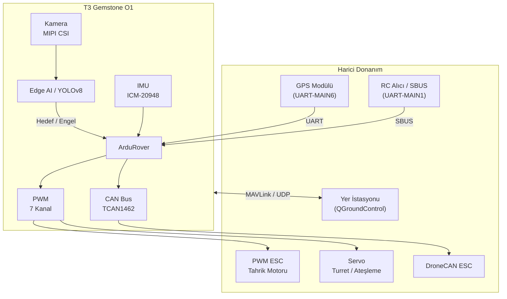

## 1. Genel Bakış

[Teknofest İnsansız Kara Aracı Yarışması](https://teknofest.org/tr/yarismalar/insansiz-kara-araci-yarismasi/),
hem uzaktan kumandalı hem de tam otonom görev icra edebilen insansız kara araçlarının tasarım, üretim ve test
süreçlerini kapsayan ulusal bir yarışmadır. Yarışmada araçlar; ateş desteği görevleri de dahil olmak üzere
harp koşullarında karşılaşılabilecek olaylar dizisini parkur ortamında tamamlaması beklenmektedir.
Kart; güçlü işlem kapasitesi, yerleşik sensörleri, Edge AI hızlandırıcısı ve ArduPilot desteğiyle
bu yarışma için uçtan uca bir platform sunmaktadır.

## 2. T3 Gemstone O1 ile Yarışma Platformu

T3 Gemstone O1, insansız kara aracı geliştirmek için gereken tüm temel yetenekleri tek bir kartta sunar.

### 2.1. ArduPilot ile Kara Aracı Kontrolü

Halihazırda kurulu gelen ArduPilot paketi, kara araçları için özel olarak geliştirilmiş
**ArduRover** aracını içerir. Diferansiyel sürüş, Ackermann direksiyon ve omni-yönlü araç konfigürasyonlarını
destekler. Rota takibi, engelden kaçınma ve otonom görev planlaması doğrudan ArduRover üzerinden sağlanır.

ArduPilot kurulumu ve parametre yapılandırması için [ArduPilot](/tr/projects/ardupilot) sayfasına bakınız.

### 2.2. RC Girişi ile Uzaktan Kumanda

Yarışmanın uzaktan kumandalı aşamasında RC alıcısından gelen SBUS sinyali ArduRover'a iletilir.
Kart UART-MAIN1 RX pini üzerinden SBUS okur; ancak SBUS protokolü ters çevrilmiş sinyal kullandığından
RC alıcısı ile bu pin arasına harici bir sinyal tersleyici devresi bağlanması zorunludur.
RC kanal atamaları ve uçuş modu seçimi ArduRover parametreleriyle yapılandırılır.

Devre şeması ve SBUS yapılandırması için [ArduPilot](/tr/projects/ardupilot) sayfasına bakınız.

### 2.3. Edge AI ile Hedef Tespiti ve Engel Algılama

Yerleşik 4 TOPS kapasiteli yapay zeka hızlandırıcısı, kamera görüntüleri üzerinde gerçek zamanlı
nesne tespiti ve sınıflandırma yapmaya yetecek işlem gücünü sağlar. Yarışma senaryolarındaki tipik AI
gereksinimleri:

| Görev | Gereken İşlem Gücü |
|-------|--------------------|
| Hedef tespiti (YOLOv8s, insan/araç tanıma) | 1–2 TOPS |
| Engel algılama ve yol segmentasyonu | 1.5–2 TOPS |
| İşaret/levha tanıma | 0.5–1 TOPS |
| Derinlik tahmini (mono kamera) | 1.5–2 TOPS |

Bu modeller, [Edge AI bölümünde](/tr/boards/o1/ai/introduction) anlatılan TI EdgeAI araç zinciri ile
T3 Gemstone O1'e derlenerek yüklenebilir.

### 2.4. MIPI CSI Kamera ile Çevre Algılama

İki adet 4-lane MIPI CSI portu, parkur ortamında çevre algılama ve hedef tanıma için kamera modülleri
bağlamaya olanak tanır. Raspberry Pi Kamera V2 gibi yaygın modüller desteklenir. Kamera akışı hem
ArduRover'ın görüntü sistemiyle hem de Edge AI pipeline'ıyla entegre edilebilir.

Kamera yapılandırması için [Kamera](/tr/boards/o1/peripherals/camera) sayfasına bakınız.

### 2.5. PWM ile Motor ve Servo Kontrolü

40-pin GPIO başlığındaki 7 adet donanımsal PWM kanalı; tahrik motorları için ESC
sinyalleri, turret dönüş servoları ve ateşleme mekanizması için kullanılır.

PWM pinout ve yapılandırması için [PWM](/tr/boards/o1/peripherals/pwm) ve [ArduPilot](/tr/projects/ardupilot)
sayfalarına bakınız.

### 2.6. CAN Bus ile Akıllı ESC Haberleşmesi

Kartın TCAN1462-Q1 CAN FD dönüştürücüsü, DroneCAN protokolünü destekleyen akıllı ESC'lerle entegrasyon
imkânı sunar. Bu sayede motor telemetrisi (akım, devir, sıcaklık) doğrudan ArduRover üzerinden okunabilir
ve güç yönetimi daha etkin biçimde yapılabilir.

CAN Bus yapılandırması için [CAN Bus](/tr/boards/o1/peripherals/canbus) sayfasına bakınız.

### 2.7. IMU ile Araç Yönelim ve Navigasyon

Kartın yerleşik ICM-20948 sensörü (ivmeölçer + jiroskop + manyetometre), ArduRover tarafından aracın
yönelimini ölçmek için doğrudan kullanılır. Harici GPS modülüyle birlikte çalışarak EKF tabanlı konum ve
hız tahmini yapılır; bu sayede parkur ortamında hassas otonom navigasyon sağlanır.

IMU hakkında daha fazla bilgi için [IMU](/tr/boards/o1/peripherals/imu) sayfasına bakınız.

### 2.8. GPS ile Otonom Navigasyon

Harici GPS modülü UART-MAIN6 üzerinden bağlanır; harici pusula için I2C-MCU0 kullanılır. ArduRover,
GPS verisiyle waypoint takibi, otomatik rota planlama ve görev icrasını destekler. Otonom aşamalarda
hassas konumlandırma için RTK-GPS kullanımı önerilir.

### 2.9. Gerçek Zamanlı Görev İcrası

Kara araçlarında hızlı engel tepkisi ve kontrol döngüsü zamanlaması kritik öneme sahiptir. PREEMPT-RT
Linux yaması ile deterministik gecikme özelliği kazanılır; ArduRover belirli CPU çekirdeklerine sabitlenebilir.

Gerçek zamanlı Linux kurulumu için [PREEMPT-RT](/tr/projects/preempt-rt) sayfasına bakınız.

### 2.10. Yer İstasyonu Bağlantısı

ArduPilot, MAVLink protokolü üzerinden çeşitli yer kontrol yazılımlarıyla çalışabilir. Kart USB Ethernet
üzerinden MAVLink yayını yapar.

| Yazılım | Platform | Özellik |
|---------|----------|---------|
| [QGroundControl](https://qgroundcontrol.com/) | Windows, Linux, macOS, Android, iOS | Kullanımı kolay, mobil destek |
| [Mission Planner](https://ardupilot.org/planner/) | Windows | Gelişmiş parametre ve görev editörü |
| [MAVProxy](https://ardupilot.org/mavproxy/) | Linux, macOS | Komut satırı, çoklu bağlantı yönlendirme |

## 3. Örnek Sistem Mimarisi

GPS ve RC alıcısı kartla doğrudan UART üzerinden haberleşir. Kamera görüntüsü Edge AI katmanında işlenerek
tespit edilen hedef ve engeller ArduRover'a iletilir. ArduRover, IMU ve GPS verilerini birleştirerek PWM
üzerinden ESC ve servoları, CAN Bus üzerinden akıllı ESC'leri sürer. Yer istasyonu bağlantısı MAVLink/UDP
üzerinden sağlanır.

## 4. Teknik Referanslar

<CardGroup cols={2}>
  <Card title="Kart Özellikleri" icon="microchip" href="/tr/boards/o1/introduction">
    TI AM67A işlemcisi, 4GB RAM, 32GB eMMC, sensörler ve arayüzlerin tam listesi
  </Card>
  <Card title="ArduPilot" icon="drone" href="/tr/projects/ardupilot">
    ArduPilot kurulum kılavuzu, PWM pinout tablosu ve QGroundControl bağlantısı
  </Card>
  <Card title="Edge AI" icon="microchip-ai" href="/tr/boards/o1/ai/introduction">
    4 TOPS AI hızlandırıcı, model derleme ve nesne tespiti pipeline'ı
  </Card>
  <Card title="Gerçek Zamanlı Linux" icon="clock" href="/tr/projects/preempt-rt">
    PREEMPT-RT yaması ile deterministic zamanlama
  </Card>
</CardGroup>

## 5. Yararlı Bağlantılar

- [Teknofest İnsansız Kara Aracı Yarışma Sayfası](https://teknofest.org/tr/yarismalar/insansiz-kara-araci-yarismasi/)
- [ArduRover Dokümantasyonu](https://ardupilot.org/rover/)
- [QGroundControl İndirme](https://qgroundcontrol.com/)
- [T3 Gemstone Topluluk Forumu](https://community.t3gemstone.org/)
