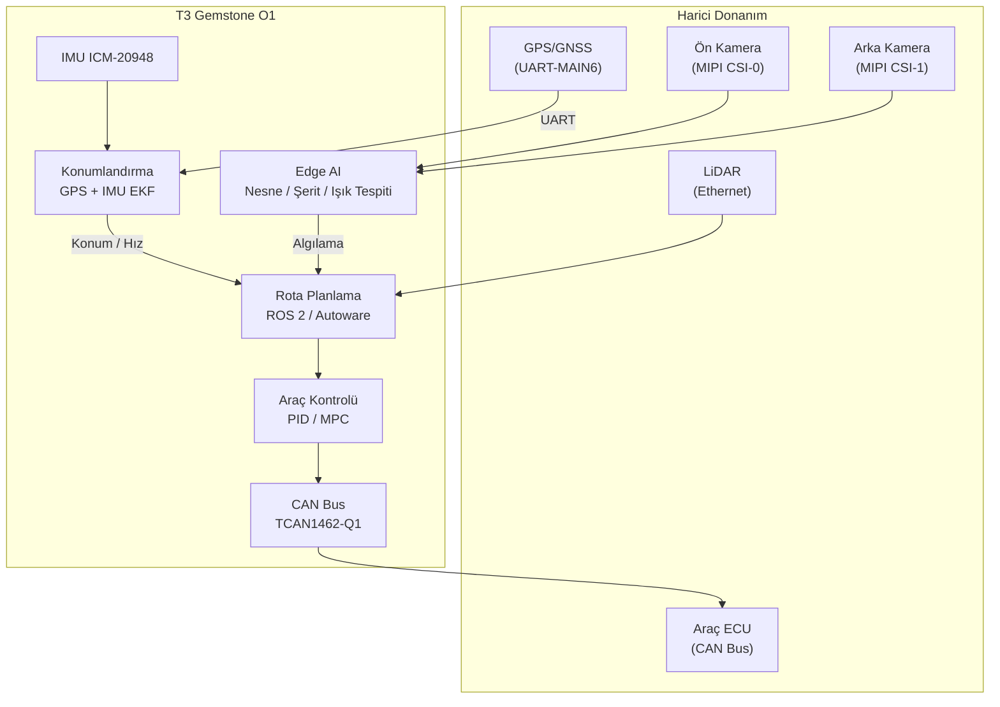

## 1. Genel Bakış

[Teknofest Robotaksi Binek Otonom Araç Yarışması](https://teknofest.org/tr/yarismalar/robotaksi-binek-otonom-arac-yarismasi/),
otonom araç teknolojilerinin ülkemizde geliştirilmesini desteklemek amacıyla düzenlenmektedir.
Yarışmada araçların, şehir içi trafik koşullarını simüle eden bir parkurda yolcu alma/indirme,
trafik kurallarına uyum, engel sakınma ve park görevlerini otonom olarak tamamlaması beklenmektedir.

Yarışma iki kategoride yürütülmektedir:

- **Özgün Araç:** Takım aracı ve yazılımı baştan tasarlar, üretir.
- **Hazır Araç:** TEKNOFEST tarafından sağlanan tam donanımlı elektrikli araç platformuna özgün yazılım geliştirilir.

T3 Gemstone O1; Edge AI hızlandırıcısı, çoklu kamera desteği, CAN Bus araç arayüzü ve gerçek zamanlı Linux ile her iki kategori için uçtan uca bir platform sunar.

## 2. T3 Gemstone O1 ile Sistem Tasarımı

### 2.1. ROS 2 Otonom Sürüş Yığını

Otonom araç yazılımı; algılama, konumlandırma, planlama ve kontrol katmanlarının birbirleriyle haberleşmesini gerektirir. ROS 2, bu katmanları bağımsız node'lar olarak çalıştırıp aralarındaki veri akışını yönettiği için otonom sürüş yazılımında endüstri standardı hâline gelmiştir. T3 Gemstone O1 üzerinde Ubuntu 22.04 ve ROS 2 Humble çalıştırılabilir; Autoware veya özel geliştirilmiş sürüş yığınları bu ortamda doğrudan yürütülür.

| ROS 2 Node | Görev |
|------------|-------|
| `perception` | Kamera + LiDAR füzyonu, nesne/şerit tespiti |
| `localization` | GPS + IMU EKF, HD harita eşleştirme |
| `planning` | Global ve lokal rota planlama, engel tepkisi |
| `control` | PID/MPC direksiyon ve hız kontrolü |
| `vehicle_interface` | CAN Bus üzerinden araç aktüatör komutları |

### 2.2. Edge AI ile Çevre Algılama

Parkurda yayaları, araçları, trafik işaretlerini ve şeritleri eş zamanlı olarak tanımak; standart CPU işlem gücüyle gerçek zamanlı yürütülmesi güç bir hesaplama yüküdür. Yerleşik 4 TOPS yapay zeka hızlandırıcısı bu işlemi harici bir donanıma gerek duymadan kart üzerinde çalıştırır.

| Görev | Model | Gereken İşlem Gücü |
|-------|-------|--------------------|
| Araç / yaya / engel tespiti | yolox_s_lite | 1–1,5 TOPS |
| Şerit ve yol segmentasyonu | deeplabv3plus_mobilenetv2_tv_edgeailite | 1–1,5 TOPS |
| Trafik işareti / ışık tanıma | mobilenet_v2_lite | 0,5 TOPS |

Desteklenen model listesi ve derleme adımları için [Model Hazırlama](/tr/boards/o1/ai/process) sayfasına bakınız.

### 2.3. MIPI CSI ile Çift Kamera

Tek kamera hem ön hem arka görüşü aynı anda karşılayamaz; ayrıca park manevraları sırasında araç arkasının görülmesi kritik önem taşır. İki adet 4-lane MIPI CSI portu; ön geniş açı ve arka dar açı kamera gibi çift kamera kurulumuna olanak tanır. Kamera akışları Edge AI pipeline'ına ve ROS 2 `/image_raw` topic'lerine beslenir.

Kamera yapılandırması için [Kamera](/tr/boards/o1/peripherals/camera) sayfasına bakınız.

### 2.4. GPS ve IMU ile Konumlandırma

GPS tek başına yüksek frekanslı konum güncellemesi sağlayamaz; ani hız veya yön değişimlerinde gecikir. Bu nedenle yerleşik ICM-20948'den (9-eksen) gelen IMU verileri GPS ile EKF aracılığıyla birleştirilerek yüksek frekanslı konum, hız ve yönelim tahmini elde edilir. Harici GPS modülü UART-MAIN6, harici pusula I2C-MCU0 üzerinden bağlanır. Hassas konumlandırma gereken durumlarda RTK-GPS önerilir.

IMU hakkında ayrıntılar için [IMU](/tr/boards/o1/peripherals/imu) sayfasına bakınız.

### 2.5. CAN Bus ile Araç Kontrolü

Araç gövdesindeki ECU'lar gaz, fren ve direksiyon komutlarını standart CAN protokolü üzerinden bekler; bu nedenle yazılım katmanının da CAN üzerinden haberleşmesi gerekir. Kartın TCAN1462-Q1 CAN FD dönüştürücüsü bu komutları araç ECU'larına iletir ve araçtan gelen hız ile durum telemetrisini okur.

CAN Bus yapılandırması için [CAN Bus](/tr/boards/o1/peripherals/canbus) sayfasına bakınız.

### 2.6. Gerçek Zamanlı Kontrol

Standart Linux çekirdeği, süreç zamanlamasını garanti etmez; yüksek sistem yükünde kontrol döngüsü gecikmesi artarak sürüş güvensizliğine yol açabilir. PREEMPT-RT Linux yaması ile deterministik gecikme sağlanır; kontrol döngüsü node'ları belirli CPU çekirdeklerine sabitlenebilir.

[PREEMPT-RT](/tr/projects/preempt-rt) sayfasına bakınız.

### 2.7. Simülasyon

Gerçek araç testleri; alan, ekipman ve güvenlik koşulları gerektirdiğinden her aşamada uygulanamaz. T3 Gemstone O1 üzerinde çalışan ROS 2 yığınları Gazebo veya CARLA simülatörleriyle doğrudan test edilerek algoritmalar gerçek araca taşınmadan önce doğrulanabilir.

## 3. Örnek Sistem Mimarisi

## 4. Teknik Referanslar

<CardGroup cols={2}>
  <Card title="Kart Özellikleri" icon="microchip" href="/tr/boards/o1/introduction">
    TI AM67A işlemcisi, 4 GB RAM, 32 GB eMMC, sensörler ve arayüzlerin tam listesi
  </Card>
  <Card title="Edge AI" icon="microchip-ai" href="/tr/boards/o1/ai/introduction">
    4 TOPS AI hızlandırıcı, model derleme ve nesne tespiti pipeline'ı
  </Card>
  <Card title="CAN Bus" icon="network-wired" href="/tr/boards/o1/peripherals/canbus">
    TCAN1462-Q1 CAN FD dönüştürücü ve araç haberleşme entegrasyonu
  </Card>
  <Card title="Gerçek Zamanlı Linux" icon="clock" href="/tr/projects/preempt-rt">
    PREEMPT-RT yaması ile deterministik zamanlama
  </Card>
</CardGroup>

## 5. Yararlı Bağlantılar

- [Teknofest Robotaksi Yarışma Sayfası](https://teknofest.org/tr/yarismalar/robotaksi-binek-otonom-arac-yarismasi/)
- [Autoware Dokümantasyonu](https://autowarefoundation.github.io/autoware-documentation/)
- [ROS 2 Humble Dokümantasyonu](https://docs.ros.org/en/humble/)
- [CARLA Simülatörü](https://carla.org/)
- [T3 Gemstone Topluluk Forumu](https://community.t3gemstone.org/)
