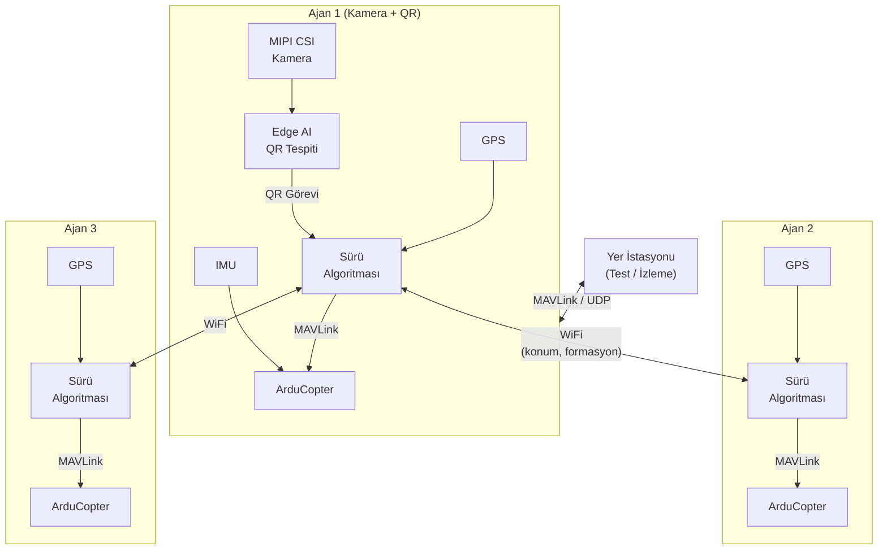

## 1. Genel Bakış

[Teknofest Sürü İHA Yarışması](https://teknofest.org/tr/yarismalar/suru-iha-yarismasi/),
birden fazla insansız hava aracının otonom formasyon uçuşu yapmasını, QR kodlardan görev bilgisi
okuyarak dinamik görev planlaması gerçekleştirmesini ve tek bir kumandadan toplu koordineli hareket
etmesini kapsayan bir yarışmadır. Sivil ve savunma alanlarında giderek daha kritik bir
konuma gelen sürü zekası algoritmalarının gerçek donanım üzerinde gösterilmesini esas alır.

Bu tür bir sistemi ayağa kaldırmak; eş zamanlı uçuş kontrolü, gerçek zamanlı görüntü işleme ve
ajanlar arası haberleşmenin tek bir platformda bir arada çalışmasını gerektiriyor. Güçlü işlem
kapasitesi, Edge AI hızlandırıcısı ve yerleşik WiFi ile kart, sürüdeki her bir İHA için hazır
bir ajan bilgisayarına dönüşüyor.

## 2. Sürü Platformu

### 2.1. ArduPilot ile Multikopter Kontrolü

Halihazırda kurulu gelen ArduPilot paketi, multikopter gövdeleri için geliştirilmiş
**ArduCopter** aracını içerir. Stabilizasyon, irtifa tutma ve waypoint takibi doğrudan bu katman
üzerinden sağlanır. Sürüdeki her ajan için ayrı bir ArduCopter örneği çalıştırılır; sürü yazılımı
bu örneklere MAVLink arayüzü üzerinden komut gönderir.

ArduPilot kurulumu için [ArduPilot](/tr/projects/ardupilot) sayfasına bakınız.

### 2.2. Edge AI ile QR Kod Algılama

Yarışmanın en kritik gereksinimlerinden biri, sürüdeki en az bir ajanın QR kodu görsel yolla
tespit edip içeriğini çözümlemesidir. Yerleşik 4 TOPS yapay zeka hızlandırıcısı, kamera akışını
gerçek zamanlı işleyerek QR tespiti ve iniş alanı renk segmentasyonu için yeterli işlem gücünü sağlar.

| Görev | Gereken İşlem Gücü |
|-------|--------------------|
| QR kod tespiti ve çözümleme | 0.5–1 TOPS |
| İniş alanı renk segmentasyonu (kırmızı/mavi) | 0.5–1 TOPS |
| Çarpışma önleme için çevre algılama | 1–1.5 TOPS |

Bu modeller, [Edge AI bölümünde](/tr/boards/o1/ai/introduction) anlatılan TI EdgeAI araç zinciriyle
derlenerek karta yüklenebilir.

### 2.3. MIPI CSI Kamera ile Görüntü Algılama

İki adet 4-lane MIPI CSI portu, QR kod okuma ve iniş alanı tespiti için kamera modülü bağlamaya
olanak tanır. Raspberry Pi Kamera V2 gibi yaygın modüller desteklenir. Kamera akışı hem QR
çözümleme pipeline'ına hem de çarpışma önleme algoritmalarına beslenebilir.

Kamera yapılandırması için [Kamera](/tr/boards/o1/peripherals/camera) sayfasına bakınız.

### 2.4. WiFi ile Dağıtık Sürü Haberleşmesi

Sürü haberleşmesinde her ajanın kendi kararını aldığı dağıtık bir mimari tercih edilmelidir.
Yerleşik 802.11n WiFi, ajanlar arası konum, hız ve formasyon durumu mesajlarının UDP/TCP üzerinden
paylaşılmasına olanak tanır. Ajanlar bir erişim noktası üzerinden ya da Linux'ta yazılım tabanlı
ad-hoc ağ kurularak haberleşebilir.

### 2.5. IMU ile Sürü Stabilizasyonu

Yerleşik ICM-20948 (ivmeölçer + jiroskop + manyetometre), ArduCopter tarafından her ajanın anlık
yönelimini ölçmek için kullanılır. Formasyon manevraları sırasında hassas pitch, roll ve yaw
ölçümleri sürü geometrisinin korunmasına katkı sağlar.

IMU hakkında daha fazla bilgi için [IMU](/tr/boards/o1/peripherals/imu) sayfasına bakınız.

### 2.6. GPS ile Otonom Navigasyon

Harici GPS modülü UART-MAIN6 üzerinden bağlanır. Her ajan kendi GPS konumunu okur; sürü yazılımı
bu konumları birleştirerek formasyon geometrisini ve rotayı hesaplar.

GPS bağlantısı ve yapılandırması için [ArduPilot](/tr/projects/ardupilot) sayfasına bakınız.

### 2.7. Gerçek Zamanlı Sürü Algoritması

Formasyon güncelleme döngüsü ve çarpışma önleme hesaplamalarının deterministik zamanlama
gerektirdiği durumlar için PREEMPT-RT Linux yaması kritik bir avantaj sağlar. Sürü algoritması
belirli CPU çekirdeklerine sabitlenebilir; böylece sistem yükünden bağımsız tutarlı güncelleme
hızları elde edilir.

Gerçek zamanlı Linux kurulumu için [PREEMPT-RT](/tr/projects/preempt-rt) sayfasına bakınız.

### 2.8. MAVLink ile İzleme ve Hata Ayıklama

Yarışma öncesi test sürecinde her ajan, MAVLink protokolü üzerinden QGroundControl veya
Mission Planner'a bağlanabilir. Kart USB Ethernet üzerinden MAVLink yayını yapar; WiFi üzerinden
çoklu ajan telemetrisi izlenebilir.

| Yazılım | Platform | Özellik |
|---------|----------|---------|
| [QGroundControl](https://qgroundcontrol.com/) | Windows, Linux, macOS, Android, iOS | Çoklu araç izleme, kolay arayüz |
| [Mission Planner](https://ardupilot.org/planner/) | Windows | Parametre yapılandırma, gelişmiş görev editörü |
| [MAVProxy](https://ardupilot.org/mavproxy/) | Linux, macOS | Çoklu bağlantı yönlendirme, komut satırı |

## 3. Örnek Sistem Mimarisi

Her ajan kendi kartı üzerinde ArduCopter, sürü algoritması ve (gerekirse) Edge AI pipeline'ını
koşturur. Ajanlar arası haberleşme WiFi üzerinden sağlanır. En az bir ajanda kamera ve QR
tespiti aktif olup çözümlenen görev bilgisi tüm sürüye yayınlanır.

## 4. Teknik Referanslar

<CardGroup cols={2}>
  <Card title="Kart Özellikleri" icon="microchip" href="/tr/boards/o1/introduction">
    TI AM67A işlemcisi, 4GB RAM, 32GB eMMC, sensörler ve arayüzlerin tam listesi
  </Card>
  <Card title="ArduPilot" icon="drone" href="/tr/projects/ardupilot">
    ArduCopter kurulum kılavuzu, PWM pinout tablosu ve QGroundControl bağlantısı
  </Card>
  <Card title="Edge AI" icon="microchip-ai" href="/tr/boards/o1/ai/introduction">
    4 TOPS AI hızlandırıcı, model derleme ve QR tespiti pipeline'ı
  </Card>
  <Card title="Gerçek Zamanlı Linux" icon="clock" href="/tr/projects/preempt-rt">
    PREEMPT-RT yaması ile deterministik zamanlama
  </Card>
</CardGroup>

## 5. Yararlı Bağlantılar

- [Teknofest Sürü İHA Yarışma Sayfası](https://teknofest.org/tr/yarismalar/suru-iha-yarismasi/)
- [Yarışma Şartnamesi (PDF)](https://cdn.teknofest.org/media/upload/userFormUpload/2026_SURU_IHA_YARISMASI_TR_20_02_V2_Oaybk.pdf)
- [ArduCopter Dokümantasyonu](https://ardupilot.org/copter/)
- [QGroundControl İndirme](https://qgroundcontrol.com/)
- [T3 Gemstone Topluluk Forumu](https://community.t3gemstone.org/)
