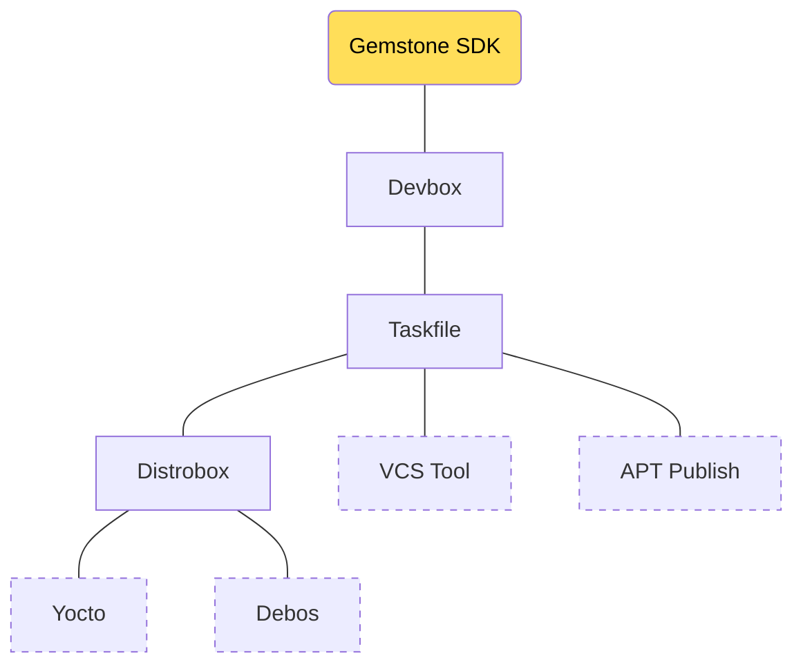
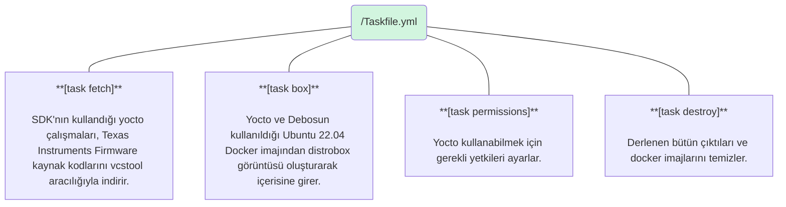
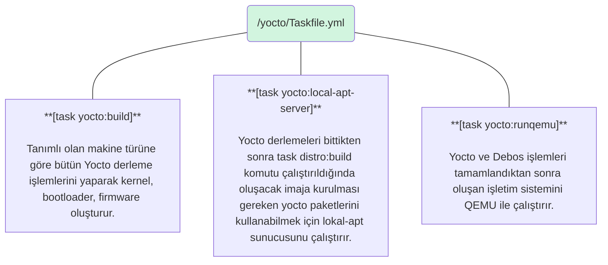
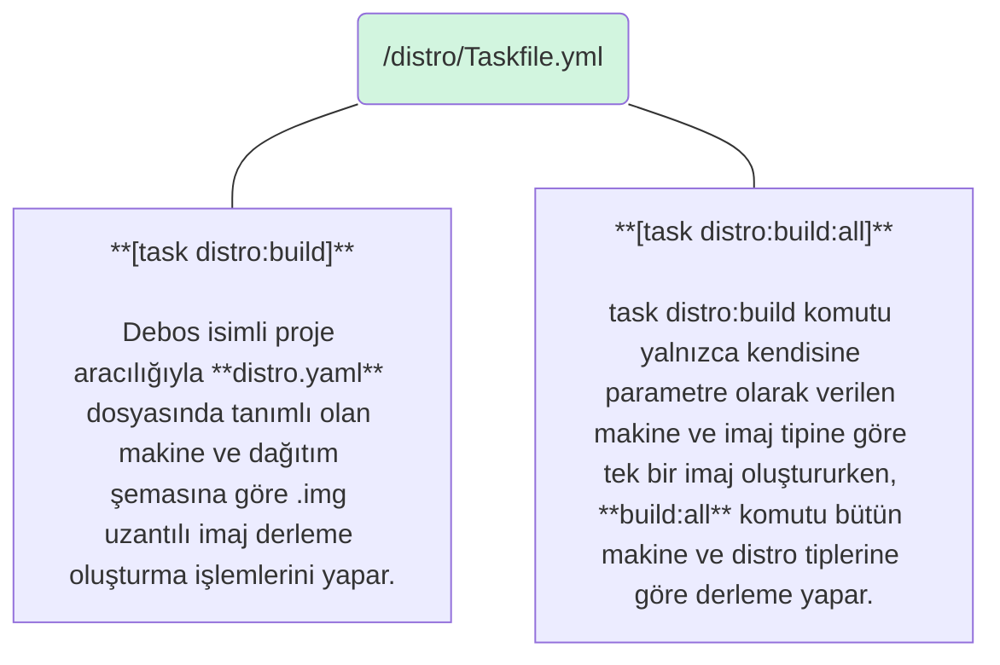

<Note>
Bu bölümde Gemstone [SDK](../community/faq#sdk-nedir)'sında bulunan bütün araçların detaylı kullanımına ve
neden tercih edildiğine değinilecektir.
</Note>

<Tip>
Bölüm bitiminde aşağıdaki konularda tecrübe edineceksiniz.

* SDK Projesinin işlevi ve klasör yapısı
* Devbox, Distrobox, Taskfile, VCSTool, Debos, Debootstrap gibi araçların kullanımı.
</Tip>

Bilindiği gibi Linux; açık kaynak kodlu bir işletim sistemi çekirdeğidir (Kernel). İşletim sistemi ise Kernel, Shell,
Masaüstü uygulamaları, pencere yöneticisi, metin editörleri, tarayıcı, sistem araçları ve sistem servisleri
gibi onlarca farklı uygulamayı barındıran bir bütündür. Windows gibi işletim sistemlerinin aksine tek bir üretici
tarafından dağıtılmayıp farklı kuruluşlarca derlenerek toparlanıp farklı isimlerle özgürce yayınlanabilmektedir.
Örneğin: [Ubuntu](https://ubuntu.com/), [Debian](https://www.debian.org/), [Pardus](https://pardus.org.tr/),
[Fedora](https://www.fedoraproject.org/), [openSUSE](https://www.opensuse.org/) gibi işletim sistemlerinin hepsi
Linux kerneli içermekle birlikte farklı GNU araçları, açık kaynak yazılım veya versiyonlar barındırmaktadır. 

Linux içeren bu işletim sistemleri çoğunlukla [Distro](../community/faq#distro-nedir) (Dağıtım) olarak
isimlendirilmektedir. İçerisinde bulunan açık kaynak kodlu yazılımların çoğununluğunun ise GNU (www.gnu.org)
çalışmaları olması münasebetiyle GNU/Linux olarak anılması açık kaynak kod topluluğu tarafından tercih edilmektedir.

Bu durum çok büyük bir çeşitlilik, özelleştirme imkanı ve güç ile birlikte farklı yazılım versiyonlarının
kullanılması dolayısıyla uyumsuzluklara ve hatalara neden olabilmektedir. Söz gelimi; Ubuntu 22 ve 
Ubuntu 24 sürümlerinde kullanılan bir metin editörünün kullandığı kütüphaneler
[Fedora Workstation 42](https://fedoraproject.org/workstation/download) ile farklılık gösterebilmektedir.

Gemstone SDK'sında kullanılan özellikle [Yocto](https://www.yoctoproject.org/) gibi araçlar ise belirli
GNU/Linux dağıtımlarının versiyonlarına destek vermekte ve bu hususlar ilgili projelerin dokümanlarında belirtilmektedir.

İşte bu gibi farklılıkların giriş seviyesindeki kullanıcılar için yarattığı karmaşıklığı azaltmak için Gemstone
[SDK](../community/faq#sdk-nedir)'sında derleme araçları için Devbox ve Distrobox gibi çözümlerden faydalanılmıştır.
Bu araçlar GNU/Linux dağıtımı veya dağıtımların versiyonları farketmeksizin ihtiyaç duyulan yazılımların
uygun sürümlerini bütün sistemlerde aynı yapı ile kullanmaya imkan sağlar!

<Tip>
Bu duruma bir örnek vermek gerekirse Ubuntu 22.04 ile `sudo apt install libfmt-dev` komutuyla 
[fmt](https://github.com/fmtlib/fmt) isimli kütüphaneyi kurduğunuzda sisteminizde bulunacak versiyon ile
Fedora'da `sudo dnf install libfmt-dev` komutu ile kurulan farklı olabilir. Dolayısıyla sizler yazılım geliştirirken
kodlarınızı indirip derleyen kişilerin uygun versiyonları temin etmesi gerekir.
</Tip>

[Devbox](https://www.jetify.com/devbox): bu gibi farklı versiyonların olası etkilerini ve karmaşıklığı azaltmak için
oluşturulmuş açık kaynaklı bir paket yönetim sistemidir. Ubuntu, Fedora gibi dağıtımlarda aynı yazılım versiyonlarını
kullanabilmeye olanak verir.

<Tip>
Devbox ile QEMU'nun 10.0 numaralı sürümünü kullanmak istiyorsanız ve Ubuntu, Pardus, Debian'ın varsayılan paket 
yöneticilerinde farklı versiyonlar mevcut ise Devbox çok uygun yardımcı bir araç olmaktadır.
</Tip>

[Distrobox](https://distrobox.it/): Docker gibi konteynır teknolojilerinden faydalanarak farklı GNU/Linux
dağıtımlarının istediğiniz versiyonunu yine kullandığınız GNU/Linux üzerinde çalıştırmayı sağlar.
(Örneğin Fedora 42 kullanarak Distrobox aracılığıyla Terminal üzerinen Ubuntu 22.04 kullanabilirsiniz)

Gemstone SDK'sında ihtiyaç duyulan yazılımların kurulumu için her bir dağıtıma özgü çalışma yapılmasına gerek bırakmamak
adına Devbox kullanılmıştır ve `sdk/devbox.json` dosyasında hangi yazılımların kurulduğu mevcuttur.

[Taskfile](https://taskfile.dev/): Betik komutları çalıştırırken çoğu zaman **.sh** uzantılı script adı verilen
küçük uygulamalar kullanılmaktadır. Zaman içerisinde bu betik/shell script'lerinin artması ile karmaşıklık oluşmakta ve 
kullanım zorluğu oluşmaktadır. Bu gibi zorlukları azaltmak için Task isimli bir araç kullanılmıştır ve çalıştırılacak
scriptleri **.yml** uzantılı dosyalara küçük parçalar halinde yazmaya, sınıflandırmaya, Terminal'den `<tab>` tuşuna
basıldığında otomatik tamamlama gibi ek özellikleri kullanmaya imkan sağlar. `sdk/Taskfile.yml` dosyasında
SDK'nın temel Taskfile dosyası bulunmaktadır.

# 1. SDK Bileşenleri

Temel kullanım amacı Gemstone geliştirme kartlarında bulunan bütün çekirdek (Linux Kernel, Bootloader, Firmware, Driver)
ve işletim sistemi (içerisinde kullandığınız bütün uygulamaları barındıran) imajlarını oluşturmak olan
**Gemstone SDK'sında**; aşağıdaki şemada bulunan araçlardan yararlanılmıştır.



### 1.1. Klasör Yapısı

```bash highlight={2,4,10,21,32}
|-- build
|-- devbox.json
|-- distro
|   |-- distro.yaml
|   |-- overlays
|   |   |-- desktop
|   |   |-- kiosk
|   |   |-- minimal
|   |-- scripts
|   |-- Taskfile.yml
|-- distrobox.ini
|-- Dockerfile
|-- LICENSE
|-- README.md
|-- repos.yml
|-- setup.sh
|-- src
|   |-- cc33xx-fw
|   |-- ti-img-rogue-umlibs
|   |-- wl18xx-fw
|-- Taskfile.yml
|-- utils
|   |-- Taskfile.yml
|-- yocto
    |-- meta-arm
    |-- meta-gemstone
    |-- meta-intel
    |-- meta-openembedded
    |-- meta-ti
    |-- openembedded-core
    |-- poky
    |-- Taskfile.yml
```

| Klasör              | Açıklama |
| :--------------     | :------- |
| /build              | Yocto, Debos ve diğer derleme araçlarının ürettiği bütün çıktıların bu klasördür |
| /distro             | Gemstone'nun Desktop, Minimal gibi farklı imajlarına ait konfigürasyonların, özelleştirme dosyalarının bulunduğu klasördür |
| /yocto              | Gemstone projesine ait yocto çalışmalarıdır. |
| /src                | Texas Instruments gibi çipleri içeren geliştirme kartına ait Firmware'lerin veya harici projelerin kaynak kodlarının bulunduğu klasördür. |

| Dosya               | Açıklama |
| :--------------     | :------- |
| repos.yml           | Gemstone SDK'nın ihtiyaç duyduğu bütün harici projelerin kaynak kodlarının git vb. repo adreslerini içeren dosyadır. vcstool ismi verilen bir uygulama ile `fetch` işlemi yapılarak kaynak kodlar bu klasöre indirilir |
| distrobox.ini       | Distrobox isimli araç ile Ubuntu 22.04 docker konteynırını oluşturan konfigürasyon dosyasıdır |
| Taskfile.yml        | Her klasörde bulunan taskfile dosyası `task klasor:komut` biçiminde betik komutları çalıştırmayı sağlar |
| devbox.json         | Devbox Shell konfigürasyon dosyasıdır |
| /distro/distro.yaml | Gemstone Desktop, Minimal, Kiosk isimli imajları özelleştirerek oluşturan Debos konfigürasyon dosyasıdır |


### 1.2. Devbox

Gemstone SDK'sında kullanılan devbox, [SDK Giriş Bölümünde](./sdk/introduction#1-3-gereksinimleri-kur) anlatıldığı gibi proje
klonlandıktan sonra `setup.sh` komutunun çalıştırılması ile sisteminize kurulur. Akabinde terminalden klasör
içerisinde `devbox shell` komutunu çalıştırdığınızda aktifleşerek `devbox.json` dosyasında tanımlı
olan **Distrobox, Taskfile, VSCTool, Qemu** paketlerini indirerek `sdk/.devbox` klasörüne kurar ve içerisindeki
yazılımları kullanabilmeniz için shell aktifleştirir. Temel kullanım amacı farklı GNU/Linux dağıtımlarında aynı
versiyona sahip yardımcı uygulamaların, paketlerin ortak bir sistemle kurulması ve kullanılabilmesidir.

[Bu adrese](https://www.jetify.com/docs/devbox/quickstart/) tıklayarak alıştırmalar yapınız ve akabinde `sdk/devbox.json`
dosyasını inceleyiniz.

### 1.3. Taskfile

Gemtone SDK'sını kullanırken Terminalden `task fetch`, `task yocto:build` veya `task distro:build` gibi komutları
çalıştırdığınızda `sdk/Taskfile.yml`, `sdk/yocto/Taskfile.yml` veya `sdk/distro/Taskfile.yml` dosyalarında tanımlı
olan fonksiyonlar icra edilir.

<Note>
Taskfile isimli uygulama, devbox.json dosyasında tanımlandığı için Devbox tarafından sisteminize kurulur.
</Note>

[Bu adrese](https://taskfile.dev/installation/) tıklayarak alıştırmalar yapınız ve
akabinde `sdk/distro/Taskfile.yml` dosyasını inceleyiniz.

Aşağıdaki şemalarda SDK'nın kullandığı bütün Task fonksiyonlarının özeti verilmiştir.

#### 1.3.1. Temel Task Fonksiyonları

<Card>

</Card>

#### 1.3.2. Yocto Task Fonksiyonları

<Card>

</Card>

#### 1.3.3. Distro Task Fonksiyonları

<Card>

</Card>

#### 1.3.4. Örnek Kullanım

```bash highlight={4,16}
gem@ubuntu:~$ cd sdk/
gem@ubuntu:sdk$ devbox shell
Starting a devbox shell...
📦 devbox:sdk> task box
task: [box] distrobox-list | grep -q 'gemstone-sdk' || docker build -f Dockerfile -t gemstone-sdk:latest .
task: [box] distrobox-assemble create --file distrobox.ini
 - Creating gemstone-sdk...
gemstone-sdk already exists
task: [box] distrobox-enter --additional-flags "--tty" --name gemstone-sdk --no-workdir
 _____ _____   _____                     _       _   _             
|_   _|___ /  |  ___|__  _   _ _ __   __| | __ _| |_(_) ___  _ __  
  | |   |_ \  | |_ / _ \| | | | '_ \ / _` |/ _` | __| |/ _ \| '_ \ 
  | |  ___) | |  _| (_) | |_| | | | | (_| | (_| | |_| | (_) | | | |
  |_| |____/  |_|  \___/ \__,_|_| |_|\__,_|\__,_|\__|_|\___/|_| |_|
                                                                   
🚀 distrobox:workdir> 
🚀 distrobox:workdir> task yocto:build
🚀 distrobox:workdir> task distro:build
```

### 1.4. VCSTool
### 1.5. Distrobox
### 1.6. Yocto
### 1.7. Debos
