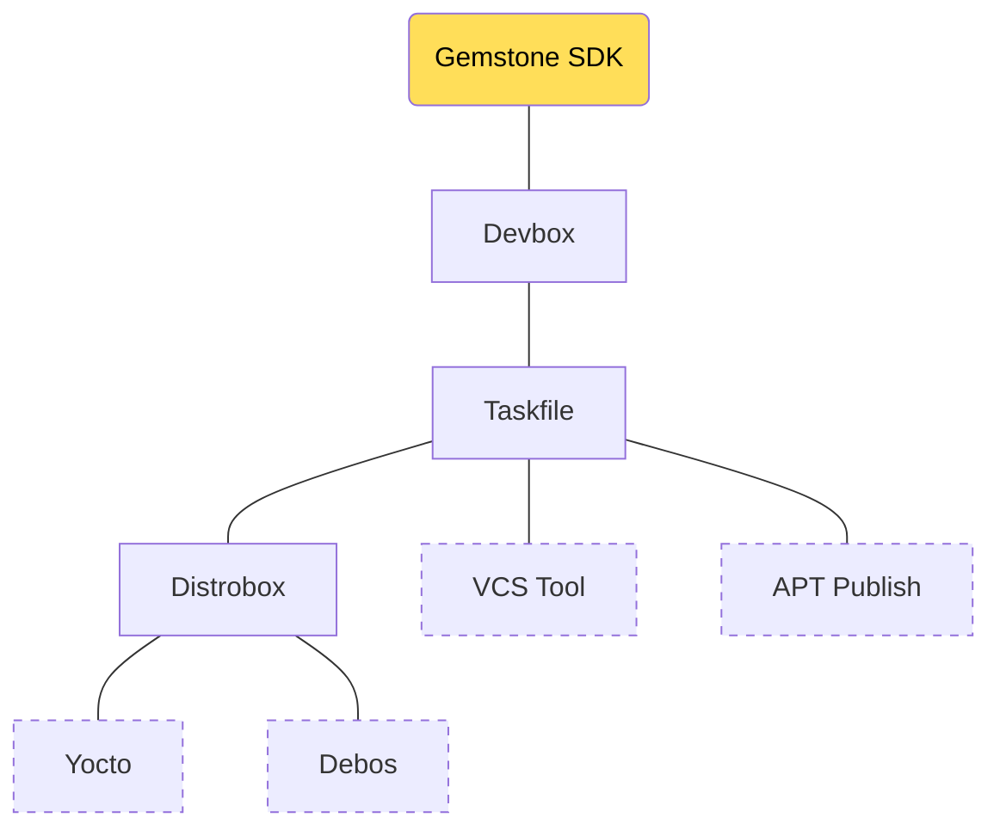

Bu bölümde Gemstone SDK'sında bulunan bütün araçların detaylı kullanımına ve neden tercih edildiğine değinilecektir.

<Tip>
Bölümü tamamladığınızda aşağıdaki konularda tecrübe edineceksiniz.

* SDK Projesinin işlevi ve klasör yapısı
* Devbox, Distrobox, Taskfile, VCSTool, Debos, Debootstrap gibi araçların kullanımı.
</Tip>

# 1. SDK Bileşenleri

Temel kullanım amacı Gemstone geliştirme kartlarında bulunan bütün çekirdek (Linux Kernel, Bootloader, Firmware, Driver)
ve işletim sistemi (içerisinde kullandığınız bütün uygulamaları barındıran) imajlarını oluşturmak olan
**Gemstone SDK'sında**; Linux dünyasındaki dağıtım çeşitliliğinin getirdiği uyumsuzlukların ortadan kaldırılması
için bir takım yardımcı araçlardan yararlanılmıştır.



### 1.1. Klasör Yapısı

```bash
|-- build
|-- devbox.json
|-- distro
|   |-- distro.yaml
|   |-- overlays
|   |   |-- desktop
|   |   |-- kiosk
|   |   |-- minimal
|   |-- scripts
|   |-- Taskfile.yml
|-- distrobox.ini
|-- Dockerfile
|-- LICENSE
|-- README.md
|-- repos.yml
|-- setup.sh
|-- src
|   |-- cc33xx-fw
|   |-- ti-img-rogue-umlibs
|   |-- wl18xx-fw
|-- Taskfile.yml
|-- utils
|   |-- Taskfile.yml
|-- yocto
    |-- meta-arm
    |-- meta-gemstone
    |-- meta-intel
    |-- meta-openembedded
    |-- meta-ti
    |-- openembedded-core
    |-- poky
    |-- Taskfile.yml
```

### 1.2. Devbox
### 1.3. Taskfile
### 1.4. Distrobox
### 1.5. VcsTool
### 1.6. Yocto
### 1.7. Debos
