<Note>
Bu bölümde Gemstone [SDK](../faq#sdk-nedir)'sında bulunan bütün araçların detaylı kullanımına ve
neden tercih edildiğine değinilecektir.
</Note>

<Tip>
Bölüm bitiminde aşağıdaki konularda tecrübe edineceksiniz.

* SDK Projesinin işlevi ve klasör yapısı
* Devbox, Distrobox, Taskfile, VCS Tool, Debos, Debootstrap gibi araçların kullanımı.
</Tip>

# 1. Önsöz

Bilindiği gibi Linux; açık kaynak kodlu bir işletim sistemi çekirdeğidir (Kernel). İşletim sistemi ise Kernel, Shell,
masaüstü uygulamaları, pencere yöneticisi, metin editörleri, tarayıcı, sistem araçları ve sistem servisleri
gibi onlarca farklı uygulamayı barındıran bir bütündür. Windows gibi işletim sistemlerinin aksine tek bir üretici
tarafından dağıtılmayıp farklı kuruluşlarca derlenerek toparlanıp farklı isimlerle özgürce yayınlanabilmektedir.
Örneğin: [Ubuntu](https://ubuntu.com/), [Debian](https://www.debian.org/), [Pardus](https://pardus.org.tr/),
[Fedora](https://www.fedoraproject.org/), [openSUSE](https://www.opensuse.org/) gibi işletim sistemlerinin hepsi
Linux kerneli içermekle birlikte farklı GNU araçları, açık kaynak yazılım veya versiyonlar barındırmaktadır. 

Linux içeren bu işletim sistemleri çoğunlukla [Distro](../faq#distro-nedir) (Dağıtım) olarak
isimlendirilmektedir. İçerisinde bulunan açık kaynak kodlu yazılımların çoğununluğunun ise GNU (www.gnu.org)
çalışmaları olması münasebetiyle
[GNU/Linux](https://opensource.stackexchange.com/questions/1025/why-do-some-people-refer-to-linux-as-gnu-linux)
olarak anılması açık kaynak kod topluluğu tarafından tercih edilmektedir.

Bu durum çok büyük bir çeşitlilik, özelleştirme imkanı ve güç ile birlikte farklı yazılım versiyonlarının
kullanılması dolayısıyla uyumsuzluklara ve hatalara neden olabilmektedir. Söz gelimi; Ubuntu 22 ve 
Ubuntu 24 sürümlerinde kullanılan bir metin editörünün kullandığı kütüphaneler
[Fedora Workstation 42](https://fedoraproject.org/workstation/download) ile farklılık gösterebilmektedir.

Gemstone SDK'sında kullanılan özellikle [Yocto](https://www.yoctoproject.org/) gibi araçlar ise belirli
GNU/Linux dağıtımlarının versiyonlarına destek vermekte ve bu hususlar ilgili projelerin dokümanlarında belirtilmektedir.

İşte bu gibi farklılıkların giriş seviyesindeki kullanıcılar için yarattığı karmaşıklığı azaltmak için Gemstone
[SDK](../faq#sdk-nedir)'sında geliştirici ortamı için Devbox ve Distrobox gibi çözümlerden faydalanılmıştır.
Bu araçlar GNU/Linux dağıtımı veya dağıtımların versiyonları farketmeksizin ihtiyaç duyulan yazılımların
uygun sürümlerini bütün sistemlerde aynı yapı ile kullanmaya imkan sağlar!

<Note>
Bu duruma bir örnek vermek gerekirse Ubuntu 22.04 ile `sudo apt install libfmt-dev` komutuyla 
[fmt](https://github.com/fmtlib/fmt) isimli kütüphaneyi kurduğunuzda sisteminizde bulunacak versiyon ile
Fedora'da `sudo dnf install libfmt-dev` komutu ile kurulan farklı olabilir. Dolayısıyla sizler yazılım geliştirirken
kodlarınızı indirip derleyen kişilerin uygun versiyonları temin etmesi gerekir.
</Note>

# 2. Giriş

[Devbox](https://www.jetify.com/devbox): Dağıtımlarda farklı versiyonları bulunan yazılımların, olası farklılıklarını
ve geliştirme karmaşıklığını azaltmak için oluşturulmuş açık kaynaklı bir paket yönetim sistemidir.
Ubuntu, Fedora gibi dağıtımlarda aynı yazılım versiyonlarını kullanabilmeye olanak verir.

<Note>
Devbox ile QEMU'nun 10.0 numaralı sürümünü kullanmak istiyorsanız ve Ubuntu, Pardus, Debian'ın varsayılan paket 
yöneticilerinde farklı versiyonlar mevcut ise Devbox çok uygun yardımcı bir araç olmaktadır.
</Note>

Gemstone SDK'sında ihtiyaç duyulan yazılımların kurulumu için her bir dağıtıma özgü çalışma yapılmasına gerek 
bırakmamak adına Devbox kullanılmıştır ve `sdk/devbox.json` dosyasında hangi yazılımların kullanıldığı yazılıdır.

[Distrobox](https://distrobox.it/): Docker gibi konteynır teknolojilerinden faydalanarak farklı GNU/Linux
dağıtımlarının istenilen versiyonunu yine kullandığınız GNU/Linux üzerinde çalıştırmayı sağlar.
(Örneğin Fedora 42 kullanarak Distrobox aracılığıyla Terminal üzerinen Ubuntu 22.04 kullanabilirsiniz)

[Taskfile](https://taskfile.dev/): Betik komutları çalıştırırken çoğu zaman **.sh** uzantılı script adı verilen
küçük uygulamalar kullanılmaktadır. Zaman içerisinde bu betik/shell script'lerinin artması ile karmaşıklık oluşmakta ve 
kullanım zorluğu meydana gelmektedir. Bu gibi zorlukları azaltmak için Task (Go-Task/Task veya Taskfile olarak
adlandırılmaktadır) isimli araç kullanılmıştır ve çalıştırılacak scriptleri **.yml** uzantılı dosyalara küçük
parçalar halinde yazmaya, sınıflandırmaya, Terminal'den `<tab>` tuşuna basıldığında otomatik
tamamlama gibi ek özellikleri kullanmaya imkan sağlar. `sdk/Taskfile.yml` dosyasında
SDK'nın temel Taskfile dosyası bulunmaktadır.

# 3. SDK Bileşenleri

Temel kullanım amacı Gemstone geliştirme kartlarında bulunan bütün çekirdek (Linux Kernel, Bootloader, Firmware, Driver)
ve işletim sistemi (içerisinde kullandığınız bütün uygulamaları barındıran) imajlarını oluşturmak olan
**Gemstone SDK'sının**; yapısı aşağıdaki şemada belirtilmiştir.


### 3.1. Klasör Yapısı

```bash highlight={2,4,10,18,28} lines
|-- build
|-- devbox.json
|-- distro
|   |-- distro.yaml
|   |-- overlays
|   |   |-- desktop
|   |   |-- kiosk
|   |   |-- minimal
|   |-- scripts
|   |-- Taskfile.yml
|-- distrobox.ini
|-- Dockerfile
|-- LICENSE
|-- README.md
|-- repos.yml
|-- setup.sh
|-- src
|-- Taskfile.yml
|-- utils
|-- yocto
    |-- meta-arm
    |-- meta-gemstone
    |-- meta-intel
    |-- meta-openembedded
    |-- meta-ti
    |-- openembedded-core
    |-- poky
    |-- Taskfile.yml
```

| Klasör              | Açıklama |
| :--------------     | :------- |
| /build              | Yocto, Debos ve diğer derleme araçlarının ürettiği bütün çıktıların bulunduğu klasördür |
| /distro             | Gemstone'nun Desktop, Minimal gibi farklı imajlarının nasıl derleneceğini belirten konfigürasyonların, özelleştirme dosyalarının bulunduğu klasördür |
| /yocto              | Gemstone projesine ait yocto çalışmalarıdır |
| /src                | Texas Instruments gibi çipleri içeren geliştirme kartına ait Firmware'lerin veya harici projelerin kaynak kodlarının bulunduğu klasördür |

| Dosya               | Açıklama |
| :--------------     | :------- |
| repos.yml           | Gemstone SDK'sının ihtiyaç duyduğu bütün harici projelerin kaynak kodlarının git vb. repo adreslerini içeren dosyadır. vcstool ismi verilen bir uygulama ile `fetch` işlemi yapılarak kaynak kodlar bu klasöre indirilir |
| distrobox.ini       | Distrobox isimli araç ile Ubuntu 22.04 docker konteynırını oluşturan konfigürasyon dosyasıdır |
| Taskfile.yml        | Her klasörde bulunan taskfile dosyası `task klasor:komut` biçiminde betik komutları çalıştırmayı sağlar |
| devbox.json         | Devbox'ın konfigürasyon dosyasıdır |
| /distro/distro.yaml | Gemstone Desktop, Minimal, Kiosk isimli imajları özelleştirerek oluşturan Debos'un konfigürasyon dosyasıdır |

### 3.2. Devbox

Gemstone SDK'sında kullanılan devbox, [SDK Giriş Bölümünde](../introduction#1-3-gereksinimleri-kur) anlatıldığı gibi proje
klonlandıktan sonra `setup.sh` komutunun çalıştırılması ile sisteminize kurulur. Akabinde terminalden klasör
içerisinde `devbox shell` komutunu çalıştırdığınızda aktifleşerek `devbox.json` dosyasında tanımlı
olan **Distrobox, Taskfile, VSCTool, Qemu** paketlerini indirerek `sdk/.devbox` klasörüne kurar ve içerisindeki
yazılımları kullanabilmeniz için shell aktifleştirir.

Temel kullanım amacı farklı GNU/Linux dağıtımlarında aynı versiyona sahip yardımcı
uygulamaların, paketlerin ortak bir sistemle kurulması ve kullanılabilmesidir.

<Tip>
[Bu adrese](https://www.jetify.com/docs/devbox/quickstart/) tıklayıp uygulamayı inceleyerek
alıştırmalar yapınız ve akabinde `sdk/devbox.json` dosyasını inceleyiniz.
</Tip>

### 3.3. Taskfile

Gemtone SDK'sını kullanırken Terminalden `task fetch yocto:build distro:build` gibi komutları
çalıştırdığınızda `sdk/Taskfile.yml sdk/yocto/Taskfile.yml sdk/distro/Taskfile.yml` dosyalarında tanımlı
olan fonksiyonlar icra edilir.

<Note>
Taskfile isimli uygulama, devbox.json dosyasında tanımlandığı için Devbox tarafından sisteminize kurulur.
</Note>

Aşağıdaki şemalarda SDK'nın kullandığı bütün Task fonksiyonlarının özeti verilmiştir.

```bash Örnek Kullanım highlight={4,17}
gem@ubuntu:~$ cd sdk/
gem@ubuntu:sdk$ devbox shell
Starting a devbox shell...
📦 devbox:sdk> task box
task: [box] distrobox-list | grep -q 'gemstone-sdk' || docker build -f Dockerfile -t gemstone-sdk:latest .
task: [box] distrobox-assemble create --file distrobox.ini
 - Creating gemstone-sdk...
gemstone-sdk already exists
task: [box] distrobox-enter --additional-flags "--tty" --name gemstone-sdk --no-workdir
 _____ _____   _____                     _       _   _             
|_   _|___ /  |  ___|__  _   _ _ __   __| | __ _| |_(_) ___  _ __  
  | |   |_ \  | |_ / _ \| | | | '_ \ / _` |/ _` | __| |/ _ \| '_ \ 
  | |  ___) | |  _| (_) | |_| | | | | (_| | (_| | |_| | (_) | | | |
  |_| |____/  |_|  \___/ \__,_|_| |_|\__,_|\__,_|\__|_|\___/|_| |_|
                                                                   
🚀 distrobox:workdir> 
🚀 distrobox:workdir> task yocto:build
🚀 distrobox:workdir> task distro:build
```

#### 3.3.1. Temel Fonksiyonlar

```mermaid
flowchart
	n1["/Taskfile.yml"]
	style n1 fill:#D2F5DF
	n1 --- n5["**[task fetch]**<br><br>SDK'nın kullandığı yocto çalışmaları, Texas Instruments Firmware kaynak kodlarını vcstool aracılığıyla indirir."]
	n1 --- n6["**[task box]**<br><br>Yocto ve Debosun kullanıldığı Ubuntu 22.04 Docker imajından distrobox görüntüsü oluşturarak içerisine girer."]
	n1 --- n7["**[task permissions]**<br><br>Yocto kullanabilmek için gerekli yetkileri ayarlar."]
	n1 --- n11["**[task destroy]**<br><br>Derlenen bütün çıktıları ve docker imajlarını temizler."]
  n1@{ shape: "rounded", label: "/Taskfile.yml" }
```

<Card>

</Card>

#### 3.3.2. Yocto Fonksiyonları

```mermaid
flowchart
	n1["/yocto/Taskfile.yml"]
	style n1 fill:#D2F5DF
	n1 --- n5["**[task yocto:build]**<br><br>Tanımlı olan makine türüne göre bütün Yocto derleme işlemlerini yaparak kernel, bootloader, firmware oluşturur."]
	n1 --- n6["**[task yocto:local-apt-server]**<br><br>Yocto derlemeleri bittikten sonra task distro:build komutu çalıştırıldığında oluşacak imaja kurulması gereken yocto paketlerini kullanabilmek için lokal-apt sunucusunu çalıştırır."]
	n1 --- n7["**[task yocto:runqemu]**<br><br>Yocto ve Debos işlemleri tamamlandıktan sonra oluşan işletim sistemini QEMU ile çalıştırır."]
	n1@{ shape: "rounded", label: "/yocto/Taskfile.yml" }
```

<Card>

</Card>

#### 3.3.3. Distro Fonksiyonları

```mermaid
flowchart
	n1["/distro/Taskfile.yml"]
  style n1 fill:#D2F5DF
	n1 --- n5["**[task distro:build]**<br><br>Debos isimli proje aracılığıyla **distro.yaml** dosyasında tanımlı olan makine ve dağıtım şemasına göre .img uzantılı imaj derleme oluşturma işlemlerini yapar."]
	n1 --- n6["**[task distro:build:all]**<br><br>task distro:build komutu yalnızca kendisine parametre olarak verilen makine ve imaj tipine göre tek bir imaj oluştururken, **build:all** komutu bütün makine ve distro tiplerine göre derleme yapar."]
	n1
	n1@{ shape: "rounded", label: "/distro/Taskfile.yml" }
```

<Card>

</Card>

<Tip>
[Bu adrese](https://taskfile.dev/installation/) tıklayıp uygulamayı inceleyerek
alıştırmalar yapınız ve akabinde `sdk/distro/Taskfile.yml` dosyasını inceleyiniz.
</Tip>

### 3.4. VCS Tool

SDK'nın ihtiyaç duyduğu harici git repolarındaki kaynak kodları indirmek için Bash Shell scripti yazmak ve
bu işlemleri manuel yapmak yerine `repos.yml` isimli dosyaya projeler tanımlanarak bunların düzenli
bir şekilde indirilebilmesini sağlamaktadır. `vcs import . < repos.yml` komutu çalıştırıldığında
ilgili dosyada tanımlı olan projeleri otomatik indirmeyi veya varsa güncelleme yapılmasını sağlar.

<Note>
[VCS (Version Control System) Tool](https://github.com/dirk-thomas/vcstool) isimli uygulama, devbox.json
dosyasında tanımlandığı için Devbox tarafından sisteminize kurulur.
</Note>

### 3.5. Distrobox

SDK klasörü içerisinde `Dockerfile` isimli bir dosya mevcuttur. Normal şartlarda bu dosyayı kullanarak Docker
aracılığıyla imaj oluşturularak içerisindeki sistem kullanılabilmektedir fakat Docker mimarisi gereği imaj
içerisinde değişiklik yapıldığında, dosya yüklenip silindiğinde bunları tekrar başlatma sonrası silmektedir
ve kalıcı dosya sistemi kullanımı zahmetlidir.

Distrobox ise Docker aracılığıyla oluşturulan imajların içerisine girdikten sonra değişiklik yapıp dosya yükledikten
sonra bunları kalıcı olarak saklanmasına imkan sağladığı için tercih edilmiştir.

<Tip>
[Bu adrese](https://distrobox.it/) tıklayıp uygulamayı inceleyerek alıştırmalar 
yapınız ve akabinde `sdk/distrobox.ini` ve `sdk/Dockerfile` dosyalarını inceleyiniz.
</Tip>

### 3.6. Debos

Kullanmakta olduğunuz Ubuntu veya Debian gibi dağıtımların kurulumu ilgili web sitelerinden indirildiğinde bir bütün
olarak içerisinde bütün yazılımları, sürücüleri barındırır ve çok yüksek boyutlu bir işletim sistemi oluşur. Gömülü
Linux çalışmalarında da Ubuntu, Debian gibi dağıtımlar kullanılabilmektedir fakat özelleştirilmesi, ihtiyaç duyulmayan
uygulama ve kütüphanelerin silinmektesi gerekmektedir. Söz gelimi kullandığınız Ubuntu 22.04 25GB'lık bir alan
kullanıyorsa bunu _T3-GEM-O1_ gibi kartlarda kullanmak mümkün değildir.

[Debootstrap](https://wiki.debian.org/Debootstrap) isimli araç Ubuntu, Debian gibi dağıtımların barındırdıkları paketler
arasından istenilenlerin seçilmesi ve özelleştirilmiş dağıtımlar hazırlanmasına imkan verir. Örneğin ihtiyaç duyulmayan
kütüphanelerin, grafik arayüzlerinin bulunmadığı çok küçük boyutlu bir ubuntu/debian sürümü oluşturarak _T3-GEM-O1_
gibi gömülü linux kartlarında kullanmaya imkan sağlar.

[Debos](https://github.com/t3gemstone/debos) ise [Debootstrap](https://gist.github.com/varqox/42e213b6b2dde2b636ef)
isimli aracı kullanmakla birlikte komut satırından karmaşık işlemlerle imaj oluşturmak yerine `.yaml` uzantılı
dosyalarla çok daha anlaşılabilir, sınıflandırılmış dağıtım oluşturmaya imkan sağlayan Go diliyle yazılmış bir projedir.

<Tip>
[Bu adrese](https://pkg.go.dev/github.com/go-debos/debos/actions/) tıklayarak inceleme
yapınız ve akabinde `sdk/distro.yaml` dosyasını inceleyiniz.
</Tip>

Gemstone SDK ile oluşturulan Minimal, Kiosk, Desktop imajları Debos ile oluşturulmuş olup opsiyonel olarak Ubuntu
ve Debian'nın bir kaç sürümüne sahiptir. _T3-GEM-O1_, Beagley-AI, Intel-Core-I7 makinelerine göre farklı mimarilerde
çalışacak biçimde konfigüre edilmiştir.

# 4. Sonuç

Bu bölümü tamamlayarak; Gemstone SDK'sının kullandığı araçların neler olduğunu ve neden tercih 
edildiğini görmüş oldunuz.

<Check>
Sonraki bölüme geçmeden önce yukarıda bulunan bütün araçların web sitelerini ziyaret ederek kendi bilgisayarınıza
kurduktan sonra alıştırma ve deneme yapmayı unutmayınız!
</Check>
