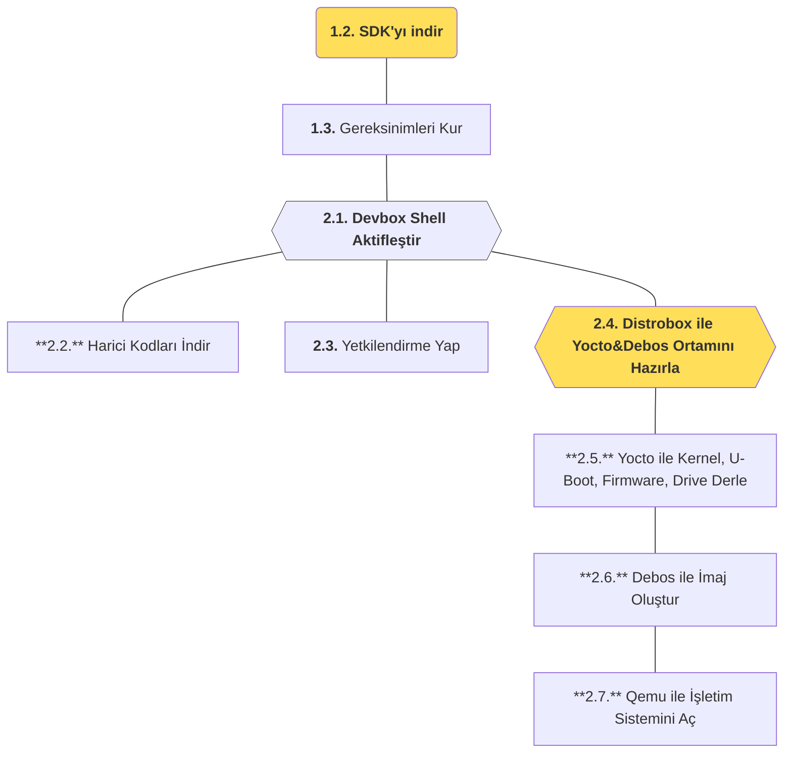

import SnippetSdkClone from '/snippets/sdk/intro/clone.mdx';
import SnippetSdkSetup from '/snippets/sdk/intro/setup.mdx';
import SnippetSdkDevboxShell from '/snippets/sdk/intro/devbox-shell.mdx';
import SnippetSdkTaskFetch from '/snippets/sdk/intro/task-fetch.mdx';
import SnippetSdkPermissions from '/snippets/sdk/intro/task-fetch.mdx';
import SnippetSdkTaskBox from '/snippets/sdk/intro/task-box.mdx';
import SnippetSdkTaskYocto from '/snippets/sdk/intro/task-yocto.mdx';
import SnippetSdkTaskDebos from '/snippets/sdk/intro/task-debos.mdx';
import SnippetSdkTaskQemu from '/snippets/sdk/intro/task-qemu.mdx';

Bu bölümde [SDK projesi](https://github.com/t3gemstone/sdk.git) geliştirici bilgisayarına indirilerek
Gemstone imajları derlenecektir. Temel düzeyde derleme işleminin nasıl yapıldığı **alıştırma** amacıyla
anlatılacaktır. Sonraki bölümlerde ise alıştırma olarak yapılan bütün bu araçların detaylarına
yer verilecektir.

<Tip>
Bölüm bitiminde aşağıdaki konularda tecrübe edineceksiniz.

* SDK bileşenlerinin temel kullanımını deneyimlemek
* Gemstone SDK ile Kernel, U-Boot, Firmware, İmaj derlemeleri yapmak
* Docker ve Distrobox gibi araçları kullanarak farklı GNU/Linux dağıtımlarını kendi bilgisayarınızda kullanmak.
</Tip>

<Note>
SDK projesi Gemstone'un yazılım altyapısını oluşturan en yoğun teknik bilgi içeren kısmıdır. Geliştirme
kartını kullanarak yazılım geliştirmek **için gerekli olmayıp** Gemstone'nun işletim sisteminin nasıl
oluşturulduğu vb. teknik konular izah edilmektedir. Geliştirme kartları ile yalnızca proje geliştirmek
istiyorsanız ve buradaki konulara ilginiz yoksa atlayabilirsiniz. Bu bölümün hedef kitlesi
**Gemstone geliştiricisi** olmak isteyenlerdir.
</Note>

<Steps>
  <Step title="SDK'yı indir">
    Ubuntu üzerinde `git clone` işlemi yaparak SDK projesini indir
  </Step>
  <Step title="Gereksinimleri Kur">
    Derleme işlemi yapabilmek için gereksinimleri `setup.sh` isimli scripti çalıştırarak kur
  </Step>
  <Step title="İmaj oluştur">
    SDK içerisindeki araçları kullanarak Gemstone imajı oluştur
  </Step>
  <Step title="QEMU kullan">
    Oluşan imajı QEMU ile sanal makine olarak çalıştır
  </Step>
</Steps>

# 1. Hazırlık

Derleme işlemleri Ubuntu 22.04 GNU/Linux dağıtımı içeren bilgisayar ile yapıldı. Debian, Fedora, Pardus gibi
dağıtımların da kullanılması mümkün olmakla birlikte ilk kez buna benzer derleme araçları kullananlar için
Ubuntu 22 veya Ubuntu 24 daha uygun olacaktır.

### 1.1. Bilgisayar Gereksinimleri

1. Ubuntu 22 veya Ubuntu 24 bilgisayar
2. En az 16GB RAM
3. En az 256GB kullanılabilir boş disk alanı

Gemstone SDK `Docker` ve `Devbox` gibi araçlara ihtiyaç duymaktadır. Aşağıdaki komutlarla SDK
projesi klonlandıktan sonra içerisinde bulunan `setup.sh` isimli script bu kurulumları otomatik yapmaktadır.

<Card>

</Card>

### 1.2. SDK'yı İndir

Ubuntu üzerinde herhangi bir klasörde Terminal açarak aşağıdaki gibi `git clone` komutu ile projeyi klonlayınız.

<SnippetSdkClone />

### 1.3. Gereksinimleri Kur

Klonlama işlemi sonrası aynı terminal ekranından `cd sdk` komutu ile klasöre girerek `setup.sh`
scriptini çalıştırma işlemini yapınız.

<SnippetSdkSetup />

<Warning>
Docker isimli uygulama daha önce sisteminizde kurulu değilse; ilk kez kuruyorsanız, Bilgisayar kullanıcı oturumunu
kapatarak yeniden giriş yapmayı unutmayınız.
</Warning>

# 2. Derleme

Gereksinim kurulum scriptini tamamladıktan sonra Terminal'den sdk klasörü içerisindeyken Devbox Shell aktifleştirerek
derleme adımlarına başlayabilirsiniz.

### 2.1. Devbox Konsolunu Aktifleştir

Ubuntu paketlerinden farklı versiyonlar içerebilen yazılım paket yönetim sistemi olan **Devbox**'ı aktifleştirerek
Gemstone SDK'sı için gerekli indirme işlemlerini ve kurulumları tamamlanmasını sağlayınız.

<SnippetSdkDevboxShell />

### 2.2. Harici Proje Kodlarını İndir

Aşağıda bulunan `task fetch` komutu aracılığıyla SDK'nın derleme esnasında ihtiyaç duyduğu bütün kaynak kodları
indirme işlemi yapılır. İndirilen bu projelerin neler olduğunu `sdk/repos.yml` dosyasından inceleyebilirsiniz.

<SnippetSdkTaskFetch />

### 2.3. Yetkilendirme İşlemlerini Yap

Yocto projesi ile işletim sistemi derleme çalışmaları doğrudan kullandığınız Ubuntu üzerinde değil, Distrobox denilen
bir araç ile yapılmaktadır. Distrobox içerisinde yocto kullanabilmek aşağıdaki komut aracılığıyla yetkilendirme yapınız.

<SnippetSdkPermissions />

### 2.4. Derleme Ortamını Hazırla

Aşağıdaki komut aracılığıyla Distrobox kurulum işlemini gerçekleştiriniz.

<SnippetSdkTaskBox />

Kurulum işleminin sonuna doğru sizlerden `⚠️  First time user password setup ⚠️` distrobox ortamınıza
bir şifre vermeniz istenecektir. Derleme işlemlerini yaparken Terminalden hangi konsol içerisinde bulunduğunuzu
ayırt edebilmeniz için bilgisayarınızın şifresinden farklı olarak 1 karakterlik şifre seçebilirsiniz.
Son olarak `🚀 distrobox:workdir>` satırını gördüğünüzde artık Yocto ve İmaj derlemesi için hazırsınız!

### 2.5. Yocto ile Çekirdek Yazılımları Derle

SDK yazılımcı kiti, farklı mimari ve işletim sistemlerine yönelik derleme yapabilmeniz için bir takım parametreler
içermektedir. Örneğin Gemstone _T3-GEM-O1_ modeli aarch64 mimari bir hedef (target) iken kullandığınız
Ubuntu bilgisayar için `intel-corei7-64` seçerek oluşan imaj dosyalarını doğrudan kendi bilgisayarınızda
çalıştırabilirsiniz. Aşağıdaki derleme işlemleri `intel-corei7-64` mimarisi için yapılmış olup QEMU isimli
sanallaştırma uygulaması aracılığıyla bu imajları doğrudan kendi bilgisayarından başlatabileceğiniz biçimde
anlatılmıştır.

<Warning>
Bu işlemler bilgisayarınızın performansına bağlı olarak yaklaşık 5 saat sürebilmektedir.
</Warning>

<SnippetSdkTaskYocto />

### 2.6. Debos ile İşletim Sistemi İmajını Derle

Yukarıdaki bölümde Yocto derlemesi tamamlandığında Kernel, Bootloader, Firmware gibi çekirdek yazılımlar oluşur.
Debos/Debootstrap ise işletim sistemi oluşturarak çekirdek yazılımlarla birleştirip **.img** uzantılı imaj
dosyasını hazırlar.

<SnippetSdkTaskDebos />

### 2.7. Derlenen İmajı QEMU ile Çalıştır

Oluşturduğunuz imaj dosyasını Gemstone kartlara yüklemeden Sanal Makine olarak QEMU aracılığıyla çalıştırmak için
aşağıdaki komutu çalıştırınız ve işletim sistemi içerisinde geziniz!

<SnippetSdkTaskQemu />

<Frame caption="QEMU ile Gemstone imajı çalıştırma.">
  <video controls className="w-full aspect-video" src="../../videos/gemstone-qemu.mp4"></video>
</Frame>

<Tip>QEMU Kullanıcı Adı: **gemstone** Şifre: **t3**</Tip>

# 3. Sonuç

Bu bölümü tamamlayarak; işletim sistemini derleyip, QEMU ile bu sistemi çalıştırarak Gemstone geliştiricilerinin
sistemleri derlerken hangi araçları kullandıklarını ve süreçleri gördünüz.

<Check>
Sonraki bölüme geçmeden önce yukarıda öğrendiğiniz bütün işlemleri bu sayfaya mümkün mertebe bakmadan
tekrar hatırlamaya çalışarak derleme işlemi yapmayı deneyiniz.
</Check>
